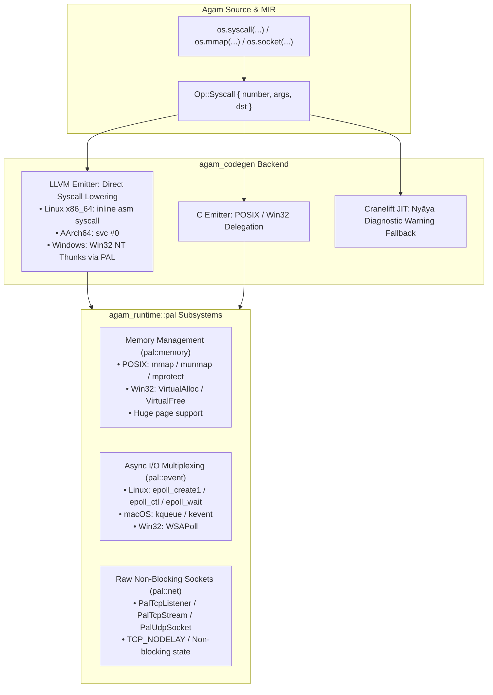

# Stage 3: Direct System Call & OS Subsystem Engine

**Stage**: `Stage 3`  
**Domain**: OS Kernel Interactions, Direct Syscalls & High-Throughput I/O  
**Status**: **COMPLETE**  

---

## 1. Executive Summary & Problem Definition

To achieve bare-metal native performance comparable to C/C++ and Rust, Agam provides a first-party Platform Abstraction Layer (PAL) in `agam_runtime::pal` and direct syscall capabilities in `Op::Syscall` that bypass third-party library overhead.

---

## 2. Technical Deliverables & Architecture

### 2.1 Direct Syscall Lowering in `agam_mir`, `agam_codegen` & `agam_jit`
- **MIR IR**: `Op::Syscall { number: ValueId, args: Vec<ValueId>, dst: ValueId }` fully wired across all MIR optimization passes (DCE, verifier, constant fold, inliner, loop unroll).
- **LLVM Codegen**:
  - Linux x86_64: Emits inline assembly `call i64 asm sideeffect "syscall", "={rax},{rax},{rdi},{rsi},{rdx},{r10},{r8},{r9}"` with `~{rcx},~{r11},~{memory}` clobbers.
  - AArch64: Emits `svc #0` using `x8` system call register conventions and `x0`..`x5` arguments.
  - Windows: Fast Win32 NT thunks via `@__agam_pal_syscall_win64`.
- **Cranelift JIT**:
  - Emits a structured 4-part Nyāya diagnostic warning explaining that `Op::Syscall` requires the LLVM AOT backend and returns 0 as a safe fallback.

### 2.2 Zero-Cost Memory Management (`agam_runtime::pal::memory`)
- Direct `mmap` / `munmap` on POSIX systems (`MAP_ANONYMOUS | MAP_PRIVATE`).
- Direct `VirtualAlloc` / `VirtualFree` on Windows (`MEM_COMMIT | MEM_RESERVE`).
- Huge page backing (`MAP_HUGETLB` / `MADV_HUGEPAGE` on Linux, `MEM_LARGE_PAGES` on Windows).
- RAII-safe page mapping with `system_page_size()` query and alignment rounding.

### 2.3 High-Throughput I/O Event Multiplexing (`agam_runtime::pal::event`)
- Unified `EventDemuxer` supporting:
  - Linux `epoll` (`epoll_create1`, `epoll_ctl`, `epoll_wait` with `EPOLLET` edge triggering).
  - macOS/BSD `kqueue` (`kqueue`, `kevent` with `EV_CLEAR`).
  - Windows `WSAPoll` socket multiplexing.

### 2.4 Raw Non-Blocking Sockets (`agam_runtime::pal::net`)
- Non-blocking `PalTcpListener`, `PalTcpStream`, and `PalUdpSocket`.
- Proper address reuse: Rust std handles `SO_REUSEADDR` automatically on POSIX before binding and `SO_EXCLUSIVEADDRUSE` on Windows to prevent socket hijacking.
- Socket options (`TCP_NODELAY`, non-blocking configuration, raw handle extraction).
- **G3 Deferred Tracking**: Zero-copy packet ring buffers are explicitly deferred to **Stage 6 (Production Standard Library & Media Codecs / Async HTTP)** where concrete throughput requirements emerge.

---

## 3. Verification & Acceptance Criteria
- [x] Direct syscall inline assembly lowering verified on x86_64, AArch64, and Windows NT thunks.
- [x] Cranelift JIT `Op::Syscall` structured Nyāya diagnostic warning verified with unit tests.
- [x] Memory allocator page arena (`VirtualAlloc`/`mmap`) verified with page alignment and protection transition tests.
- [x] Socket loopback non-blocking transfers and event multiplexer readiness verified.
- [x] `cargo check` and `cargo test` pass with 0 errors and 0 warnings across `agam_runtime` and `agam_jit`.
