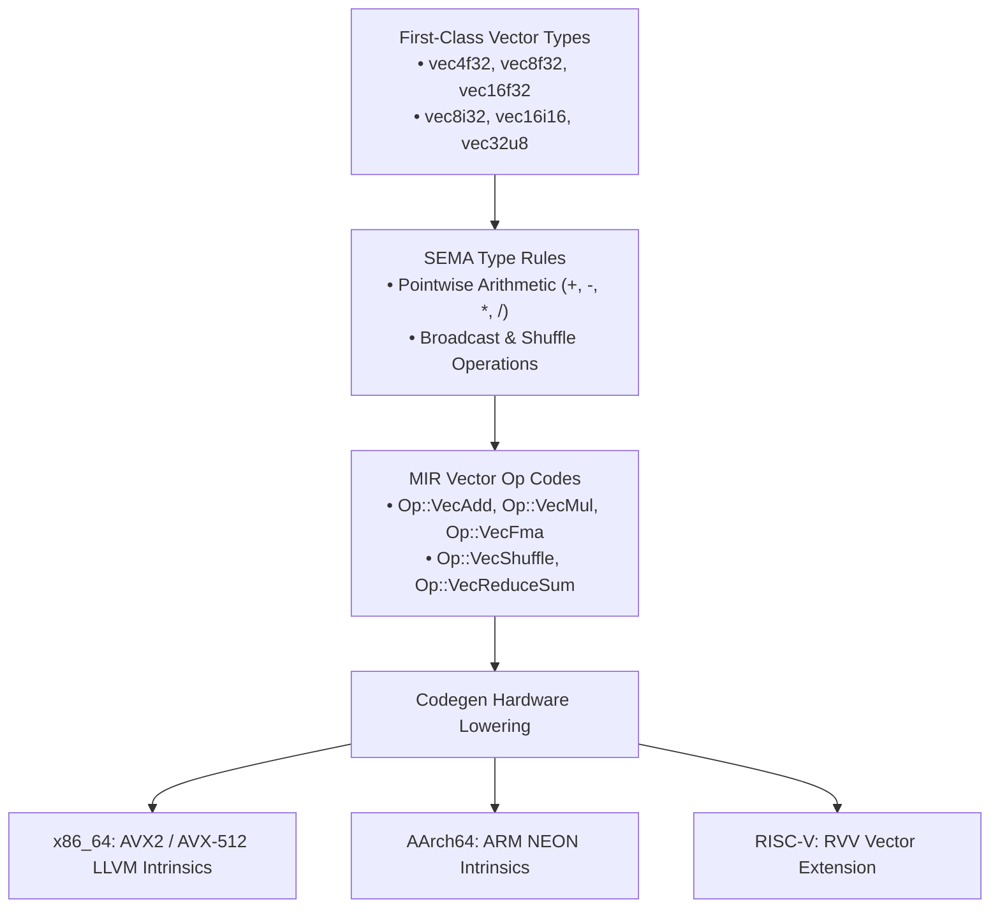

# Stage 5: High-Performance SIMD Vector Engine

**Stage**: `Stage 5 (Planned Execution)`  
**Domain**: Vectorized Compute, Hardware Intrinsics & Micro-Architectural Acceleration  
**Status**: **PLANNED**  

---

## 1. Executive Summary & Problem Definition

Modern high-throughput compute (image processing, audio codecs, machine learning kernels, ray tracing) requires explicit SIMD vectorization. Stage 5 introduces first-class vector types and target-specific hardware intrinsic lowerings across AVX2, AVX-512, ARM NEON, and RISC-V RVV.

---

## 2. Technical Deliverables & Architecture

### 2.1 First-Class Vector Types
- Syntax: `let v: vec8f32 = [1.0, 2.0, 3.0, 4.0, 5.0, 6.0, 7.0, 8.0];`
- Pointwise operators: `v1 * v2 + v3` lowers directly to fused multiply-add (`vfmadd`).

### 2.2 Micro-Architectural Target Adapters & Mask Predication
- x86_64: 256-bit YMM registers (`<8 x float>`) and 512-bit ZMM registers (`<16 x float>`).
- **AVX-512 Predication (`znver4`/`znver5`/AVX-512)**:
  - Utilize dedicated 64-bit opmask registers (`k0`–`k7`) for branchless inner loops (`Op::VecMaskCompare`, `Op::VecMaskedLoad`, `Op::VecMaskedStore`).
  - Exploit AMD Zen 4/5 double-pumped 256-bit execution units (zero thermal downclocking / frequency throttling).
  - Eliminate branch misprediction stalls in conditional filters (`if x > threshold`) and tail loops.
- AArch64: 128-bit Q registers (`<4 x float>`).
- RISC-V: Dynamic vector length registers (`vsetvli`).

---

## 3. Verification & Acceptance Criteria
- [ ] Dot product benchmark (`dot_product.agam`) achieves $> 95\%$ of peak native vector throughput.
- [ ] 4x4 matrix multiplication vectorized using AVX2/NEON FMA instructions.
- [ ] Branchy filter loop benchmark proves zero branch misprediction stalls under AVX-512 mask predication (`znver4`).
- [ ] 100% test pass rate across vector math test suites.

