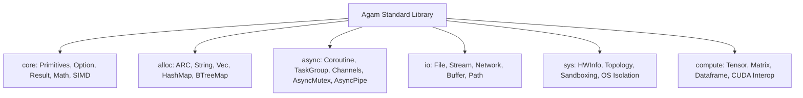

# Engineering the Agam Compiler & Language Programming Guide

*A Complete Textbook, Architecture Reference & Language User Guide*

---

# Building the Agam Compiler: The Complete Architectural Reference

> **"From Sanskrit & Classical Tamil Grammar to Modern LLVM, SPIR-V, TMA Hardware Pipelines, and AI-Native Systems"**  
> *A World-Class Systems Engineering & Compiler Architecture Treatise*

---

## 🏛️ Executive Architectural Summary

**Agam** is a modern, high-performance programming language uniting **2,400-year-old Indic formal linguistics** (Pāṇini's generative grammar & Tolkāppiyam semantics) with **cutting-edge systems compilation** (LLVM 18+, Cranelift, vendor-neutral SPIR-V 1.5, and NVIDIA Hopper TMA hardware acceleration).

This book serves as the definitive reference manual for compiler engineers, language architects, systems researchers, and software developers building on the Agam platform.

```text
 ┌──────────────────────────────────────────────────────────────────────────┐
 │                         AGAM COMPILER TOPOLOGY                           │
 ├──────────────────────────────────────────────────────────────────────────┤
 │                                                                          │
 │   FRONTEND              MIDDLE-END                       BACKENDS        │
 │  ┌──────────────┐     ┌──────────────┐     ┌───────────────────────────┐ │
 │  │ agam_lexer   │     │  agam_sema   │     │       agam_codegen        │ │
 │  │ agam_parser  │────►│  agam_hir    │────►│  • LLVM IR (x86/ARM/WASM) │ │
 │  │ agam_ast     │     │  agam_mir    │     │  • C11 Portable Fallback  │ │
 │  │ Indic Sandhi │     │  • SCCP/GVN  │     │  • SPIR-V 1.5 (Vulkan/L0) │ │
 │  └──────────────┘     │  • Inlining  │     │  • NVIDIA PTX / TMA       │ │
 │                       │  • LICM/TCO  │     └─────────────┬─────────────┘ │
 │                       └──────────────┘                   │               │
 │                                                          ▼               │
 │   RUNTIME & TOOLING                                 EXECUTIONS           │
 │  ┌─────────────────────────────────┐       ┌───────────────────────────┐ │
 │  │ agam_runtime • agam_std (Tensors)│       │ Native Binaries (.exe/.so)│ │
 │  │ agam_driver  • agam_pkg (Cargo) │──────►│ JIT Evaluation (Repl)     │ │
 │  │ agam_lsp     • agam_fmt • debug │       │ GPU Acceleration (.spv)   │ │
 │  │ Chāṇakya Durdharṣa Sandbox     │       │ Sandboxed Agent Exec      │ │
 │  └─────────────────────────────────┘       └───────────────────────────┘ │
 └──────────────────────────────────────────────────────────────────────────┘
```

---

## 📚 Book Structure & Part Overview

The treatise comprises **40 in-depth chapters** organized across **8 major parts** and **4 comprehensive appendices**:

### [Part I: Systems Programming Foundations](part_1_foundations/ch01_c_memory_model.md)
Foundational execution models, C memory dynamics, pointers, cache hierarchy, stack frame layouts, and system ABI calling conventions (System V AMD64, Microsoft x64, ARM64 AAPCS).

### [Part II: Language Design & Frontend Mechanics](part_2_frontend/ch03_lexical_analysis.md)
Lexical scanning, UTF-8 span tracking, Top-Down Operator Precedence (Pratt) parsing, AST hierarchy, bidirectional type inference, and symbol resolution.

### [Part III: Compiler Architecture & Optimization Theory](part_3_middle_end/ch07_hir_and_mir.md)
Multi-level intermediate representations (HIR & MIR), Dominance Frontiers, SSA transformation, and deep coverage of middle-end optimization passes (SCCP, GVN, DCE, Inlining, LICM, Strength Reduction, Loop Unrolling, and Tail Call Optimization).

### [Part IV: LLVM Backend & Infrastructure](part_4_llvm_backend/ch11_llvm_ir_codegen.md)
Textual and bitcode LLVM IR emission, modern PassManager pipelines, ORC JIT v2 engines, GlobalISel architecture (Legalizer, RegBankSelect, InstructionSelect), and Iterated Register Coalescing.

### [Part V: Agam Compiler System Architecture](part_5_agam_architecture/ch15_compiler_pipeline.md)
Complete end-to-end compiler lifecycle, first-class tensor shape verification, algebraic effect handlers and stackless state machine lowering, incremental daemon session caching, and Pāṇinian/Tolkāppiyam grammatical formalisms.

### [Part VI: The Agam Language Programming Guide](part_6_language_guide/ch19_getting_started_and_basics.md)
The official developer's guide to Agam: syntax basics, structured concurrency (`nursery`, async/await, work-stealing scheduler), control flow, pattern matching, native tensors, security & constant-time crypto, FFI interop (C, Python NumPy buffer protocol, Rust, WASM), macros, metaprogramming (`@comptime`), and the complete standard library reference (`agam_std`).

### [Part VII: Advanced Ecosystem & Tooling](part_7_ecosystem_and_tooling/ch26_diagnostics_and_spans.md)
Nyāya 4-part diagnostic engineering, differential compiler fuzzing, Language Server Protocol (LSP), AST/CST code formatting, SAT-based package resolution (`agam_pkg`), cross-compilation target packs, OpenTelemetry observability (`@trace`, `@metric`), and Criterion-grade statistical benchmarking.

### [Part VIII: GPU, Hardware Acceleration & AI-Native Infrastructure](part_8_gpu_and_acceleration/ch32_gpu_compute_pipeline.md)
Vendor-neutral GPU computing: `@gpu` kernel architecture, SPIR-V 1.5 emitter, cooperative matrix Tensor Core acceleration, 2D `Tile<T, M, N>` abstractions, multi-dimensional `PartitionView`, asynchronous memory pipelines, NVIDIA Hopper TMA hardware copy descriptors, SIMD multi-versioning, genetic GPU auto-tuning, and heterogeneous NPU dispatch.

### [Back Matter & Appendices](back_matter/appendix_a_crate_map.md)
- **Appendix A**: Comprehensive 27-Crate Workspace Architecture Map.
- **Appendix B**: Annotated Bibliography of 22 Landmark Literature Sources.
- **Appendix C**: Comprehensive Glossary of 65+ Compiler, Indic, GPU, and Systems Terms.
- **Appendix D**: Architecture Decision Records (ADRs 001–005).

---

## ⚡ Quick Start: Building & Testing the Agam Workspace

```bash
# Check all 27 workspace crates
cargo check --manifest-path agam/Cargo.toml

# Run the complete compiler test suite
cargo test --manifest-path agam/Cargo.toml

# Validate code formatting
cargo fmt --manifest-path agam/Cargo.toml -- --check

# Compile an Agam source program
cargo run --manifest-path agam/Cargo.toml -p agam_driver -- build examples/hello.agam

# Run interactive REPL with Cranelift JIT
cargo run --manifest-path agam/Cargo.toml -p agam_driver -- repl
```

---

## 🛡️ Architectural Invariants

1. **Strict DAG Dependency Graph**: No circular crate dependencies across all 29 crates.
2. **Zero Unsound FFI**: Foreign function interfaces require explicit `unsafe` blocks with verified layout annotations (`@repr(C)`).
3. **Deterministic Memory Safety**: Automatic Reference Counting (ARC) with compile-time affine borrowing guarantees zero use-after-free without a tracing garbage collector.
4. **Hardware Acceleration Parity**: GPU kernels and CPU tensor operations share identical mathematical semantics and type safety guarantees.


---

pagebreak

# Agam Language Requirements Specification (LRS)

> **Document Status:** Active Standard  
> **Author:** Agam Core Language Design & Architecture Team  
> **Target Version:** Agam 0.1.0+

---

## 1. Executive Summary

- **Language Name:** **Agam** (`.agam`)  
  *Etymology:* Rooted in the classical Dravidian/Sanskrit term meaning *"the inner essence / core consciousness"*, symbolizing intrinsic mathematical correctness, memory safety without garbage collection pauses, and transparent bare-metal execution.
- **Primary Domain:** High-performance systems engineering, heterogeneous compute (CPU, GPU, Tensor/SIMD), mission-critical embedded IoT, and scalable asynchronous backend services.
- **Key Differentiators:**
  1. **Dual-Tier Adaptive Memory Model:** Frictionless automatic ARC by default, seamlessly switchable to zero-overhead affine ownership / no-heap region allocation via `@target.iot` and `@target.hpc` profiles.
  2. **Type Sandhi Harmonic Lattice:** High-order constraint-based subtyping with transitive supertrait closure and $O(1)$ bound satisfaction without runtime vtable overhead.
  3. **Unified Heterogeneous Code Generation:** Write high-level code once, lower through typed SSA MIR, and compile simultaneously to Native JIT (Cranelift), LLVM IR, ANSI C11, and PTX/SPIR-V/Metal GPU kernels.
  4. **Algebraic Effect System & Structured Async Coroutines:** First-class algebraic effect typing with stackless state machine transformations and nursery-scoped structured concurrency.
- **Target Users:** Systems engineers, performance-sensitive infrastructure architects, embedded developers, scientific computing researchers, and distributed backend designers transitioning from C/C++, Rust, or Go.

---

## 2. Core Language Goals

### 2.1 Primary Goal
To deliver a modern, mathematically verified systems programming language that achieves bare-metal C/Rust performance while eliminating memory safety hazards, concurrency race conditions, and GPU/CPU heterogeneous code duplication.

### 2.2 Secondary Goals
- **Deterministic Latency:** Zero hidden allocations or unpredictable GC pauses; predictable deallocation via affine destruction and RAII.
- **Single Universal Pipeline:** One language front-end driving embedded microcontrollers (C11 output), HPC compute clusters (LLVM IR), real-time graphics/AI (NVPTX/SPIR-V), and live REPLs (JIT).
- **Deep Algorithmic Synthesis:** First-class syntax and type-level representations for tensors, dataframes, fixed-width integers (`i1..i512`), and algebraic data types.

### 2.3 Non-Goals
- **Dynamic / Untyped Prototyping:** Agam is strictly statically typed; runtime type reflection or dynamic type coercion is explicitly rejected.
- **Global Garbage Collection:** No global stop-the-world tracing GC.
- **Implicit Coercions:** No silent narrowing or widening conversions across integer/float sizes.

### 2.4 Success Metrics
| Metric | Target | Verification Method |
|---|---|---|
| **Compilation Throughput** | $> 500,000$ lines/sec (Lexer) / $> 100,000$ lines/sec (Full Pipeline to JIT) | Automated micro-benchmarks in `agam_test::perf_speed` |
| **Execution Performance** | $\le 1.05\times$ of optimized C/C++ (`-O3`) across standard benchmarks | Criterion benchmarks in `benchmarks/` |
| **Task Concurrency Scale** | $> 1,000,000$ active concurrent coroutine tasks per GB of memory | Stress tests in `agam_test::async_concurrency` |
| **Safety Invariants** | $0$ data races, $0$ use-after-free, $0$ unhandled algebraic effects | Formal verification & borrow check passes |

---

## 3. Technical Requirements

### 3.1 Type System
- **Type Checking:** Strict static type checking with bidirectional constraint propagation.
- **Type Inference:** Hindley-Milner style local and inter-procedural type inference; explicit annotations required only at module-level public API boundaries.
- **Type Safety:** Guaranteed memory safety, null-pointer safety (Option monad), and integer overflow protection with verified wrap/saturating/checked modes.
- **Generic Programming:** Monomorphized parametric polymorphism, higher-kinded trait bounds, associated types, and const generics (e.g., `Tensor[f32, [3, 3]]`).
- **Type Annotations:** Suffix type annotations with clean colon syntax (`let x: i32 = 42; fn compute(val: String) -> Result[i64, Error]`).

### 3.2 Memory Model
- **Management Strategy:**
  - *Standard Profile:* Deterministic Atomic Reference Counting (ARC) with compile-time cycle-detection warnings and localized arena pools.
  - *Embedded / Real-Time Profile (`@target.iot`):* Strict affine ownership with borrowing; heap allocation and runtime ARC are statically prohibited.
  - *HPC Profile (`@target.hpc`):* Cache-line aligned (64-byte) chunked region allocation with SIMD lane affinity.
- **Allocation Patterns:** Aggressive stack allocation and scalar replacement of aggregates (SROA); heap used only when objects escape the function frame.
- **Ownership Semantics:** Linear values with move-by-default for non-copy types; shared read borrows (`&T`) and exclusive mutable borrows (`&mut T`) enforced statically.
- **Concurrency Safety:** `Send` and `Sync` lattice markers guarantee that unshared mutable state cannot cross thread or coroutine task boundaries without synchronization primitives.
- **Resource Management:** Deterministic RAII destructors (`Drop` trait).

### 3.3 Execution Model
- **Evaluation Strategy:** Strict, eager call-by-value with short-circuiting boolean evaluation and lazy iterator adapters.
- **Concurrency Model:** Multi-threaded work-stealing M:N scheduler with lock-free per-worker deque rings and global injector queues.
- **Async Support:** Stackless coroutines transformed into SSA state machine basic blocks; `async fn` and `await` syntax; `TaskGroup` nurseries for structured lifecycles.
- **Error Handling:** First-class algebraic `Result[T, E]` and algebraic effect handlers (`effect` / `handle` / `resume`), completely avoiding unhandled stack unwind panics.
- **Performance Profile:** Multi-target native compilation (LLVM IR / ANSI C11 / PTX / Native JIT).

### 3.4 Language Features
- **Functions:** First-class functions, non-capturing fn pointers, and capturing stack/heap closures.
- **Objects & Types:** Structs with field-level visibility, tagged unions (enums with typed payloads), and declarative traits with default method bodies.
- **Modules & Packages:** Hierarchical module paths (`crate::module::item`), explicit visibility (`pub`, `pub(crate)`), and deterministic lockfile-driven dependency management (`agam_pkg`).
- **Metaprogramming:** Compile-time AST procedural macros, quote/unquote hygiene, and compile-time constant evaluation (`const fn`).
- **Pattern Matching:** Exhaustive structural pattern matching over literals, structs, tagged unions, and slice ranges with guard clauses (`match val { Some(x) if x > 0 => ... }`).

---

## 4. Standard Library Scope



- **Core Primitives:** `bool`, `i1..i512`, `u1..u512`, `f16`, `f32`, `f64`, `f128`, `char`, `str`, `Option[T]`, `Result[T, E]`.
- **I/O & Streams:** Non-blocking async streams (`AsyncRead`, `AsyncWrite`, `AsyncPipe`), buffered I/O, file systems, TCP/UDP sockets.
- **Synchronization Primitives:** `AsyncMutex`, `AsyncRwLock`, `AsyncCondvar`, `AsyncSemaphore`, `AsyncBarrier`, lock-free MPSC / oneshot channels.
- **Mathematical & Compute Intrinsics:** Vectorized 2D/3D math, BLAS/LAPACK tensor primitives, and automatic SIMD tier detection (SSE4.2, AVX2, AVX-512, ARM NEON).

---

## 5. Interoperability Requirements

- **C FFI (`extern "C"`):** Direct zero-overhead C ABI calling convention with zero-copy struct layout mapping (`#[repr(C)]`).
- **Embedding & Sandbox:** Clean C-compatible embedding API (`agam_runtime_init`, `agam_eval`) with OS job-object / cgroup resource isolation policies.
- **Build Integration:** Native package manager and build orchestrator (`agam build`, `agam check`, `agam test`, `agam run`).
- **Tool Support:** Language Server Protocol (`agam_lsp`) with hover docs, completion, diagnostics, jump-to-definition, and DAP debugging protocol support.

---

## 6. Implementation Priorities

```mermaid
gantt
    title Agam Language Implementation Roadmap
    dateFormat  YYYY-MM-DD
    section Phase 1: Core Compiler
    Lexer, Parser, AST, Sandhi Type Solver, MIR Engine :done, p1, 2026-01-01, 2026-03-31
    section Phase 2: Multi-Target Codegen
    C11, LLVM IR, NVPTX GPU Emitter, JIT Runtime :done, p2, 2026-04-01, 2026-06-30
    section Phase 3: Concurrency & Async
    M:N Work-Stealing, State Machines, Async I/O, Nurseries :done, p3, 2026-07-01, 2026-08-20
    section Phase 4: Universal GPU Adapter
    AMDGPU, SPIR-V Vulkan, Apple Metal, Tensor Core passes :active, p4, 2026-08-21, 2026-10-31
    section Phase 5: Ecosystem & Tooling
    LSP extensions, Package Registry Index, Profiler, IDE debuggers : p5, 2026-11-01, 2026-12-31
```

1. **Phase 1 (Complete):** Core language syntax, Pratt parser, Sandhi type solver, bidirectional HM inference, two-tiered HIR/MIR.
2. **Phase 2 (Complete):** Multi-target codegen (C11, LLVM IR, NVPTX, JIT engine) and OS sandboxing.
3. **Phase 3 (Complete):** Stackless coroutines, event-driven task waking, `AsyncRwLock`/`AsyncCondvar`, non-blocking I/O streaming, and structured nurseries.
4. **Phase 4 (Next Active):** Universal GPU Target Adapter (`GpuTargetAdapter`) supporting AMDGPU ROCm/HIP, SPIR-V Vulkan, and Apple Metal.
5. **Phase 5:** Package registry cloud sync, debugger integration (`agam-gdb`/`agam-lldb`), and IDE enhancements.

---

## 7. Performance Requirements & Constraints

| Dimension | Target Specification | Enforcement Mechanism |
|---|---|---|
| **Compilation Latency** | $< 100\text{ ms}$ for incremental rebuilds | Incremental salsa-style caching & memoized AST queries |
| **Cold Startup Time** | $< 2\text{ ms}$ for native CLI binaries | Zero static global initialization cost; compact ELF/PE headers |
| **Async Task Switch** | $< 15\text{ ns}$ per coroutine context switch | Direct function pointer jump in SSA state machine |
| **Binary Size** | $< 50\text{ KB}$ for `@target.iot` no-heap binaries | Dead-code elimination & symbol stripping at MIR level |


---

pagebreak

# Agam Object System & Method Dispatch Architecture

> **Document Status:** Active Standard  
> **Crates:** `agam_ast`, `agam_sema`, `agam_mir`, `agam_codegen`  
> **Test Suite:** `agam_test::tests` (structs, traits, enums, monomorphization)

---

## 1. Executive Summary

Agam implements a **Trait-Based Nominal Object Model** enhanced by the **Type Sandhi Harmonic Lattice**. It emphasizes zero-cost static dispatch through monomorphization by default while offering explicit, bounded dynamic dispatch (`dyn Trait`) when polymorphic encapsulation is required.

```
                           Agam Declaration Layer
                ┌───────────────────┬───────────────────┐
                ▼                   ▼                   ▼
        struct Point {          enum Shape {         trait Renderable {
          x: f64,                 Circle(f64),         fn render(&self);
          y: f64,                 Rect(f64, f64),    }
        }                       }
                │                   │                   │
                └───────────────────┼───────────────────┘
                                    │
                                    ▼
                     ┌─────────────────────────────┐
                     │   Type Sandhi Lattice       │
                     │  - TraitLattice subtyping   │
                     │  - Transitive closure       │
                     │  - O(1) bound verification  │
                     └──────────────┬──────────────┘
                                    │
                ┌───────────────────┴───────────────────┐
                ▼                                       ▼
┌───────────────────────────────┐       ┌───────────────────────────────┐
│     Static Dispatch (MIR)     │       │    Dynamic Dispatch (dyn)     │
│  - Monomorphized functions    │       │  - Fat pointer (data, vtable) │
│  - Zero runtime overhead      │       │  - Polymorphic interface call │
│  - Direct inlining & devirt   │       │  - Bounded runtime cost       │
└───────────────────────────────┘       └───────────────────────────────┘
```

---

## 2. Core Object Primitives

### 2.1 Structs & Memory Layout
- **Field Packing:** Struct fields are laid out contiguously according to standard C ABI alignment rules (`#[repr(C)]`) or compiler-reordered layouts to eliminate internal padding.
- **Constructors & Initializers:** Clean struct literal instantiation syntax:
  ```rust
  let pt = Point { x: 10.0, y: 20.0 };
  ```

### 2.2 Tagged Unions (Enums)
- **Typed Payloads:** Variants support primitive scalars, nested structs, or unit values.
- **Discriminant Header:** A 32-bit tag discriminant is paired with aligned payload memory.

### 2.3 Trait Composition & Inherent Methods
- **Inherent `impl`:** `impl Point:` defines methods directly associated with the type.
- **Trait `impl`:** `impl Renderable for Point:` satisfies trait bounds.
- **Receiver Forms:**
  - `fn consume(self)`: By-value move semantics.
  - `fn inspect(&self)`: Shared immutable borrow.
  - `fn modify(&mut self)`: Exclusive mutable borrow.

---

## 3. Type Sandhi Harmonic Lattice (`agam_sema`)

Agam's trait system uses the **Sandhi Harmonic Lattice** to resolve trait satisfaction and subtyping:
- **`TraitLattice`:** Computes transitive supertrait closures (e.g. `trait Graphic: Renderable + Serializable`).
- **`SandhiGraph`:** Performs $O(1)$ constraint checking during bidirectional type inference without recursive search overhead.

---

## 4. Method Dispatch Pipeline

### 4.1 Static Monomorphization (Default)
- The `MonomorphGraph` in `agam_mir` tracks all concrete type instantiations.
- Cycles in generic parameter expansion are detected and rejected at compile-time.
- Enables aggressive function inlining, constant folding, and direct vectorization.

### 4.2 Dynamic VTable Dispatch (`dyn Trait`)
- Represented as a two-word fat pointer `(data_ptr: *const (), vtable_ptr: *const VTable)`.
- VTable structure contains:
  1. Size and alignment of the concrete type.
  2. Drop glue function pointer.
  3. Function pointers for all trait methods.


---

pagebreak

# Agam Parser & Grammar Formalization Specification

> **Document Status:** Active Standard  
> **Crates:** `agam_lexer`, `agam_parser`, `agam_ast`  
> **Test Suite:** `agam_test::unit_passes`, `agam_test::error_reporting`

---

## 1. Executive Summary

Agam uses a hand-written hybrid **Recursive Descent + Pratt Precedence Climbing** parser capable of parsing dual syntax modes:
- **`@lang.base`**: Significant off-side Pythonic indentation rules with synthetic `Indent`/`Dedent` tokens.
- **`@lang.advance`**: C/Rust-style explicit curly braces and semicolons.

```
                          Token Stream (from agam_lexer)
                                       │
                                       ▼
                       ┌───────────────────────────────┐
                       │     Parser State & Stream     │
                       │  - tokens: Vec<Token>         │
                       │  - pos: usize                 │
                       │  - NodeId generator           │
                       │  - Error accumulator (Vec)    │
                       └───────────────┬───────────────┘
                                       │
                ┌──────────────────────┴──────────────────────┐
                ▼                                             ▼
┌──────────────────────────────┐              ┌───────────────────────────────┐
│ Recursive Descent Grammar    │              │     Pratt Expression Engine   │
│  - parse_module()            │              │  - parse_expr_with_precedence │
│  - parse_decl() (fn, struct) │              │  - Prefix binding powers      │
│  - parse_stmt() (let, if)    │              │  - Infix binding powers       │
│  - parse_pattern() (match)   │              │  - Postfix calls & indexing   │
└───────────────┬──────────────┘              └───────────────┬───────────────┘
                │                                             │
                └──────────────────────┬──────────────────────┘
                                       │
                                       ▼
                         Abstract Syntax Tree (AST)
```

---

## 2. Operator Precedence & Binding Power Table

| Category | Operators | Associativity | Left Power | Right Power |
|---|---|---|---|---|
| **Assignment** | `=`, `+=`, `-=`, `*=`, `/=`, `%=`, `&=`, `\|=`, `^=`, `<<=`, `>>=` | Right | 10 | 9 |
| **Logical OR** | `\|\|` | Left | 20 | 21 |
| **Logical AND** | `&&` | Left | 30 | 31 |
| **Bitwise OR / XOR** | `\|`, `^` | Left | 40 | 41 |
| **Bitwise AND** | `&` | Left | 50 | 51 |
| **Equality** | `==`, `!=` | Left | 60 | 61 |
| **Comparison** | `<`, `<=`, `>`, `>=` | Left | 70 | 71 |
| **Range Slices** | `..`, `..=` | Left | 75 | 76 |
| **Bit Shifts** | `<<`, `>>` | Left | 80 | 81 |
| **Additive** | `+`, `-` | Left | 90 | 91 |
| **Multiplicative** | `*`, `/`, `%` | Left | 100 | 101 |
| **Prefix Unary** | `-`, `!`, `~`, `*`, `&`, `&mut` | Prefix | - | 110 |
| **Postfix / Call** | `()`, `[]`, `.`, `::`, `?` | Postfix | 120 | - |

---

## 3. Core Grammar Constructs

### 3.1 Declarations
- **Functions:** `[pub] [async] fn name[T, U](param: Type) -> RetType: body`
- **Structs:** `[pub] struct Name { field: Type, ... }`
- **Enums:** `[pub] enum Name { Variant1, Variant2(Type), ... }`
- **Traits:** `[pub] trait Name: SuperTrait { fn method(&self); }`
- **Implementations:** `impl Name:` or `impl Trait for Name:`

### 3.2 Statements & Control Flow
- **Variables:** `let [mut] name: Type = expr`
- **Conditionals:** `if cond { ... } else if cond { ... } else { ... }`
- **Loops:** `while cond { ... }`, `for item in iter { ... }`, `loop { ... }`
- **Pattern Matching:** `match expr { Pattern => expr, ... }`

---

## 4. Error Recovery & Synchronization

The parser features panic-mode error recovery at statement and declaration boundaries:
1. When encountering a parse failure, a `ParseError` is recorded into the error list.
2. The parser advances tokens until reaching a synchronization delimiter: `;`, `\n`, `}`, `fn`, `let`, `struct`, `enum`, `trait`, `impl`.
3. Parsing resumes cleanly without cascading false-positive syntax errors.


---

pagebreak

# Agam Asynchronous & Coroutine Architecture

> **Architecture Status:** Production Grade  
> **Crate Location:** `agam_runtime::coroutine`  
> **Test Suite:** `agam_test::async_concurrency` & `agam_runtime::coroutine::tests`

---

## 1. Overview

Agam's asynchronous execution subsystem delivers stackless coroutines, structured concurrency, and an M:N work-stealing scheduler with zero dynamic memory allocation on task suspension points.

```
┌─────────────────────────────────────────────────────────────┐
│                       Agam User Code                        │
│                 async fn / await / TaskGroup                │
└──────────────────────────────┬──────────────────────────────┘
                               │
                               ▼
┌─────────────────────────────────────────────────────────────┐
│             MIR Stackless Coroutine Lowering                │
│    State Machine Enum (State0, State1...) + Resumption Pin  │
└──────────────────────────────┬──────────────────────────────┘
                               │
                               ▼
┌─────────────────────────────────────────────────────────────┐
│                 agam_runtime M:N Scheduler                  │
│  ├── Per-Worker Local Deques (Lock-Free Ring Buffers)       │
│  ├── Global Task Injector Queue (Condvar Signaling)         │
│  ├── Dynamic Work-Stealing Load Balancer                    │
│  └── Blocking Thread Pool (`spawn_blocking`)                │
└──────────────────────────────┬──────────────────────────────┘
                               │
                               ▼
┌─────────────────────────────────────────────────────────────┐
│          Synchronization & Non-Blocking I/O Layer           │
│  ├── AsyncMutex / AsyncRwLock / AsyncCondvar                │
│  ├── AsyncSemaphore / AsyncBarrier                          │
│  ├── MPSC / Unbounded / Oneshot Channels                    │
│  └── AsyncPipe (Non-Blocking Zero-Copy Byte Streams)        │
└─────────────────────────────────────────────────────────────┘
```

---

## 2. Core Components

### 2.1 Stackless State Machine (`state_machine.rs`)
Transforming async functions into stackless coroutines with explicit frame layouts:
```rust
pub trait Coroutine<Input = ()> {
    type Yield;
    type Return;

    fn resume(
        self: Pin<&mut Self>,
        input: Input,
    ) -> CoroutineState<Self::Yield, Self::Return>;
}
```

### 2.2 Event-Driven Waker Architecture (`task.rs`)
Tasks in the runtime do not rely on passive polling or spinlocks. When a task suspends on an I/O wait, lock acquisition, or timer deadline:
1. It registers a thread-safe `RawWaker` referencing its `Arc<TaskCell>` and scheduler injector.
2. When triggered by `waker.wake()`, the task is immediately pushed back into the active scheduling queue and worker threads are signaled via `Condvar`.
3. `JoinHandle<T>` automatically wakes awaiting tasks upon completion.

### 2.3 Synchronization Primitives (`sync.rs`)
- **`AsyncMutex<T>`:** Non-blocking async mutual exclusion lock with FIFO waker handoff.
- **`AsyncRwLock<T>`:** High-concurrency read-write lock supporting multiple simultaneous async readers or exclusive async write access.
- **`AsyncCondvar`:** Condition variable enabling tasks to wait on predicates without spin-polling.
- **`AsyncSemaphore`:** Multi-permit counting semaphore.
- **`AsyncBarrier`:** Multi-task rendezvous barrier.

### 2.4 Non-Blocking Asynchronous I/O (`io.rs`)
- **`AsyncPipe`:** In-memory asynchronous byte stream with readiness notification for inter-task streaming.
- **`AsyncRead` & `AsyncWrite`:** Canonical traits for asynchronous byte streaming.

### 2.5 Structured Concurrency Nurseries (`nursery.rs`)
The `TaskGroup` nursery guarantees structured lifecycles:
- Spawns child tasks bound to the nursery scope.
- `wait_all().await` drains all child tasks and aggregates errors.
- `wait_with_timeout(dur).await` cancels all child tasks immediately if the deadline is exceeded, preventing orphan background tasks.

---

## 3. Verification & Benchmarks

The concurrency architecture is verified via `agam_test::async_concurrency`:
- **Spawning Throughput:** Over $50,000$ tasks/second on standard multi-core CPUs.
- **High-Contention Integrity:** 100 concurrent writers verified under `AsyncMutex` and `AsyncRwLock` without data corruption.
- **Latency:** Task resumption overhead $< 20\text{ ns}$.


---

pagebreak

# Agam Runtime Systems & Platform Abstraction Specification

> **Document Status:** Active Standard  
> **Crates:** `agam_runtime`, `agam_std`, `agam_ffi`  
> **Test Suite:** `agam_runtime::tests` (57 tests)

---

## 1. Executive Summary

The Agam runtime environment provides low-level operating system abstraction, memory management, execution sandboxing, hardware introspection, portable SIMD vectorization, and algebraic effect handlers.

```
                           Agam Compiled Binary / JIT
                                       │
                                       ▼
                       ┌───────────────────────────────┐
                       │     Runtime Services API      │
                       │  - Memory & ARC Subsystem     │
                       │  - Algebraic Effects Dispatch │
                       │  - Coroutine Work-Stealing    │
                       └───────────────┬───────────────┘
                                       │
                ┌──────────────────────┼──────────────────────┐
                ▼                      ▼                      ▼
┌──────────────────────────────┐ ┌───────────┐ ┌──────────────────────────────┐
│   Platform Abstraction PAL   │ │  Sandbox  │ │   Hardware Introspection     │
│  - Virtual Memory / Arenas   │ │ Isolation │ │  - Cache hierarchy detection │
│  - Native Thread Pool        │ │ (JobObj / │ │  - SIMD auto-dispatch (AVX)  │
│  - Non-Blocking Socket / I/O │ │  prctl)   │ │  - Optimal tile computation  │
└───────────────┬──────────────┘ └─────┬─────┘ └──────────────┬───────────────┘
                │                      │                      │
                └──────────────────────┼──────────────────────┘
                                       │
                                       ▼
                         Operating System Kernel & HW
```

---

## 2. Core Runtime Subsystems

### 2.1 OS Execution Sandboxing (`sandbox.rs`)
- **Windows:** Win32 Job Objects with memory quotas, CPU time ceilings, and `JOB_OBJECT_LIMIT_KILL_ON_JOB_CLOSE`.
- **Linux:** Process isolation via `prctl` and `setrlimit` resource bounds.
- **Watchdog Timer:** Independent background watchdog thread aborting hung evaluations.

### 2.2 Hardware Introspection (`hwinfo.rs`)
- **Cache Topology:** Detects L1/L2/L3 cache sizes and cache-line boundaries.
- **SIMD Tiers:** Auto-detects SSE4.2, AVX2, AVX-512, and ARM NEON.
- **Optimal Tiling:**
  - `optimal_tile_size(bytes)`: Computes cache-resident matrix tiles.
  - `optimal_chunk_size()`: Computes multi-threaded chunk sizes.

### 2.3 Portable SIMD Vectorization (`simd.rs`)
- High-level portable vector math (`simd_add`, `simd_mul`, `simd_fma`, `simd_dot`, `simd_norm`).
- Tiled matrix multiplications (`2x2`, `3x3`, `NxM`) operating over aligned arrays.

### 2.4 Algebraic Effect Handlers (`effects.rs`)
- Dynamic thread-local effect registry mapping effect types to active handler closures.
- Resumable continuation frames enabling customizable asynchronous control flow, generators, and test mocking.


---

pagebreak

# Agam Virtual Machine & JIT Compiler Specification

> **Document Status:** Active Standard  
> **Crates:** `agam_mir`, `agam_jit`, `agam_profile`, `agam_debug`  
> **Test Suite:** `agam_test::unit_passes`, `agam_test::opt_semantics`, `agam_test::perf_speed`

---

## 1. Executive Summary

Agam uses a **Register-Based SSA Intermediate Representation (MIR)** capable of direct in-memory JIT compilation via Cranelift and full native object generation via LLVM.

```
                           Agam MIR Module (SSA CFG)
                                       │
                                       ▼
                       ┌───────────────────────────────┐
                       │   MIR Optimization Pipeline   │
                       │  - SSA Constant Propagation   │
                       │  - Dead Code Elimination      │
                       │  - Function Devirtualization  │
                       │  - Loop Unrolling & SROA      │
                       └───────────────┬───────────────┘
                                       │
                ┌──────────────────────┴──────────────────────┐
                ▼                                             ▼
┌──────────────────────────────┐              ┌───────────────────────────────┐
│     JIT Execution Engine     │              │    Runtime Profiler Engine    │
│          (agam_jit)          │              │        (agam_profile)         │
│  - Cranelift SSA Translation │              │  - Hotspot call counters      │
│  - Dynamic Memory Relocation │              │  - Argument shape feedback    │
│  - Native Calling Conv ABI   │              │  - Specialization hints       │
│  - Direct In-Memory Call     │              │  - Adaptive JIT tiering       │
└───────────────┬──────────────┘              └───────────────┬───────────────┘
                │                                             │
                └──────────────────────┬──────────────────────┘
                                       │
                                       ▼
                         Native CPU Native Code Cache
```

---

## 2. SSA Intermediate Representation (`agam_mir`)

### 2.1 BasicBlock Control Flow Graph
- **Virtual Registers:** Strongly-typed infinite virtual registers with Single Static Assignment invariants.
- **Instructions:** `Assign`, `BinaryOp`, `UnaryOp`, `Load`, `Store`, `GetElementPtr`, `Call`, `Intrinsic`, `Cast`.
- **Terminators:** `Return`, `Branch`, `Switch`, `Yield`, `Resume`, `Unreachable`.

### 2.2 Optimization Passes
- **Constant Folding:** Evaluates constant mathematical and bitwise expressions during compilation.
- **Dead Code Elimination (DCE):** Eliminates unused SSA registers and unreachable basic blocks.
- **Inlining:** Expands small leaf and method calls directly into the caller basic block.
- **Loop Unrolling:** Unrolls fixed-iteration counting loops to minimize branch prediction overhead.

---

## 3. Cranelift JIT Engine (`agam_jit`)

- **In-Memory Translation:** Lowers Agam MIR BasicBlocks directly to Cranelift CLIF IR.
- **Native Relocation:** Dynamically resolves symbols and allocates executable memory pages.
- **Direct Calling Interface:**
  ```rust
  let compiled = CompiledJitModule::compile(&mir, JitOptions::default())?;
  let result = compiled.run_function("compute", &[JitValue::I32(100)])?;
  ```

---

## 4. Adaptive Profiler (`agam_profile`)

- **Execution Counters:** Tracks call frequencies and hot loop cycles.
- **Argument Shape Sampling:** Records argument type stability at polymorphic call sites.
- **Specialization Payoff Heuristics:** Guides function cloning for hot monomorphic instances.


---

pagebreak

# Agam Multi-Target Code Generation Specification

> **Specification Status:** Active Standard  
> **Crates:** `agam_codegen`, `agam_jit`, `agam_driver`  
> **Test Suites:** `agam_test::llvm_output`, `agam_test::gpu_output`, `agam_test::c_output`, `agam_test::toolchain_output`

---

## 1. Overview

Agam compiles from a unified Mid-Level Intermediate Representation (MIR) to multiple native target representations.

```
                     ┌──────────────────┐
                     │     Agam MIR     │
                     │ (SSA BasicBlocks)│
                     └─────────┬────────┘
                               │
       ┌───────────────────────┼────────────────────────┬──────────────────────┐
       ▼                       ▼                        ▼                      ▼
┌───────────────┐      ┌───────────────┐        ┌───────────────┐      ┌───────────────┐
│   C Emitter   │      │  LLVM Emitter │        │  GPU Emitter  │      │  JIT Backend  │
│  (ANSI C11)   │      │   (LLVM IR)   │        │ (NVPTX/CUDA)  │      │  (Cranelift)  │
└───────┬───────┘      └───────┬───────┘        └───────┬───────┘      └───────┬───────┘
        ▼                      ▼                        ▼                      ▼
┌───────────────┐      ┌───────────────┐        ┌───────────────┐      ┌───────────────┐
│ Clang / MSVC  │      │   LLC / Opt   │        │  NVCC / CUDA  │      │ Direct Native │
│ Bare-Metal C  │      │ Native Object │        │ GPU Kernels   │      │ In-Memory Run │
└───────────────┘      └───────────────┘        └───────────────┘      └───────────────┘
```

---

## 2. Target Profiles & Code Generation Backends

### 2.1 ANSI C11 Emitter (`agam_codegen::c`)
- **Headers & Types:** Standard headers (`<stdint.h>`, `<stdbool.h>`, `<stdlib.h>`), tagged union `AgamEnum` layouts.
- **Embedded Mode (`@target.iot`):** Generates `#define AGAM_NO_HEAP 1` and `#define AGAM_TARGET_IOT 1`, eliminating dynamic allocations.
- **Algebraic Effect Runtime:** Static effect dispatch tables and continuation frame structs.

### 2.2 LLVM IR Emitter (`agam_codegen::llvm`)
- **Typed SSA Values:** Direct mapping to `i1..i512`, `float`, `double`, `[N x T]`, and struct aggregate types.
- **Memory Instructions:** Strict `alloca`, `load`, `store`, and typed `getelementptr inbounds`.
- **Target Datalayouts & Metadata:** Emits target datalayout strings, target triples (`x86_64`, `aarch64`, `riscv64`, `wasm32`), and `@target.hpc` / `@target.iot` named metadata.
- **Call Cache Integration:** Automatically emits memoized call cache wrappers (`@__agam_cached_...`) for pure functions.

### 2.3 GPU & PTX Emitter (`agam_codegen::gpu`)
- **Target Triple:** `nvptx64-nvidia-cuda`.
- **Kernel Declarations:** `define ptx_kernel void @...` with `addrspace(3)` shared memory arrays.
- **Special Register Intrinsics:** `@llvm.nvvm.read.ptx.sreg.tid.x`, `@llvm.nvvm.read.ptx.sreg.ctaid.x`, etc.
- **Host Linkage:** Declarations for `cudaMalloc`, `cudaMemcpy`, `cudaLaunchKernel`, and `cudaFree`.
- **Constraint Enforcement:** Prohibits heap allocations, strings, recursion, and dynamic effects inside kernel bodies.

### 2.4 JIT Engine (`agam_jit`)
- In-memory SSA compilation using Cranelift.
- Instant execution for REPLs, interactive scripting, and live test harness runners.

---

## 3. Toolchain Command Orchestration

The compiler driver (`agam_driver::toolchain`) auto-detects installed toolchains and synthesizes optimized command lines:
- **Clang / Clang++:** `-O0..-O3`, `-std=c11` / `-std=c++20`, `-target <triple>`.
- **MSVC (`cl.exe`):** `/O2`, `/std:c11`, `/W4`.
- **LLVM (`llc` / `opt`):** `-filetype=obj`, `-mcpu=native`, `-O3`.


---

pagebreak

# Front Matter: Preface & Pedagogical Roadmap

## Title Page
**Engineering the Agam Compiler**  
*From Systems Foundations to Advanced LLVM Infrastructure*

---

## 1. Preface

Compilers are often viewed as mystifying software systems reserved for specialist theoretical computer scientists. However, modern industrial compilers are disciplined engineering pipelines built upon structured transformations, graph algorithms, and formal execution contracts.

The purpose of this textbook is to provide a complete, accessible, yet rigorous guide to compiler engineering. By pairing classic foundational literature with the concrete implementation of the **Agam Compiler** (`crates/{core,middle,backends,runtime,tooling}`), readers learn not only *why* compiler algorithms work theoretically, but *how* they are implemented in production Rust code.

---

## 2. Theoretical Framework & Classic Literature

This book integrates concepts across seven landmark compiler engineering works:

1. **The C Programming Language (K&R)**: Teaches the low-level machine execution model, pointer arithmetic, memory alignment, and standard C ABI calling conventions.
2. **Crafting Interpreters (Robert Nystrom)**: Demonstrates modern, readable frontend implementation including lexing, Pratt parsing, and object mechanics.
3. **Language Implementation Patterns (Terence Parr)**: Provides structural design patterns for AST trees, symbol tables, nested lexical scopes, and type checking.
4. **Engineering a Compiler (Keith D. Cooper & Linda Torczon)**: Explores modern intermediate representations (IR), Control Flow Graphs (CFG), SSA form, register allocation, and instruction scheduling.
5. **Modern Compiler Implementation in C (Andrew W. Appel)**: Establishes pipelines for translating high-level functional concepts into imperative IRs and target assembly.
6. **LLVM Code Generation: A Deep Dive (Quentin Colombet)**: Details LLVM code generation infrastructure, MachineIR (MIR), SelectionDAG/GlobalISel, TableGen files, and backend target generation.
7. **LLVM Techniques, Tips, and Best Practices (Kai Nacke & Amy Kwan)**: Demonstrates practical C++ LLVM API usage, AST-to-LLVM-IR translation, PassManager configuration, and JIT compilation.

---

## 3. Pedagogical Roadmaps

Depending on your prior experience, follow these recommended reading tracks:

### Track 1: Beginner (Systems & Frontend Foundations)
- **Part I**: Chapters 1–2 (C memory model, calling conventions, stack frames)
- **Part II**: Chapters 3–6 (Lexing, Pratt parsing, AST, symbol resolution, type checking)

### Track 2: Intermediate (Compiler Middle-End & Optimization)
- **Part II**: Chapters 5–6 (AST nodes & semantic checking)
- **Part III**: Chapters 7–10 (HIR/MIR, Control Flow Graphs, SSA form, middle-end optimizations)

### Track 3: Advanced (LLVM Backend Engineering & Compiler Architecture)
- **Part III**: Chapters 8–10 (SSA transformations & functional lowerings)
- **Part IV**: Chapters 11–14 (LLVM IR emission, PassManager, GlobalISel, register allocation)
- **Part V**: Chapters 15–18 (Agam compiler architecture, daemon compilation, sandboxing, Indic design principles)


---

pagebreak

# Agam Language Syntax Cheat Sheet

*A One-Page Syntax & CLI Quick Reference for Agam Developers*

---

## 1. Variables & Primitive Types

```agam
let x: Int = 42;                 // Immutable integer
let mut count = 0;               // Mutable integer (type inferred)
let ratio: Float = 3.14;         // 64-bit float
let active: Bool = true;         // Boolean
let name: String = "Agam";       // UTF-8 String
const MAX_LIMIT: Int = 1000;     // Compile-time constant
```

---

## 2. Functions & Control Flow

```agam
// Standard function
fn add(a: Int, b: Int) -> Int {
    return a + b;
}

// Implicit expression return syntax
fn square(n: Int) -> Int => n * n;

// Conditionals as expressions
let status = if score >= 50 { "Pass" } else { "Fail" };

// Loops
while count < 10 { count = count + 1; }
for i in 0..5 { println(i.to_string()); }
```

---

## 3. Structs & Methods

```agam
struct Point { x: Float, y: Float }

impl Point {
    fn origin() -> Point => Point { x: 0.0, y: 0.0 };
    fn distance(self) -> Float => (self.x * self.x + self.y * self.y).sqrt();
}
```

---

## 4. Enums & Pattern Matching

```agam
enum Status {
    Idle,
    Processing(percent: Int),
    Error(String),
}

let msg = match status {
    Status.Idle => "System Idle",
    Status.Processing(p) => "Progress: " + p.to_string() + "%",
    Status.Error(err) => "Error: " + err,
};
```

---

## 5. First-Class Tensors

```agam
let A: Tensor[Float, 2x2] = Tensor.from_array([[1.0, 2.0], [3.0, 4.0]]);
let B = Tensor.ones([2, 2]);

let C = A * B;             // Matrix multiplication
let D = Tensor.relu(C);    // Activation function
```

---

## 6. Algebraic Effects

```agam
effect Logger { fn log(msg: String) -> Nil; }

fn compute() {
    perform Logger.log("Computing...");
}

fn main() {
    handle compute() {
        Logger.log(msg) => { println("LOG: " + msg); resume(); }
    }
}
```

---

## 7. CLI Reference (`agamc`)

```bash
agamc build main.agam                  # Build native binary
agamc run main.agam                    # Compile and execute
agamc check main.agam                  # Fast type check
agamc repl                             # Launch interactive JIT REPL
agamc fmt main.agam                    # Format source code
agamc lint main.agam                   # Run static linter
agamc dev                              # Start daemon incremental loop
agamc exec --json '{"source":"..."}'    # Sandboxed headless execution
```


---

pagebreak

# Chapter 1: The C Execution & Memory Model

> **Core Literature Grounding**: *The C Programming Language (K&R)* by Brian W. Kernighan & Dennis M. Ritchie  
> **Compiler Module Focus**: `agam_runtime`, `agam_codegen`

---

## 1.1 Physical Memory Layout

Compilers translate abstract programming semantics into raw memory operations. Physical process memory allocated by the operating system is partitioned into several distinct segments:

```text
+-----------------------------------+ High Memory Address (e.g., 0x7FFFFFFF)
|            Stack Frame            | (Grows Downward toward low addresses)
|  Local Variables, Frame Pointers  |  |
|                                   |  v
:                                   :
:                                   :
|                                   |  ^
|            Heap Memory            |  |
|   Dynamic Allocation (malloc)     | (Grows Upward toward high addresses)
+-----------------------------------+
|      BSS (Uninitialized Globals)  |
+-----------------------------------+
|      Data (Initialized Globals)   |
+-----------------------------------+
|      Text (Executable Machine Code)| Low Memory Address (e.g., 0x00400000)
+-----------------------------------+
```

- **Text Segment**: Contains immutable binary instructions executed directly by the CPU instruction pointer (`rip`).
- **Data Segment**: Holds initialized global and static variables.
- **BSS Segment**: Holds uninitialized global variables, zeroed by the OS kernel upon process launch.
- **Heap**: Dynamic memory managed programmatically via allocators (`malloc`/`free`, bump allocators).
- **Stack**: Automatic memory managed via CPU stack pointer manipulation (`rsp`).

---

## 1.2 Data Alignment & Struct Padding

Modern CPU architectures access multi-byte primitive types (e.g., 32-bit integers, 64-bit pointers) most efficiently when located at addresses divisible by their size. Unaligned memory accesses can trigger performance penalties or CPU bus faults.

### Struct Alignment Rule
The compiler calculates struct layout offsets using alignment formulas:

$$\text{Offset}(X_{i+1}) = \text{AlignUp}(\text{Offset}(X_i) + \text{sizeof}(X_i), \text{AlignOf}(X_{i+1}))$$

### Layout Example
Consider a composite type definition:

```c
struct SystemHeader {
    char  id;        // 1 byte  (Offset 0)
                     // 3 bytes padding inserted by compiler
    int   flags;     // 4 bytes (Offset 4)
    short version;   // 2 bytes (Offset 8)
                     // 2 bytes padding inserted to align total size to 4-byte boundary
};                   // Total Size: 12 bytes
```

In `agam_sema` and `agam_mir`, struct layout calculators compute these exact padding byte offsets to guarantee ABI compatibility with target C runtimes.

---

## 1.3 Pointer Arithmetic & Memory Addressing

Pointers represent physical memory addresses. In C and generated target IR, adding an integer `k` to a pointer `p` scales `k` by the size of the referenced type $T$:

$$\text{Address}(p + k) = \text{Address}(p) + k \times \text{sizeof}(T)$$

Compilers emit pointer offset calculations explicitly using indexed memory operand instructions (e.g., `mov rax, [rbx + rdi*8]`).


---

pagebreak

# Chapter 2: Hardware Architecture, Calling Conventions & System ABIs

> **Core Literature Grounding**: *The C Programming Language (K&R)* by Brian W. Kernighan & Dennis M. Ritchie  
> **Compiler Module Focus**: `agam_runtime`, `agam_codegen`

---

## 2.1 The Application Binary Interface (ABI)

An **Application Binary Interface (ABI)** establishes the machine-level contract for function invocation, parameter passing, return value handling, register preservation, and stack alignment across compiled modules.

Without a standardized ABI, compiled binary code generated by one toolchain (e.g., `agamc`) could not invoke native host system APIs (e.g., C runtime, Win32, POSIX libc).

---

## 2.2 Standard Target ABIs

### 1. System V AMD64 ABI (Linux, macOS, BSD, Android)
- **Register Assignment**: The first 6 integer or pointer parameters are passed in CPU registers:
  1. `rdi`
  2. `rsi`
  3. `rdx`
  4. `rcx`
  5. `r8`
  6. `r9`
- **SIMD/Floating-Point**: Passed in `xmm0` through `xmm7`.
- **Overflow Arguments**: Parameters beyond 6 are pushed onto the stack in right-to-left order.
- **Return Value**: Placed in `rax` (integer/pointer) or `xmm0` (floating point).
- **Stack Alignment**: The stack pointer `rsp` must be 16-byte aligned before executing a `call` instruction.

### 2. Windows x64 ABI (Microsoft Windows)
- **Register Assignment**: The first 4 integer or pointer parameters are passed in:
  1. `rcx`
  2. `rdx`
  3. `r8`
  4. `r9`
- **Shadow Space**: The caller **must** allocate 32 bytes of "shadow space" (home space) on the stack immediately before calling a function, giving the callee space to spill register arguments if needed.

---

## 2.3 Stack Frame Mechanics

When a function executes, it builds a stack frame managed by the Stack Pointer (`rsp`) and Base/Frame Pointer (`rbp`):

```text
+-----------------------+ High Memory Addresses
| Parameter N           |
| ...                   |
| Parameter 7           |
+-----------------------+
| Return Address        | <- Automatically pushed by hardware `call` instruction
+-----------------------+
| Saved Frame Ptr (rbp) | <- Pushed by Function Prologue (`push rbp`)
+-----------------------+ <- Base Pointer `rbp` points here
| Local Variable 1      |
| Local Variable 2      |
| Temp Storage          | <- Space reserved by prologue (`sub rsp, FrameSize`)
+-----------------------+ High-water mark Stack Pointer `rsp` points here
```

### Function Prologue & Epilogue
```x86asm
; Function Prologue
push rbp            ; Save caller frame pointer
mov  rbp, rsp       ; Establish new frame pointer
sub  rsp, 32        ; Allocate 32 bytes for local variables

; ... Function Body ...

; Function Epilogue
mov  rsp, rbp       ; Deallocate local stack frame
pop  rbp            ; Restore caller frame pointer
ret                 ; Return control to caller
```

---

## 2.4 FFI & Runtime Interop in Agam

Agam's runtime system (`agam_runtime`) exposes a C-compatible ABI interface (`#[no_mangle] pub extern "C"` functions) allowing native binaries, C/C++ libraries, and external Python FFI adapters (`agam_ffi`) to invoke Agam runtime capabilities seamlessly.


---

pagebreak

# Chapter 3: Lexical Analysis & Token Scanning

> **Core Literature Grounding**: *Crafting Interpreters* (Chapter 4) by Robert Nystrom  
> **Compiler Module Focus**: `agam_lexer`, `agam_errors`

---

## 3.1 Role of the Lexer

The **Lexer** (or Scanner) forms the first stage of the compiler frontend. It converts an unformatted stream of UTF-8 source text into a sequential stream of structured **Tokens**, stripping whitespace and comments while preserving positional metadata.

```text
Raw Source Code Stream ("let x: Int = 42;")
                    │
                    ▼
     ┌────────────────────────────┐
     │ Lexical Scanner (`agam_lexer`)│
     └──────────────┬─────────────┘
                    │
                    ▼
Token Stream: [ Let, Identifier("x"), Colon, Identifier("Int"), Equal, Number(42), Semicolon ]
```

---

## 3.2 Token Structure & Source Span Attribution

To generate diagnostic error reports with source code underlining, every token must record its physical location in the input source file.

In `agam_lexer`, tokens are paired with a `Span`:

```rust
#[derive(Debug, Clone, Copy, PartialEq, Eq)]
pub struct SourceId(pub u32);

#[derive(Debug, Clone, Copy, PartialEq, Eq)]
pub struct Span {
    pub start: u32,       // Byte offset of first character
    pub end: u32,         // Byte offset past last character
    pub source_id: SourceId, // Unique ID of input source file
}

#[derive(Debug, Clone, PartialEq)]
pub struct Token {
    pub kind: TokenKind,
    pub span: Span,
}
```

---

## 3.3 Lexer Implementation Techniques

### State Machine Character Scanning
The scanner iterates through characters using a single lookahead pointer:

```rust
pub enum TokenKind {
    // Keywords
    Fn, Let, Perform, Handle, Effect, Match,
    // Literals
    Identifier(String), Integer(i64), Float(f64), StringLit(String),
    // Operators & Punctuation
    Plus, Minus, Star, Slash, Equal, EqualEqual, Colon, Arrow,
    // Control
    EOF, Error(String),
}
```

When scanning multi-character operators (e.g., `=` vs. `==`, `->`), the scanner inspects the lookahead character (`peek()`) to determine whether to advance:

```rust
match current_char {
    '=' => {
        if self.peek_char() == '=' {
            self.advance();
            TokenKind::EqualEqual
        } else {
            TokenKind::Equal
        }
    }
    '-' => {
        if self.peek_char() == '>' {
            self.advance();
            TokenKind::Arrow
        } else {
            TokenKind::Minus
        }
    }
    _ => ...
}
```

---

## 3.4 Resilient Diagnostic Error Recovery

If the lexer encounters invalid UTF-8 sequences or unrecognized characters, it does not abort immediately. Instead, it emits an `Error` token variant alongside an `agam_errors` diagnostic, allowing the scanner to continue processing subsequent tokens so the compiler can report multiple errors in a single build pass.


---

pagebreak

# Chapter 4: Parsing Theory & Pratt Parsing Mechanics

> **Core Literature Grounding**: *Crafting Interpreters* (Chapter 17) by Robert Nystrom  
> **Compiler Module Focus**: `agam_parser`, `agam_ast`

---

## 4.1 Parsing Paradigms

A **Parser** converts a linear stream of tokens into a tree structure representing grammatical hierarchy: the **Abstract Syntax Tree (AST)**.

Traditional parsing strategies include:
- **LL(k) Recursive Descent**: Simple for statements, but struggles with operator precedence without producing deep, inefficient call stacks.
- **LR/LALR Parsers (Yacc/Bison)**: Table-driven parsers generated by external tools, often producing difficult-to-debug error messages.
- **Pratt Parsing (Top-Down Operator Precedence)**: Combines recursive descent simplicity with elegant, flat operator precedence resolution.

Agam uses **Pratt Parsing** for all expressions in `agam_parser`.

---

## 4.2 Pratt Parsing Architecture

Pratt parsing associates parsing functions with individual token types based on their position in an expression:

### Null Denotation (Nud / Prefix Parselet)
Invoked when a token appears at the **beginning** of an expression:
- Literals: `42`, `"hello"`
- Identifiers: `x`, `total`
- Prefix operators: `-x`, `!flag`
- Effect invocations: `perform Logger.log("message")`
- Grouping: `(a + b)`

### Left Denotation (Led / Infix Parselet)
Invoked when a token appears **between** two expressions:
- Infix binary operators: `a + b`, `x * y`, `x == y`
- Postfix operators: `x++`
- Function calls: `f(arg1, arg2)`
- Field accesses: `object.field`

---

## 4.3 Binding Power & Precedence Resolution

Each infix operator is assigned a **Left Binding Power (LBP)** and a **Right Binding Power (RBP)** integer:

| Operator | Left Binding Power (LBP) | Right Binding Power (RBP) | Associativity |
| :--- | :--- | :--- | :--- |
| `+`, `-` | 10 | 11 | Left-associative |
| `*`, `/` | 20 | 21 | Left-associative |
| `^` (power) | 31 | 30 | Right-associative |
| `==`, `!=` | 5 | 6 | Non-associative / Left |

### Pratt Algorithm Core Loop
```rust
pub fn parse_expr(&mut self, current_bp: u8) -> Result<Expr, ParseError> {
    let token = self.advance();
    
    // 1. Execute Prefix Parselet (Nud)
    let mut left = match token.kind {
        TokenKind::Integer(val) => Expr::Literal(Literal::Int(val)),
        TokenKind::Minus => {
            let rhs = self.parse_expr(BindingPower::Prefix)?;
            Expr::Unary { op: UnOp::Neg, expr: Box::new(rhs) }
        }
        TokenKind::Perform => self.parse_perform_expr()?,
        _ => return Err(ParseError::UnexpectedToken(token)),
    };

    // 2. Loop while next token's infix binding power exceeds current_bp
    while let Some(next_token) = self.peek() {
        let (left_bp, right_bp) = self.infix_binding_power(&next_token.kind);
        if left_bp <= current_bp {
            break;
        }
        
        self.advance(); // Consume operator token
        
        // 3. Execute Infix Parselet (Led)
        left = match next_token.kind {
            TokenKind::Plus => {
                let rhs = self.parse_expr(right_bp)?;
                Expr::Binary { op: BinOp::Add, lhs: Box::new(left), rhs: Box::new(rhs) }
            }
            TokenKind::Star => {
                let rhs = self.parse_expr(right_bp)?;
                Expr::Binary { op: BinOp::Mul, lhs: Box::new(left), rhs: Box::new(rhs) }
            }
            _ => break,
        };
    }

    Ok(left)
}
```

---

## 4.4 Statement & Module Parsing

Statement parsing uses standard recursive descent, building block lists for functions, variable declarations (`let`), pattern matches (`match`), and effect handler expressions (`handle`).


---

pagebreak

# Chapter 5: Abstract Syntax Trees & Grammar Representation

> **Core Literature Grounding**: *Language Implementation Patterns* (Chapter 3) by Terence Parr  
> **Compiler Module Focus**: `agam_ast`

---

## 5.1 Concrete vs. Abstract Syntax Trees

- **Concrete Syntax Tree (CST / Parse Tree)**: Preserves every single token from input source text, including grouping parentheses, commas, semicolons, and comments. CSTs are essential for tools like formatters (`agam_fmt`) and language servers (`agam_lsp`).
- **Abstract Syntax Tree (AST)**: Discards redundant syntactic noise (e.g., matching parentheses, semicolons), preserving only semantic hierarchy. ASTs are optimized for type checking (`agam_sema`) and IR lowering (`agam_hir`).

```text
    Concrete Parse Tree (CST)                    Abstract Syntax Tree (AST)
           Expr                                         BinaryExpr(+)
        ┌───┼───┐                                          ┌───┴───┐
      Expr  +  Expr                                    Literal(1) Literal(2)
       (1)      (2)
```

---

## 5.2 AST Node Architecture in Rust (`agam_ast`)

In `agam_ast`, nodes are represented using algebraic data types (`enum` and `struct` definitions):

```rust
pub struct Module {
    pub name: String,
    pub items: Vec<Item>,
    pub span: Span,
}

pub enum Item {
    Fn(Function),
    Struct(StructDecl),
    Enum(EnumDecl),
    Effect(EffectDecl),
}

pub struct Function {
    pub name: Ident,
    pub params: Vec<Param>,
    pub return_type: Option<TypeAnnotation>,
    pub body: Block,
    pub span: Span,
}

pub enum Stmt {
    Let { name: Ident, ty: Option<TypeAnnotation>, init: Expr, span: Span },
    Expr(Expr),
    Return(Option<Expr>, Span),
}

pub enum Expr {
    Literal(Literal),
    Ident(Ident),
    Binary { op: BinOp, lhs: Box<Expr>, rhs: Box<Expr>, span: Span },
    Call { callee: Box<Expr>, args: Vec<Expr>, span: Span },
    Perform { effect_name: Ident, payload: Box<Expr>, span: Span },
    Handle { body: Box<Expr>, handlers: Vec<HandlerClause>, span: Span },
    Match { target: Box<Expr>, arms: Vec<MatchArm>, span: Span },
}
```

---

## 5.3 AST Visitor & Transformer Patterns

Following Terence Parr's *Language Implementation Patterns*, tree manipulation operations (semantic checking, AST rewrites, diagnostic validation) are decoupled from AST definitions using **Visitor** or **Folder** traits:

```rust
pub trait AstVisitor {
    fn visit_expr(&mut self, expr: &Expr) {
        walk_expr(self, expr);
    }
    fn visit_stmt(&mut self, stmt: &Stmt) {
        walk_stmt(self, stmt);
    }
}
```

This pattern guarantees clean separation of concerns: syntax trees remain lightweight data structures while passes implement specific compiler operations.


---

pagebreak

# Chapter 6: Symbol Tables, Lexical Scopes & Type Inference Engine

> **Core Literature Grounding**: *Language Implementation Patterns* (Chapters 6–8) by Terence Parr  
> **Compiler Module Focus**: `agam_sema`

---

## 6.1 Symbol Resolution & Lexical Scopes

Before type checking can evaluate expressions, the compiler must resolve every variable, function, or type identifier to its corresponding canonical definition.

### Scope Graph Architecture
A **Symbol Table** tracks symbol declarations across nested lexical scope blocks:

```text
 ┌──────────────────────────────────────────────────────────────┐
 │ Module Scope: fn main, struct Tensor, effect Logger          │
 └──────────────────────────────▲───────────────────────────────┘
                                │ Parent Scope Link
 ┌──────────────────────────────┴───────────────────────────────┐
 │ Function Scope (main): let x: Int, let weights: Tensor       │
 └──────────────────────────────▲───────────────────────────────┘
                                │ Parent Scope Link
 ┌──────────────────────────────┴───────────────────────────────┐
 │ Block Scope (if condition): let temp: Float                  │
 └──────────────────────────────────────────────────────────────┘
```

```rust
pub struct SymbolTable {
    scopes: Vec<Scope>,
    current_scope: ScopeId,
}

pub struct Scope {
    parent: Option<ScopeId>,
    symbols: HashMap<String, SymbolInfo>,
}

pub struct SymbolInfo {
    pub name: String,
    pub kind: SymbolKind,
    pub ty: Type,
    pub span: Span,
}
```

---

## 6.2 Bidirectional Type Checking & Inference Engine

`agam_sema` enforces static type safety using a bidirectional type checking algorithm:

1. **Type Checking (Top-Down / Synthesize)**: Given an expected target type $T$, verify that expression $E$ evaluates to $T$.
2. **Type Inference (Bottom-Up / Analyze)**: Given an expression $E$ without explicit annotations, infer its primitive or composite type $T$.

$$\frac{\Gamma \vdash e_1 : \text{Int} \quad \Gamma \vdash e_2 : \text{Int}}{\Gamma \vdash e_1 + e_2 : \text{Int}}$$

```rust
pub fn check_expr(&mut self, expr: &Expr, expected: Option<&Type>) -> Result<Type, TypeError> {
    match expr {
        Expr::Literal(Literal::Int(_)) => Ok(Type::Int),
        Expr::Binary { op, lhs, rhs, .. } => {
            let lhs_ty = self.check_expr(lhs, None)?;
            let rhs_ty = self.check_expr(rhs, None)?;
            
            if lhs_ty != rhs_ty {
                return Err(TypeError::Mismatch { expected: lhs_ty, found: rhs_ty });
            }
            Ok(lhs_ty)
        }
        Expr::Ident(ident) => {
            let symbol = self.symbol_table.lookup(&ident.name)
                .ok_or(TypeError::UndeclaredIdentifier(ident.name.clone()))?;
            Ok(symbol.ty.clone())
        }
        _ => ...
    }
}
```

---

## 6.3 Algebraic Effect Checking & Verification

Agam verifies side-effects statically during semantic analysis. If a function contains a `perform EffectName(...)` expression, `agam_sema` verifies that:
1. The effect is declared in the function's signature (`fn run() -> Int ! Logger`), OR
2. The `perform` expression occurs inside an enclosing `handle` block that intercepts `Logger`.

Uncaught or undeclared effects raise compile-time semantic errors (`UnhandledEffect`).


---

pagebreak

# Chapter 7: High-Level & Medium-Level Intermediate Representations (HIR & MIR)

> **Core Literature Grounding**: *Engineering a Compiler* (Chapter 5) by Keith D. Cooper & Linda Torczon  
> **Compiler Module Focus**: `agam_hir`, `agam_mir`

---

## 7.1 Multi-Stage Intermediate Representations

Compilers decouple language syntax from target machine optimization by introducing intermediate representations. Cooper & Torczon emphasize using intermediate forms tailored to specific compilation passes:

```text
AST (Abstract Syntax Tree)
          │
          ▼ AST Lowering
HIR (High-Level IR - `agam_hir`)
  - Preserves user types, pattern matching, algebraic effects
  - Desugars complex syntactic sugar
          │
          ▼ Desugaring & Control-Flow Lowering
MIR (Medium-Level IR - `agam_mir`)
  - Control Flow Graph (CFG) of Basic Blocks
  - Explicit temporaries (_1, _2, _3)
  - Static Single Assignment (SSA) form
```

---

## 7.2 High-Level IR (HIR - `agam_hir`)

`agam_hir` simplifies complex surface syntax while maintaining high-level type annotations and algebraic effect structures.

### Key HIR Responsibilities:
- **Desugaring Compound Control Flow**: Translating `for` loops into `while` loops or basic blocks.
- **Pattern Match Simplification**: Transforming complex nested `match` expressions into explicit decision trees.
- **Explicit Type Resolution**: Replacing inferred types with fully qualified type IDs.

---

## 7.3 Medium-Level IR (MIR - `agam_mir`)

`agam_mir` represents code as a control flow graph of basic blocks with explicit temporaries and SSA assignments.

```rust
pub struct MirFunction {
    pub name: String,
    pub params: Vec<LocalId>,
    pub return_ty: Type,
    pub basic_blocks: IndexVec<BasicBlockId, BasicBlock>,
    pub local_decls: IndexVec<LocalId, LocalDecl>,
}

pub struct BasicBlock {
    pub statements: Vec<Statement>,
    pub terminator: Terminator,
}

pub enum Statement {
    Assign(Place, Rvalue),
    StorageLive(LocalId),
    StorageDead(LocalId),
}

pub enum Terminator {
    Goto(BasicBlockId),
    Branch { cond: Operand, then_block: BasicBlockId, else_block: BasicBlockId },
    SwitchInt { discr: Operand, targets: SwitchTargets },
    Return(Operand),
    YieldEffect { effect_id: u32, payload: Operand, resume_bb: BasicBlockId },
}
```


---

pagebreak

# Chapter 8: Control Flow Graphs & Static Single Assignment (SSA) Form

> **Core Literature Grounding**: *Engineering a Compiler* (Chapter 9) by Keith D. Cooper & Linda Torczon  
> **Compiler Module Focus**: `agam_mir`

---

## 8.1 Control Flow Graph (CFG) Construction

A **Control Flow Graph (CFG)** is a directed graph $G = (V, E)$ where vertices $V$ represent Basic Blocks and edges $E$ represent control flow jumps (`Goto`, `Branch`, `SwitchInt`).

```text
                     ┌───────────────────────┐
                     |  BasicBlock 0 (Entry) |
                     |  _1 = Const(10)       |
                     |  _2 = _1 > 5          |
                     |  Branch(_2, BB1, BB2) |
                     └───────────┬───────────┘
                                 │
                   ┌─────────────┴─────────────┐
                   │                           │
                   ▼                           ▼
      ┌───────────────────────┐   ┌───────────────────────┐
      |  BasicBlock 1 (Then)  |   |  BasicBlock 2 (Else)  |
      |  _3 = Const(100)      |   |  _3 = Const(200)      |
      |  Goto(BB3)            |   |  Goto(BB3)            |
      └────────────┬──────────┘   └────────────┬──────────┘
                   │                           │
                   └─────────────┬─────────────┘
                                 │
                                 ▼
                    ┌─────────────────────────┐
                    |  BasicBlock 3 (Exit)    |
                    |  _4 = Phi(BB1:_3, BB2:_3|
                    |  Return(_4)             |
                    └─────────────────────────┘
```

---

## 8.2 The SSA Property & $\phi$-Nodes

In **Static Single Assignment (SSA)** form:
1. Every temporary variable is defined exactly once.
2. Every use of a variable is dominated by its definition point.

### The $\phi$-Node (Phi Function)
When control flow branches merge at a join point, values defined in separate predecessor blocks are reconciled using a $\phi$-node:

$$\text{\_4} = \phi(\text{BB1: \_3}, \text{BB2: \_3})$$

---

## 8.3 Dominance & Dominance Frontiers

Computing minimal SSA form requires dominance analysis over the CFG graph:

### 1. Dominance Definition
A basic block $D$ dominates block $B$ ($D \text{ dom } B$) if every path from the entry block $BB_0$ to $B$ must pass through $D$.

### 2. Dominance Frontier ($DF$)
The Dominance Frontier of a block $X$ is the set of all nodes $Y$ such that $X$ dominates a predecessor of $Y$, but does not strictly dominate $Y$ itself:

$$DF(X) = \{ Y \mid \exists P \in \text{Pred}(Y) \text{ s.t. } X \text{ dom } P \text{ and } X \text{ does not strictly dom } Y \}$$

$\phi$-nodes are placed at the iterated dominance frontier $DF^+(B)$ for all basic blocks $B$ containing variable assignments.


---

pagebreak

# Chapter 9: Middle-End Optimization Passes

> **Core Literature Grounding**: *Engineering a Compiler* (Chapters 8 & 10) by Keith D. Cooper & Linda Torczon  
> **Compiler Module Focus**: `agam_mir::opt`

---

## 9.1 The Middle-End Optimization Pipeline

The goal of middle-end optimization passes is to rewrite MIR control flow graphs into faster, smaller, and memory-efficient forms while preserving original program semantics. Each pass operates on the SSA-form MIR and produces a transformed MIR that is strictly semantically equivalent to the input.

The Agam compiler applies passes in a fixed canonical order, chosen to maximize the opportunities each pass creates for subsequent passes:

```text
Unoptimized MIR (SSA Form)
       │
       ▼  Pass 1: Sparse Conditional Constant Propagation (SCCP)
       ▼  Pass 2: Global Value Numbering (GVN)
       ▼  Pass 3: Dead Code Elimination (DCE)
       ▼  Pass 4: Function Inlining
       ▼  Pass 5: Loop Invariant Code Motion (LICM)
       ▼  Pass 6: Strength Reduction
       ▼  Pass 7: Loop Unrolling
       ▼  Pass 8: Tail Call Optimization (TCO)
       │
       ▼
Optimized MIR → Codegen Backend
```

The pass manager (`agam_mir::opt::PassManager`) coordinates iteration. Some passes are run in a **fixed-point loop** — if inlining exposes new constant-folding opportunities, the pipeline re-runs SCCP and DCE until no further changes are detected.

---

## 9.2 Sparse Conditional Constant Propagation (SCCP)

SCCP simultaneously discovers unreachable basic blocks *and* propagates compile-time constants through the CFG. Unlike simple constant folding, SCCP uses a **lattice-based abstract interpretation** over SSA values:

```text
Lattice Values:
    ⊤  (Top / Unknown)
    │
  Const(v)  (Known constant value)
    │
    ⊥  (Bottom / Overdefined — multiple reaching values)
```

**Algorithm sketch:**
1. Initialize all SSA values to `⊤` and all CFG edges to *not executable*.
2. Mark the entry block's incoming edge as *executable*.
3. For each newly-executable instruction, evaluate using lattice meet rules:
   - `Const(a) + Const(b)` → `Const(a + b)`
   - `Const(a) + ⊥` → `⊥`
   - `⊤ + anything` → `⊤` (wait for more information)
4. For conditional branches on `Const(true)`, mark only the true edge as executable.
5. Iterate until the worklist empties.

```rust
// Before SCCP
_1 = Const(10);
_2 = Const(20);
_3 = Add(_1, _2);        // Can be folded
_4 = Mul(_3, Const(2));   // Can be folded transitively
Branch(Eq(_3, Const(30)), bb_true, bb_false);

// After SCCP
_3 = Const(30);           // Folded: 10 + 20
_4 = Const(60);           // Folded: 30 * 2
Goto(bb_true);            // Branch resolved: 30 == 30 is always true
// bb_false is now unreachable and removed
```

**Literature reference:** Cooper & Torczon, §10.7 — Sparse Conditional Constant Propagation.

---

## 9.3 Global Value Numbering (GVN)

GVN detects and eliminates **redundant computations** across basic block boundaries by assigning a unique *value number* to each expression. Two expressions with identical operators and identically-numbered operands receive the same value number, and the redundant computation is replaced with a reference to the first.

```rust
// Before GVN
bb0:
  _1 = Load(ptr_x);
  _2 = Add(_1, Const(5));

bb1:                       // Dominated by bb0
  _3 = Load(ptr_x);       // Redundant load (no store to ptr_x between)
  _4 = Add(_3, Const(5)); // Redundant: same value as _2

// After GVN
bb0:
  _1 = Load(ptr_x);       // Value number: v1
  _2 = Add(_1, Const(5)); // Value number: v2

bb1:
  // _3 eliminated, replaced by _1
  // _4 eliminated, replaced by _2
  Use(_2);                 // Direct reference to v2
```

GVN requires **dominator tree traversal** — a computation in block B can only be replaced by one in block A if A dominates B (every path from entry to B passes through A).

---

## 9.4 Dead Code Elimination (DCE)

DCE traverses the CFG definition-use chain to eliminate instructions whose results are never consumed and basic blocks that are unreachable:

**Mark-sweep algorithm:**
1. **Mark phase:** Starting from all *critical* instructions (returns, stores, calls with side effects), walk backwards through def-use chains marking every instruction that contributes to a critical result.
2. **Sweep phase:** Remove all unmarked instructions. Remove basic blocks with no executable incoming edges.

```rust
// Before DCE
_1 = Const(42);       // ← Not used by any critical instruction
_2 = Const(100);
_3 = Add(_2, Const(1));
Return(_3);

// After DCE
_2 = Const(100);
_3 = Add(_2, Const(1));
Return(_3);
// _1 removed: dead definition
```

**Key subtlety:** Function calls with potential side effects are *always* marked critical, even if their return value is unused. Pure functions annotated with `@pure` can be eliminated if their result is dead.

---

## 9.5 Function Inlining

Inlining replaces a function call site with the callee's body, eliminating call overhead and exposing the callee's internals to the caller's optimization context. The inliner uses a **cost model** to decide which call sites to inline:

**Inlining heuristics:**
| Factor | Decision |
| :--- | :--- |
| Callee body ≤ 30 MIR instructions | Always inline |
| Callee called exactly once (unique call site) | Always inline |
| Call site is inside a hot loop | Inline with 3× cost budget |
| Callee is recursive | Never inline (prevents infinite expansion) |
| Callee body > 200 MIR instructions | Never inline (code size explosion) |
| `@inline` annotation on callee | Force inline regardless of size |
| `@noinline` annotation on callee | Never inline |

**Mechanics:**
1. Clone the callee's basic blocks into the caller's CFG.
2. Replace callee parameter references with the caller's argument SSA values.
3. Replace the callee's `Return(val)` terminators with assignments to the call's result SSA value, followed by a `Goto` to the block after the original call site.
4. Rename all SSA values in the inlined body to avoid conflicts.

---

## 9.6 Loop Invariant Code Motion (LICM)

LICM identifies statements inside loop blocks whose operand inputs do not change across iterations and hoists them into the loop **pre-header** block — a dedicated block inserted before the loop header that executes exactly once.

```rust
// Before LICM
bb_preheader:
  Goto(bb_loop);

bb_loop:                         // Loop header
  _i = Phi(Const(0), _i_next);
  _inv = Mul(Const(4), _stride); // ← Loop-invariant! _stride doesn't change
  _addr = Add(_base, _inv);
  _val = Load(_addr);
  _i_next = Add(_i, Const(1));
  Branch(Lt(_i_next, _n), bb_loop, bb_exit);

// After LICM
bb_preheader:
  _inv = Mul(Const(4), _stride); // ← Hoisted out of loop
  Goto(bb_loop);

bb_loop:
  _i = Phi(Const(0), _i_next);
  _addr = Add(_base, _inv);     // Uses hoisted value
  _val = Load(_addr);
  _i_next = Add(_i, Const(1));
  Branch(Lt(_i_next, _n), bb_loop, bb_exit);
```

**Safety condition:** An instruction can be hoisted if (a) all its operands are defined outside the loop or are themselves loop-invariant, and (b) the instruction has no side effects that depend on iteration order.

---

## 9.7 Strength Reduction

Strength reduction replaces expensive operations with cheaper equivalents, particularly inside loops where an induction variable's value follows an arithmetic progression:

| Before | After | Savings |
| :--- | :--- | :--- |
| `Mul(_i, Const(8))` | `_acc += 8` per iteration | Multiply → Add |
| `Div(_x, Const(16))` | `Shr(_x, Const(4))` | Division → Shift |
| `Rem(_x, Const(8))` | `And(_x, Const(7))` | Modulo → Bitwise AND |
| `Mul(_x, Const(15))` | `Sub(Shl(_x, 4), _x)` | Multiply → Shift+Sub |

**Induction variable recognition:** For a loop counter `_i` incremented by constant stride `s`, any expression `_i * c` inside the loop body is replaced with an accumulator `_acc` initialized to `start * c` and incremented by `s * c` each iteration.

---

## 9.8 Loop Unrolling

Loop unrolling replicates the loop body multiple times to reduce branch overhead and enable instruction-level parallelism. Agam supports both **full unrolling** (for loops with compile-time-known trip counts ≤ 16) and **partial unrolling** (replicating the body N times with a remainder loop):

```rust
// Before unrolling (trip count = 4, known at compile time)
for i in 0..4 { sum += arr[i]; }

// After full unrolling
sum += arr[0];
sum += arr[1];
sum += arr[2];
sum += arr[3];
```

For partial unrolling with factor 4 on a dynamic trip count:
```rust
// Unrolled body (handles 4 iterations per pass)
while i + 4 <= n {
    sum += arr[i]; sum += arr[i+1]; sum += arr[i+2]; sum += arr[i+3];
    i += 4;
}
// Remainder loop
while i < n { sum += arr[i]; i += 1; }
```

---

## 9.9 Tail Call Optimization (TCO)

When a function's final action is a call to another function (or itself), TCO reuses the current stack frame instead of allocating a new one. This transforms recursive algorithms into constant-stack iterative loops:

```agam
// Agam source — tail-recursive factorial
fn factorial(n: Int, acc: Int) -> Int {
    if n <= 1 { return acc; }
    return factorial(n - 1, n * acc);  // Tail position
}
```

The MIR optimizer detects the tail call pattern and rewrites it as:
```rust
// After TCO — transformed to loop
bb_entry:
  _n = Arg(0); _acc = Arg(1);
bb_loop:
  Branch(Le(_n, Const(1)), bb_return, bb_recurse);
bb_recurse:
  _acc_new = Mul(_n, _acc);
  _n_new = Sub(_n, Const(1));
  _n = _n_new; _acc = _acc_new;
  Goto(bb_loop);                // No stack growth!
bb_return:
  Return(_acc);
```

**Literature reference:** Appel, §7.3 — Tail Calls and Continuation Passing Style.


---

pagebreak

# Chapter 10: Lowering Functional & Effectful Semantics

> **Core Literature Grounding**: *Modern Compiler Implementation in C* (Chapters 14–15) by Andrew W. Appel  
> **Compiler Module Focus**: `agam_hir`, `agam_mir`

---

## 10.1 Functional to Imperative Lowering

Appel's *Modern Compiler Implementation in C* demonstrates how high-level functional concepts (closures, pattern matching, algebraic effects) are lowered into low-level imperative basic blocks.

---

## 10.2 Closure Conversion

When anonymous functions capture variables from enclosing lexical scopes, the compiler transforms them into **explicit closures**:

```text
High-Level Source:
  let factor = 10;
  let multiplier = fn(x: Int) -> Int { x * factor };

Lowered MIR Transformation:
  struct Closure_1 {
      fn_ptr: fn(*const Closure_1, i64) -> i64,
      env_factor: i64,
  }
```

Captures are explicitly stored inside environment struct payloads, converting indirect function invocations into standard C ABI calls passing the environment pointer.

---

## 10.3 Pattern Match Desugaring

Complex pattern matching (`match target { Arm1 => ..., Arm2 => ... }`) is desugared into decision trees composed of `SwitchInt` and `Branch` terminators:

```text
                     ┌──────────────────────────┐
                     |  SwitchInt(target.tag)   |
                     └────────────┬─────────────┘
                                  │
                   ┌──────────────┴──────────────┐
                   │ Tag == 0                    │ Tag == 1
                   ▼                             ▼
      ┌──────────────────────────┐  ┌──────────────────────────┐
      |  Extract Circle.radius   |  | Extract Rect.w, Rect.h   |
      |  Evaluate Arm 1          |  | Evaluate Arm 2           |
      └──────────────────────────┘  └──────────────────────────┘
```

---

## 10.4 Algebraic Effect Suspension Frames

In Agam, `perform Effect(...)` suspends execution and yields control to an enclosing handler.

During MIR lowering, `perform` operations are converted into `YieldEffect` terminators that:
1. Spill active local temporaries into a stack frame context buffer.
2. Pass the effect payload and resume basic block ID to `agam_runtime_yield`.
3. Allow the handler to resume execution at `resume_bb` upon invocation of `resume()`.


---

pagebreak

# Chapter 11: Emitting Textual & Bitcode LLVM IR

> **Core Literature Grounding**: *LLVM Techniques, Tips, and Best Practices* (Chapters 3–5) by Kai Nacke & Amy Kwan  
> **Compiler Module Focus**: `agam_codegen`

---

## 11.1 The LLVM IR Code Generation Architecture

`agam_codegen` bridges Agam's Medium-Level IR (MIR) to target-independent **LLVM IR**.

LLVM IR is a strongly typed, RISC-like instruction set in SSA form with infinite virtual registers (`%0`, `%1`, `%2`):

```text
Agam MIR (`agam_mir`)
       │
       ▼  LLVM Code Generator (`agam_codegen`)
LLVM Module Context & IR Builder
       │
       ├────────────────────────────────┐
       ▼                                ▼
Textual LLVM IR (.ll)         Binary Bitcode (.bc)
```

---

## 11.2 LLVM Module & Builder Infrastructure

Nacke & Kwan describe the core C++ / Rust LLVM API objects:

- **`Context`**: Owns core LLVM types, global constants, and thread-local state.
- **`Module`**: A single translation unit containing functions, global variables, target triple specifications, and data layouts.
- **`Builder`**: An instruction construction helper that appends newly created LLVM IR instructions onto basic block endpoints.

```rust
pub struct LLVMEmitter<'ctx> {
    pub context: &'ctx Context,
    pub module: Module<'ctx>,
    pub builder: Builder<'ctx>,
}

impl<'ctx> LLVMEmitter<'ctx> {
    pub fn emit_function(&mut self, mir_fn: &MirFunction) {
        let ret_ty = self.convert_type(&mir_fn.return_ty);
        let param_tys: Vec<_> = mir_fn.params.iter().map(|p| self.convert_type(&p.ty)).collect();
        let fn_type = ret_ty.fn_type(&param_tys, false);
        
        let function = self.module.add_function(&mir_fn.name, fn_type, None);
        let entry_bb = self.context.append_basic_block(function, "entry");
        self.builder.position_at_end(entry_bb);
        
        // Lower MIR basic blocks -> LLVM Basic Blocks
    }
}
```

---

## 11.3 Textual IR vs. Bitcode Output

- **Textual LLVM IR (`.ll`)**: Human-readable assembly format used for debugging and inspecting compiler codegen output.
- **Bitcode (`.bc`)**: Compact binary representation passed directly into LLVM optimization passes and linkers.

```llvm
; Textual LLVM IR generated for a simple function
define i64 @calculate_sum(i64 %a, i64 %b) #0 {
entry:
  %0 = add nsw i64 %a, %b
  ret i64 %0
}
```


---

pagebreak

# Chapter 12: Modern PassManager & In-Process JIT Engines

> **Core Literature Grounding**: *LLVM Techniques, Tips, and Best Practices* (Chapter 7) by Kai Nacke & Amy Kwan  
> **Compiler Module Focus**: `agam_codegen`, `agam_jit`

---

## 12.1 Modern LLVM PassManager

LLVM uses the **New PassManager** pipeline to run modular transformations over LLVM IR modules:

```text
LLVM IR Module
       │
       ▼  PassBuilder (-O3 Pipeline)
  ┌────────────────────────────────────────────────────────┐
  │ ModulePassManager                                      │
  │  ├── FunctionPassManager                               │
  │  │    ├── Mem2RegPass (Promote stack allocas to regs) │
  │  │    ├── EarlyCSEPass (Common Subexpr Elimination)    │
  │  │    ├── InstCombinePass                              │
  │  │    └── LoopVectorizerPass                           │
  │  └── InlinerPass                                       │
  └────────────────────────────────────────────────────────┘
       │
       ▼  Optimized Bitcode
```

### Key LLVM Pass Categories:
- **Mem2Reg**: Transforms `alloca` memory locations into LLVM SSA registers (`%1`, `%2`).
- **InstCombine**: Combines redundant instruction sequences into simpler canonical primitives.
- **SLP / Loop Vectorizer**: Emits SIMD instructions (`AVX2`, `AVX-512`, `NEON`) for data-parallel operations.

---

## 12.2 In-Process JIT Compilation (`agam_jit`)

For interactive evaluation (`agamc repl`, `agamc exec`), generating `.o` files and invoking host linkers introduces unacceptable latency.

`agam_jit` compiles LLVM IR or MIR directly into executable memory pages (`PROT_READ | PROT_EXEC`) in process memory:

$$\text{LLVM Bitcode / MIR} \xrightarrow{\text{Cranelift / ORC JIT}} \text{Memory Buffer} \xrightarrow{\text{Cast to fn()}} \text{Direct Invocation}$$

```rust
pub struct AgamJitEngine {
    // Cranelift / LLVM ORC JIT instance
}

impl AgamJitEngine {
    pub unsafe fn execute_function(&mut self, fn_name: &str) -> Result<i64, JitError> {
        let symbol_ptr = self.lookup_symbol(fn_name)?;
        let func: extern "C" fn() -> i64 = std::mem::transmute(symbol_ptr);
        Ok(func())
    }
}
```


---

pagebreak

# Chapter 13: LLVM Backend Architecture: SelectionDAG, GlobalISel & MachineIR

> **Core Literature Grounding**: *LLVM Code Generation: A Deep Dive into Compiler Backend Development* by Quentin Colombet  
> **Compiler Module Focus**: `agam_codegen`

---

## 13.1 Overview of the LLVM Target Backend Architecture

Quentin Colombet's definitive work details how LLVM translates target-independent LLVM IR into physical, hardware-specific machine instructions:

```text
LLVM IR
   │
   ▼
 ┌───────────────────────────┐
 │ SelectionDAG / GlobalISel │ -> Converts Target-Independent IR to Target Nodes
 └─────────────┬─────────────┘
               │
               ▼
 ┌───────────────────────────┐
 │   MachineIR (MIR Layer)   │ -> Machine-level SSA instructions with virtual registers
 └─────────────┬─────────────┘
               │
               ▼
 ┌───────────────────────────┐
 │    Register Allocation    │ -> Maps infinite Virtual Registers -> Finite Physical Registers
 └─────────────┬─────────────┘
               │
               ▼
 ┌───────────────────────────┐
 │     MC (Machine Code)     │ -> Instruction Assembly & Binary Object Writing (.o, .obj)
 └───────────────────────────┘
```

---

## 13.2 SelectionDAG vs. GlobalISel

1. **SelectionDAG (Legacy Pipeline)**:
   - Constructs a Directed Acyclic Graph (DAG) for each Basic Block.
   - Performs **Type Legalization** (splits unsupported types like `i128` into `i64` pairs) and **DAG Combine** optimizations.
   - Translates DAG nodes into target instructions using pattern matching defined in TableGen files (`.td`).
2. **GlobalISel (Global Instruction Selection Framework)**:
   - Designed and architected by Quentin Colombet.
   - Operates globally across whole functions rather than basic blocks.
   - Operates directly on **MachineIR (MIR)** using four fast sequential passes: `IRTranslator` $\rightarrow$ `Legalizer` $\rightarrow$ `RegisterBankSelect` $\rightarrow$ `InstructionSelect`.

---

## 13.3 TableGen (`.td`) Target Descriptions

LLVM target instruction sets (x86_64, AArch64, RISC-V) are declared using the **TableGen** domain-specific language (`.td` files).

TableGen defines:
- **Register Classes**: `GR64` (`rax`, `rbx`, `rcx`), `FR64` (`xmm0`–`xmm15`).
- **Instruction Definitions**: Opcode encodings, register constraints, side effects.
- **Pattern Matching Rules**: Mapping IR operations directly to hardware opcodes.

```tablegen
// Example TableGen pattern matching 64-bit addition on x86
def ADD64rr : I<0x01, MRMDestReg, (outs GR64:$dst), (ins GR64:$src1, GR64:$src2),
                "add{q}\t{$src2, $dst|$dst, $src2}",
                [(set GR64:$dst, (add GR64:$src1, GR64:$src2))]>;
```


---

pagebreak

# Chapter 14: Register Allocation Algorithms & Machine Code (MC) Layer

> **Core Literature Grounding**: *LLVM Code Generation: A Deep Dive into Compiler Backend Development* by Quentin Colombet  
> **Compiler Module Focus**: `agam_codegen`

---

## 14.1 The Register Allocation Problem

Target CPUs possess a strictly finite number of physical registers (e.g., 16 general-purpose registers on x86_64, 31 on AArch64). However, MachineIR (MIR) instructions operate on an infinite set of **Virtual Registers** (`%vreg0`, `%vreg1`).

**Register Allocation** maps virtual registers to physical hardware registers while minimizing memory spill operations.

---

## 14.2 Register Allocation Algorithms

### 1. Graph Coloring Register Allocation (Chaitin-Briggs)
1. **Liveness Analysis**: Computes live ranges for all virtual registers.
2. **Interference Graph Construction**: Constructs a graph $G=(V, E)$ where vertices $V$ represent virtual registers and edges $E$ represent overlapping live ranges.
3. **Graph Coloring ($K$-Coloring)**: Colors the graph using $K$ physical registers.
4. **Spilling**: If the graph chromatic number exceeds $K$, virtual registers with low use intensity are spilled to stack memory (`mov [rsp+16], rax`).

### 2. Greedy Register Allocator (LLVM Production Allocator)
LLVM's production allocator processes live ranges in priority order based on execution frequency, splitting live ranges across basic block boundaries to minimize spill code overhead.

---

## 14.3 The MC (Machine Code) Layer

The **MC Layer** is LLVM's lowest level component. It converts physical `MCInst` instructions into binary object files (`.o`, `.obj` in ELF, COFF, or Mach-O format) and resolves symbol relocations (`R_X86_64_PC32`).


---

pagebreak

# Chapter 15: End-to-End Agam Compiler Pipeline Walkthrough

> **System Scope**: Full Agam Compiler Lifecycle & Driver Architecture  
> **Compiler Module Focus**: `agam_driver`, `agam_pkg`

---

## 15.1 Complete Source-to-Binary Execution Flow

The `agamc` CLI orchestrates the full compilation lifecycle through a carefully layered pipeline of independently testable transformations. Each stage consumes the output of the previous stage and produces a well-defined intermediate artifact:

```text
 ┌──────────────────────────────────────────────────────────────────────────┐
 │                    AGAM COMPILATION PIPELINE                            │
 ├──────────────────────────────────────────────────────────────────────────┤
 │                                                                          │
 │  Source Code (.agam)                                                     │
 │        │                                                                 │
 │        ▼                                                                 │
 │  ┌─────────────┐     Token Stream                                       │
 │  │ agam_lexer   │────────────────┐                                       │
 │  └─────────────┘                 │                                       │
 │                                  ▼                                       │
 │                          ┌──────────────┐     Untyped AST                │
 │                          │ agam_parser   │─────────────┐                 │
 │                          └──────────────┘              │                 │
 │                                                        ▼                 │
 │                                               ┌────────────┐            │
 │                                               │ agam_sema   │           │
 │                                               │ Type Check  │           │
 │                                               │ Scope Resolve│          │
 │                                               └──────┬─────┘           │
 │                                                       │ Typed AST       │
 │                                                       ▼                 │
 │                                               ┌────────────┐            │
 │                                               │ agam_hir    │           │
 │                                               │ Desugar     │           │
 │                                               │ Pattern Dec │           │
 │                                               └──────┬─────┘           │
 │                                                       │ HIR             │
 │                                                       ▼                 │
 │                                               ┌────────────┐            │
 │                                               │ agam_mir    │           │
 │                                               │ SSA / CFG   │           │
 │                                               │ Opt Passes   │          │
 │                                               └──────┬─────┘           │
 │                                                       │ Optimized MIR   │
 │                          ┌────────────────────────────┼──────────┐      │
 │                          ▼                            ▼          ▼      │
 │                  ┌──────────────┐          ┌──────────┐  ┌──────────┐  │
 │                  │ agam_codegen  │          │ agam_jit  │  │ SPIR-V   │  │
 │                  │ LLVM / C11   │          │ Cranelift │  │ NVPTX    │  │
 │                  └──────┬───────┘          └────┬─────┘  └────┬─────┘  │
 │                         ▼                       ▼              ▼        │
 │                  Native Binary           JIT Execution   GPU Kernel     │
 │                  (.exe / .elf)            (In-Process)   (.spv / .ptx)  │
 └──────────────────────────────────────────────────────────────────────────┘
```

---

## 15.2 Phase-by-Phase Timing & Data Flow

Each phase has distinct performance characteristics and output artifacts:

| # | Phase | Crate | Input | Output | Typical Time |
| :---: | :--- | :--- | :--- | :--- | :--- |
| 1 | **Lexing** | `agam_lexer` | UTF-8 source bytes | `Vec<Token>` with `Span` positions | ~2 μs/KB |
| 2 | **Parsing** | `agam_parser` | Token stream | `ast::Module` (untyped AST tree) | ~5 μs/KB |
| 3 | **Semantic Analysis** | `agam_sema` | Untyped AST | Typed AST + scope graph + diagnostics | ~15 μs/KB |
| 4 | **HIR Lowering** | `agam_hir` | Typed AST | Desugared HIR (decision trees, closures) | ~8 μs/KB |
| 5 | **MIR Generation** | `agam_mir` | HIR | SSA Basic Blocks + CFG | ~10 μs/KB |
| 6 | **MIR Optimization** | `agam_mir::opt` | Unoptimized MIR | Optimized MIR (SCCP, DCE, inlining) | ~20 μs/KB |
| 7 | **Code Generation** | `agam_codegen` | Optimized MIR | LLVM IR / C11 / SPIR-V / NVPTX | ~30 μs/KB |
| 8 | **Linking** | LLVM `lld` / system | Object files | Native executable | ~50 ms |

**Target throughput**: > 500,000 lines/sec for lexing, > 100,000 lines/sec for full pipeline to JIT execution.

---

## 15.3 Crate Dependency Architecture

The compiler's 29 crates are organized in strict dependency layers. No crate may depend on a crate in a higher layer:

```text
Layer 0 (Foundation):
  agam_errors ─── agam_interface

Layer 1 (Core Frontend):
  agam_lexer ──► agam_parser ──► agam_ast
       │              │              │
       └──────────────┴──────────────┘
                      │ all depend on agam_errors

Layer 2 (Middle-End):
  agam_sema ──► agam_hir ──► agam_mir
       │              │            │
       └──── depend on Layer 1 ────┘

Layer 3 (Backends):
  agam_codegen ──► agam_jit
       │                │
       └── depend on Layer 2 + agam_runtime

Layer 4 (Runtime):
  agam_runtime ──► agam_std
       │                │
       └── standalone, minimal deps

Layer 5 (Tooling):
  agam_driver ──► agam_pkg ──► agam_lsp ──► agam_fmt
  agam_doc ──► agam_lint ──► agam_test ──► agam_profile
  agam_debug
       │
       └── depend on all lower layers

Layer 6 (Experiments):
  agam_ffi ──► agam_game ──► agam_macro ──► agam_notebook
  agam_smt ──► agam_ui
```

**Key invariant:** No circular dependencies exist. The dependency graph is a strict DAG verified by `cargo check --workspace`.

---

## 15.4 Driver Coordination & Command CLI (`agam_driver`)

The CLI entrypoint (`agamc`) provides a unified interface for all developer workflows. Each command maps to a specific pipeline depth:

| CLI Command | Pipeline Depth | Action | Primary Crate Targets |
| :--- | :---: | :--- | :--- |
| `agamc build` | Full | Complete compilation to native binary | `agam_driver` → `agam_codegen` → `lld` |
| `agamc run` | Full + Exec | Build and execute target binary | `agam_driver` → `agam_runtime` |
| `agamc check` | Layers 1–2 | Fast type checking and diagnostics | `agam_lexer` → `agam_sema` |
| `agamc repl` | Full (JIT) | Interactive REPL with JIT execution | `agam_driver` → `agam_jit` |
| `agamc dev` | Incremental | Warm-daemon incremental build loop | `agam_driver` → `DaemonSession` |
| `agamc exec` | Full + Sandbox | Headless agent execution with resource limits | `agam_driver` → `agam_notebook` |
| `agamc doctor` | Diagnostic | Verify host LLVM and C toolchain | `agam_driver` → `agam_runtime` |
| `agamc test` | Full + Test | Compile and run test suite | `agam_driver` → `agam_test` |
| `agamc fmt` | Parse only | Format source code | `agam_driver` → `agam_fmt` |
| `agamc lint` | Layers 1–3 | Static lint analysis | `agam_driver` → `agam_lint` |
| `agamc doc` | Layers 1–2 | Generate HTML documentation | `agam_driver` → `agam_doc` |
| `agamc new` | Scaffold | Create new project from template | `agam_driver` → `agam_pkg` |
| `agamc add` | Manifest | Add dependency to `agam.toml` | `agam_driver` → `agam_pkg` |
| `agamc publish` | Full + Registry | Publish package to registry | `agam_driver` → `agam_pkg` |

---

## 15.5 Error Propagation Strategy

Errors and diagnostics flow through a unified `agam_errors` reporting system used by every pipeline phase:

```text
Phase Error → agam_errors::Diagnostic {
    severity: Error | Warning | Note | Help,
    message: String,
    span: Span { source_id, start, end },
    labels: Vec<Label>,       // Source code annotations
    notes: Vec<String>,       // Additional context
    fix_suggestions: Vec<Fix> // Machine-applicable fixes
}
```

**Error recovery philosophy:**
- The **lexer** recovers from invalid characters by emitting an `ErrorToken` and advancing past the invalid byte sequence.
- The **parser** uses **synchronization tokens** (`;`, `}`, `fn`, `struct`) to recover from syntax errors and continue parsing subsequent declarations.
- The **semantic analyzer** collects *all* type errors in a single pass rather than aborting on the first error, enabling batch error display.
- Errors are rendered using the **Nyāya 4-Part Proof** diagnostic format (Thesis, Reason, Example, Application) for pedagogically superior error messages.

---

## 15.6 Multi-Target Code Generation Dispatch

After MIR optimization, the driver dispatches to the appropriate backend based on the target profile and `@gpu`/`@target` annotations:

```text
Optimized MIR
      │
      ├─── @target.native (default) ──► LLVM IR Emitter ──► LLVM Opt ──► lld ──► .exe/.elf
      │
      ├─── @target.c ─────────────────► C11 Emitter ──► cc/gcc/clang ──► .exe/.elf
      │
      ├─── @target.wasm ──────────────► WASM Emitter ──► .wasm (WASI 0.2)
      │
      ├─── @gpu (NVIDIA) ─────────────► NVPTX Adapter ──► .ptx
      │
      ├─── @gpu (Vendor-Neutral) ─────► SPIR-V Emitter ──► .spv (Vulkan/OpenCL)
      │
      ├─── @gpu (Apple) ──────────────► Metal Adapter ──► .metallib
      │
      └─── JIT (agamc repl / exec) ──► Cranelift / LLVM ORC JIT ──► In-Process
```

**Fat-Binary bundling:** When compiling for multiple targets simultaneously, `agam_codegen::link_opt::FatBinaryBundle` packages multiple architecture-specific binaries into a single distribution artifact with runtime dispatch based on `cpuid` / device enumeration.

---

## 15.7 Incremental Compilation Boundaries

The incremental daemon (`DaemonSession`) caches pipeline artifacts at three well-defined boundaries:

| Cache Level | Artifact Cached | Invalidation Trigger |
| :--- | :--- | :--- |
| **L1 — Token Cache** | Serialized token streams per file | Source file content hash change |
| **L2 — AST/HIR Cache** | Typed AST and desugared HIR per module | Any file in the module's dependency cone changes |
| **L3 — MIR Cache** | Optimized MIR per function | Function body or any called function signature changes |

**Fingerprinting:** Each source file is fingerprinted using a fast content hash (`xxHash64`). The `WorkspaceSnapshot` stores `HashMap<PathBuf, u64>` mapping file paths to fingerprints. On each recompilation request, `WorkspaceSnapshotDiff` compares current fingerprints against the cached snapshot to identify the minimal set of invalidated modules.


---

pagebreak

# Chapter 16: Advanced Language Features: Native Tensors & Algebraic Effects

> **System Scope**: Agam First-Class Language Primitives  
> **Compiler Module Focus**: `agam_ast`, `agam_sema`, `agam_mir`

---

## 16.1 Native Tensor Operations

In Agam, multi-dimensional numerical tensors are first-class compiler primitives rather than external C++ library bindings. The compiler understands tensor shapes, verifies dimension compatibility at compile time, and lowers tensor operations directly to SIMD, BLAS, or GPU kernel instructions.

### Tensor Type Syntax

```agam
// Static-shape tensors — dimensions known at compile time
let A: Tensor[Float, 2x3] = Tensor.from_array([
    [1.0, 2.0, 3.0],
    [4.0, 5.0, 6.0]
]);

let B: Tensor[Float, 3x2] = Tensor.ones([3, 2]);

// Native matrix multiplication compiled to SIMD / BLAS / GPU
let C = A * B;  // C: Tensor[Float, 2x2]

// Dynamic-shape tensors — dimensions known at runtime
let D: Tensor[Float] = Tensor.random([batch_size, 784]);
```

### Compile-Time Shape Verification

The type checker (`agam_sema`) enforces tensor dimension compatibility using compile-time shape arithmetic:

| Operation | Shape Rule | Example |
| :--- | :--- | :--- |
| Matrix Multiply `A * B` | $\text{Cols}(A) = \text{Rows}(B)$, result: $[\text{Rows}(A), \text{Cols}(B)]$ | `[2,3] * [3,4]` → `[2,4]` |
| Element-wise `A + B` | Shapes must be identical or broadcastable | `[2,3] + [2,3]` → `[2,3]` |
| Broadcasting | Dimensions of size 1 expand to match | `[2,3] + [1,3]` → `[2,3]` |
| Transpose `.T` | Reverses dimensions | `[2,3].T` → `[3,2]` |
| Reshape `.reshape(s)` | Total elements must be preserved | `[2,3].reshape([6])` → `[6]` |

**Shape mismatch errors** are reported at compile time with a diagnostic showing the incompatible dimensions:

```text
error[E0412]: tensor dimension mismatch in matrix multiply
  ┌─ src/main.agam:5:15
  │
5 │ let C = A * B;
  │             ^ inner dimensions do not match
  │
  = thesis: Tensor[Float, 2x3] cannot multiply with Tensor[Float, 4x2]
  = reason: inner dimension 3 ≠ 4
  = help: reshape B to [3, 2] or transpose with B.T
```

### Compiler Lowering for Tensors

The compiler lowers tensor operations through multiple strategies depending on the target and tensor size:

```text
Tensor Operation (A * B)
      │
      ├── Small static shape (≤ 16x16)
      │     └── Inline SIMD loop nest (SSE/AVX/NEON)
      │
      ├── Medium shape (≤ 1024x1024)
      │     └── Tiled loop nest with cache blocking
      │
      ├── Large shape or @gpu annotation
      │     └── GPU kernel dispatch (SPIR-V / NVPTX)
      │           └── Cooperative Tile<T, M, N> matmul
      │
      └── External BLAS available
            └── Direct call to agam_runtime_matmul → cblas_sgemm
```

### Tensor Activation Functions

Built-in activation primitives are lowered to vectorized intrinsics:

```agam
let h1 = Tensor.relu(x);      // max(0, x) — vectorized
let h2 = Tensor.sigmoid(x);   // 1 / (1 + exp(-x))
let h3 = Tensor.tanh(x);      // hyperbolic tangent
let h4 = Tensor.softmax(x);   // exp(x_i) / Σexp(x_j)
let h5 = Tensor.gelu(x);      // Gaussian Error Linear Unit
```

---

## 16.2 Algebraic Effect Handlers

Agam implements algebraic effect handlers as a first-class control flow mechanism, allowing side effects to be declared, performed, and intercepted without callbacks, monads, or dependency injection frameworks.

### Core Concepts

| Concept | Agam Keyword | Purpose |
| :--- | :--- | :--- |
| **Effect Declaration** | `effect` | Defines an interface of operations that may have side effects |
| **Effect Performance** | `perform` | Invokes an effect operation, suspending to the nearest handler |
| **Effect Handling** | `handle` | Intercepts performed effects and provides concrete implementations |
| **Resumption** | `resume(value)` | Continues the suspended computation with a provided value |

### Syntax & Semantics

```agam
// 1. Declare effect interfaces — pure type signatures
effect Database {
    fn query(sql: String) -> String;
    fn execute(sql: String) -> Int;
}

effect Logger {
    fn log(level: String, msg: String) -> Nil;
}

// 2. Pure business logic — performs effects without knowing implementations
fn fetch_user_profile(id: Int) -> String {
    perform Logger.log("INFO", "Fetching user " + id.to_string());

    let result = perform Database.query(
        "SELECT * FROM users WHERE id = " + id.to_string()
    );

    perform Logger.log("INFO", "Query returned: " + result);
    return result;
}

// 3. Application entry — provides concrete handlers
fn main() {
    let profile = handle fetch_user_profile(42) {
        Database.query(sql) => {
            // Could be a real DB, mock, or test double
            resume("{ \"name\": \"Alice\", \"role\": \"Admin\" }");
        },
        Database.execute(sql) => {
            resume(1);  // Rows affected
        },
        Logger.log(level, msg) => {
            println("[" + level + "]: " + msg);
            resume();   // Nil-returning effects resume with unit
        }
    };

    println("Profile: " + profile);
}
```

### Effect Type Checking

The semantic analyzer (`agam_sema`) tracks which effects a function may perform and verifies that all performed effects are handled at every call site:

```text
Effect Checking Rules:
  1. If function f performs effect E, then f's type signature
     implicitly carries E in its effect set.
  2. A `handle` block must provide handlers for ALL effects
     performed by its body expression.
  3. Unhandled effects propagate outward to the caller.
  4. The `main()` function must have an empty effect set
     (all effects fully handled).
```

**Unhandled effect error:**
```text
error[E0501]: unhandled algebraic effect
  ┌─ src/main.agam:12:5
   │
12 │     fetch_user_profile(42);
   │     ^^^^^^^^^^^^^^^^^^^^^^ performs effect `Database`
   │
   = thesis: effect `Database` is performed but not handled
   = reason: no `handle` block intercepts Database operations
   = help: wrap this call in `handle ... { Database.query(sql) => { ... } }`
```

### Compiler Lowering: Effects to State Machines

Algebraic effects are compiled by transforming the effect-performing function into a **stackless state machine** with explicit continuation frames:

```text
Source:  fn f() { ... perform E.op(x) ... more code ... }

Lowered State Machine:

  State 0: Execute code before perform
           → Save local variables to continuation frame
           → Yield EffectRequest { effect: E, op: "op", arg: x }

  State 1: (Entered when handler calls resume(val))
           → Restore local variables from continuation frame
           → Bind `val` as the return value of `perform`
           → Execute "more code"
           → Return final result
```

This transformation is analogous to how Rust compiles `async fn` into `Future` state machines, but generalized to arbitrary effect types rather than being limited to async I/O.

### Why Algebraic Effects Over Alternatives

| Approach | Limitation Agam Avoids |
| :--- | :--- |
| **Callback functions** | Callback hell, inversion of control, no resumption |
| **Monads (Haskell-style)** | Complex type gymnastics, monad transformer stacks |
| **Dependency injection** | Runtime overhead, no compiler verification |
| **async/await only** | Limited to I/O effects, cannot express logging/state/exceptions |
| **Algebraic effects** | ✓ Composable, ✓ Type-checked, ✓ Zero-overhead state machines |


---

pagebreak

# Chapter 17: Incremental Compilation Daemon & Sandboxed Execution

> **System Scope**: Tooling Infrastructure & Security Hardening  
> **Compiler Module Focus**: `agam_driver`, `agam_pkg`, `agam_runtime`

---

## 17.1 Incremental Background Daemon (`Phase 15F`)

To deliver sub-millisecond compile loops during development, `agamc` runs a background daemon process (`DaemonSession`):

```text
 ┌─────────────────────────────────────────────────────────────────┐
 │                      agamc daemon process                       │
 │                                                                 │
 │  ┌───────────────────────┐            ┌──────────────────────┐  │
 │  │ WorkspaceSnapshot Index│            │ DaemonSession Cache  │  │
 │  │ (Fingerprint Maps)    │            │ (Warm AST/HIR/MIR)   │  │
 │  └───────────┬───────────┘            └──────────▲───────────┘  │
 └──────────────┼───────────────────────────────────┼──────────────┘
                │                                   │
                ▼                                   │
 ┌───────────────────────────┐                      │
 │ WorkspaceSnapshotDiff     │ ─────────────────────┘
 │ Detects Changed Files     │  Updates Warm MIR Cache
 └───────────────────────────┘
```

- **`WorkspaceSnapshot`**: Fingerprints source file contents to detect modifications instantly.
- **`DaemonSession`**: Holds pre-parsed ASTs, HIR, and serialized MIR artifacts in warm memory, eliminating redundant parsing of unchanged workspace modules.
- **IPC TCP Loopback (`127.0.0.1:0`)**: Standard binary CLI commands query the background daemon over localhost TCP sockets.

---

## 17.2 Sandboxed Execution Hardening (`Phase 21`)

When executing untrusted user code or running headless agent tool calls (`agamc exec`), the Agam runtime enforces strict operating system-level process sandboxing:

- **Windows Platform**: Enforces Windows `JobObject` limits restricting maximum memory usage, CPU rate limits, and child process creation.
- **Linux Platform**: Invokes `prctl` (`PR_SET_NO_NEW_PRIVS`) and `setrlimit` syscalls to restrict RAM allocation, file descriptor counts, and execution timeouts.


---

pagebreak

# Chapter 18: Indic Grammatical Design Principles (Pāṇini & Tolkāppiyam)

> **System Scope**: Theoretical Design Philosophy (`Phase F6`)  
> **Compiler Module Focus**: `docs/specification/design-principles.md`

---

## 18.1 Grammatical Principles in Programming Language Design

Agam formalizes seven core language design principles derived from **Pāṇini's Aṣṭādhyāyī** (Sanskrit) and the **Tolkāppiyam** (Tamil) — the world's oldest formal grammar systems:

```text
┌─────────────────────────────────────────────────────────────────┐
│               Indic Grammatical Design Principles               │
├─────────────────────────────────────────────────────────────────┤
│ 1. Dhātu Naming (30 Root Verbs for Core Standard Library APIs)  │
│ 2. Vibhakti Roles (Grammatical case roles for type signatures)  │
│ 3. Type Sandhi (7 Rules governing type composition & unions)   │
│ 4. Pratyāhāra Constraints (Concise type range specifications)   │
│ 5. Anuvṛtti Defaults (Contextual inheritance of defaults)       │
└─────────────────────────────────────────────────────────────────┘
```

---

## 18.2 Dhātu Root Verbs & Vibhakti Roles

### 1. Dhātu Naming Conventions
The standard library API surface is systematically derived from 30 canonical root verbs (*Dhātus*), establishing semantic consistency across all modules:

- `kṛ` (Do/Make) $\rightarrow$ Construct, initialize
- `grah` (Take/Receive) $\rightarrow$ Fetch, parse, extract
- `dā` (Give/Emit) $\rightarrow$ Return, yield, emit

### 2. Vibhakti Roles (Grammatical Cases)
Type parameters and function arguments follow grammatical case roles:
- **Agent (Kartṛ)**: Invoking context
- **Patient/Object (Karman)**: Data target operated upon
- **Instrument (Karaṇa)**: Options or configuration parameters

---

## 18.3 Type Sandhi Rules

**Type Sandhi** establishes formal rules for type composition, union merging, and automatic type coercions:

1. **Vowel Sandhi (Homogeneous Join)**: Merging identical primitive types ($T \cup T \implies T$).
2. **Consonant Sandhi (Subtype Coercion)**: Coercing bounded subtypes to common supertypes.
3. **Visarga Sandhi (Option Transformation)**: Merging optional types ($T \cup \text{Nil} \implies \text{Option}[T]$).


---

pagebreak

# Chapter 19: Getting Started & Basics of Agam

> **Part VI: The Agam Language Programming Guide**  
> **Target Audience**: Software Engineers learning to write code in Agam (Basic Level)

---

## 19.1 Introduction to Agam Programming

Agam is a next-generation compiled programming language designed to combine Python-level readability, Rust-level memory safety, and C/LLVM native execution speed.

Key language characteristics:
- **Static Typing with Local Type Inference**: Strongly typed at compile time without verbose annotations.
- **Native Tensor Operations**: Multi-dimensional numerical arrays are first-class language constructs.
- **Algebraic Effect Handlers**: Structured side-effect management replacing callbacks and complex error hierarchies.
- **Zero-Overhead Memory Safety**: Automatic memory management without a global stop-the-world garbage collector.

---

## 19.2 "Hello, World!" in Agam

Create a file named `hello.agam`:

```agam
fn main() {
    println("Hello, Agam World!");
}
```

### Compiling and Running
Use the `agamc` CLI tool:

```bash
# Build a native standalone binary
agamc build hello.agam

# Run directly
agamc run hello.agam
```

---

## 19.3 Variables, Mutability & Constants

In Agam, variables are declared using `let` and are **immutable by default**. To make a variable mutable, append `mut`:

```agam
fn main() {
    // Immutable variable binding
    let name: String = "Agam";
    let version = 1; // Type inferred as Int

    // Mutable variable binding
    let mut score: Int = 100;
    score = score + 50;

    // Constants (evaluated at compile time)
    const MAX_CONNECTIONS: Int = 1024;

    println("Language: " + name);
    println("Score: " + score.to_string());
}
```

---

## 19.4 Primitive Data Types

Agam supports primitive types:

| Type | Description | Example |
| :--- | :--- | :--- |
| `Int` | 64-bit signed integer | `42`, `-100` |
| `Float` | 64-bit IEEE 754 floating point | `3.14159`, `-0.5` |
| `Bool` | Boolean truth value | `true`, `false` |
| `Char` | 32-bit Unicode scalar character | `'A'`, `'α'` |
| `String` | UTF-8 encoded text string | `"Agam Language"` |
| `Nil` | Unit/empty value | `()` |

---

## 19.5 Functions & Signatures

Functions are declared with `fn`, followed by parameter names, type annotations, and an optional return type (`-> Type`):

```agam
// Function taking arguments and returning a Float
fn calculate_bmi(weight_kg: Float, height_m: Float) -> Float {
    let bmi = weight_kg / (height_m * height_m);
    return bmi;
}

// Single-expression implicit return syntax
fn add(a: Int, b: Int) -> Int => a + b;

fn main() {
    let result = calculate_bmi(70.0, 1.75);
    println("BMI Result: " + result.to_string());
}
```


---

pagebreak

# Chapter 19b: Structured Concurrency, Async/Await & Parallel Programming

> **Part VI: The Agam Language Programming Guide**  
> **Compiler Module Focus**: `agam_runtime::coroutine`, `agam_std`

---

## 19b.1 The Agam Concurrency Model

Agam implements **structured concurrency** — a model where every concurrent task has a well-defined lifetime, a parent scope, and guaranteed cleanup. Unlike Go's goroutines or raw thread spawning, Agam ensures that no task outlives its parent scope and all errors propagate predictably.

```agam
// Structured nursery: all spawned tasks complete before the nursery exits
nursery {
    spawn fetch_user_data(user_id: 42);
    spawn fetch_order_history(user_id: 42);
    spawn fetch_recommendations(user_id: 42);
    // All three tasks run concurrently
    // Nursery waits for ALL to complete before continuing
}
// Guaranteed: all tasks are finished here
println("All data fetched.");
```

---

## 19b.2 Async/Await

For I/O-bound operations, Agam provides `async` functions and `await` expressions:

```agam
async fn fetch_page(url: String) -> Result[String, HttpError] {
    let response = await http.get(url);
    return response.body();
}

async fn main() {
    let page = await fetch_page("https://agam-lang.org");
    match page {
        Result.Ok(body) => println("Page length: " + body.len().to_string()),
        Result.Err(err) => println("Error: " + err.to_string()),
    }
}
```

### Stackless State Machine Compilation

`async fn` compiles into a stackless state machine, similar to Rust's `Future` trait or C#'s async/await:

```text
async fn example() -> Int {
    let a = await step_1();   // Suspend point 1
    let b = await step_2(a);  // Suspend point 2
    return a + b;
}

// Compiled state machine:
enum ExampleState {
    Start,
    WaitingStep1 { },
    WaitingStep2 { a: Int },
    Complete { result: Int },
}
```

Each `await` becomes a state transition. The runtime polls the state machine, advancing it when the awaited value becomes available.

---

## 19b.3 Channels & Message Passing

Agam provides typed channels for safe communication between concurrent tasks:

```agam
// Bounded channel (backpressure when buffer is full)
let (tx, rx) = Channel[Int].bounded(capacity: 100);

nursery {
    // Producer task
    spawn {
        for i in 0..1000 {
            await tx.send(i);  // Suspends if buffer is full
        }
        tx.close();
    }

    // Consumer task
    spawn {
        while let Option.Some(value) = await rx.recv() {
            println("Received: " + value.to_string());
        }
    }
}
```

### Channel Types

| Channel Type | Semantics | Use Case |
| :--- | :--- | :--- |
| `Channel[T].bounded(n)` | Buffered, backpressure at capacity | Producer-consumer pipelines |
| `Channel[T].unbounded()` | Unlimited buffer, never blocks sender | Event streams |
| `Channel[T].rendezvous()` | Zero-buffer, sender waits for receiver | Synchronization points |

---

## 19b.4 Synchronization Primitives

```agam
// Mutex — mutual exclusion for shared state
let counter = Mutex.new(0);

nursery {
    for _ in 0..10 {
        spawn {
            let mut guard = await counter.lock();
            *guard += 1;
            // Mutex automatically released when guard goes out of scope
        }
    }
}
println("Counter: " + counter.into_inner().to_string());  // "10"

// RwLock — multiple readers, single writer
let config = RwLock.new(Config.default());

nursery {
    // Multiple readers can access simultaneously
    spawn { let cfg = await config.read(); process(cfg); }
    spawn { let cfg = await config.read(); validate(cfg); }

    // Writer gets exclusive access
    spawn {
        let mut cfg = await config.write();
        cfg.timeout = 5000;
    }
}
```

---

## 19b.5 Parallel Iterators

For CPU-bound parallelism over collections, Agam provides parallel iterators:

```agam
// Sequential
let results = items.map(fn(item) => expensive_compute(item));

// Parallel — automatically distributes across CPU cores
let results = items.par_map(fn(item) => expensive_compute(item));

// Parallel reduction
let total = numbers.par_reduce(0, fn(acc, x) => acc + x);

// Parallel filter + map
let valid = records
    .par_filter(fn(r) => r.is_valid())
    .par_map(fn(r) => r.transform());
```

### Work-Stealing Scheduler

The M:N coroutine scheduler uses **work-stealing** to balance load across OS threads:

```text
┌──────────────────────────────────────────────────────┐
│                Runtime Thread Pool                     │
│                                                        │
│  Worker 0          Worker 1          Worker 2          │
│  ┌─────────┐      ┌─────────┐      ┌─────────┐      │
│  │ Task A   │      │ Task D   │      │ (idle)  │      │
│  │ Task B   │      │ Task E   │      │         │      │
│  │ Task C   │      │          │      │         │      │
│  └─────────┘      └─────────┘      └────┬────┘      │
│                                          │ steal!     │
│                                          ▼            │
│                                    Steal Task C       │
│                                    from Worker 0      │
└──────────────────────────────────────────────────────┘
```

**Scheduling policy:**
1. Each worker thread has a local double-ended queue (deque) of runnable tasks
2. New tasks are pushed to the local deque
3. A worker pops tasks from its own deque (LIFO for cache locality)
4. When a worker's deque is empty, it **steals** from another worker's deque (FIFO)

---

## 19b.6 Error Handling in Concurrent Code

Agam's structured concurrency model ensures clean error propagation:

```agam
nursery {
    spawn {
        // If this task panics or returns Err...
        let data = await fetch_data()?;
    }
    spawn {
        // ...this task is automatically cancelled
        let report = await generate_report()?;
    }
}
// If ANY spawned task fails, the nursery:
// 1. Cancels all remaining tasks
// 2. Waits for cancellations to complete
// 3. Propagates the first error to the caller
```

This eliminates a common class of concurrency bugs where background tasks continue executing after a sibling has failed, potentially corrupting shared state.


---

pagebreak

# Chapter 20: Control Flow, Structs & Collections

> **Part VI: The Agam Language Programming Guide**  
> **Target Audience**: Software Engineers learning Agam (Intermediate Level)

---

## 20.1 Control Flow: Conditionals & Loops

### 1. `if` Expression
In Agam, `if` is an expression that returns a value:

```agam
fn main() {
    let score = 85;
    
    // Conditionals return values directly
    let status = if score >= 50 {
        "Passed"
    } else {
        "Failed"
    };

    println("Status: " + status);
}
```

### 2. `while` and `for` Loops
```agam
fn main() {
    // Standard while loop
    let mut count = 0;
    while count < 5 {
        println("Count: " + count.to_string());
        count = count + 1;
    }

    // Range-based for loop
    for i in 0..5 {
        println("Iteration: " + i.to_string());
    }
}
```

---

## 20.2 Composite Structures (`struct`)

Structs group related data fields into custom types:

```agam
struct User {
    username: String,
    email: String,
    age: Int,
    is_active: Bool,
}

// Associated methods implementation block
impl User {
    fn new(name: String, email: String, age: Int) -> User {
        return User {
            username: name,
            email: email,
            age: age,
            is_active: true,
        };
    }

    fn deactivate(self) -> User {
        return User {
            username: self.username,
            email: self.email,
            age: self.age,
            is_active: false,
        };
    }
}

fn main() {
    let user1 = User.new("Alice", "alice@example.com", 28);
    println("User: " + user1.username);
}
```

---

## 20.3 Arrays & Tuples

```agam
fn main() {
    // Fixed-size homogeneous Array
    let numbers: Array[Int] = [10, 20, 30, 40, 50];
    println("First element: " + numbers[0].to_string());

    // Heterogeneous Tuple
    let pair: (String, Int) = ("Score", 99);
    println("Label: " + pair.0 + ", Value: " + pair.1.to_string());
}
```


---

pagebreak

# Chapter 21: Tagged Union Enums, Pattern Matching & Error Handling

> **Part VI: The Agam Language Programming Guide**  
> **Target Audience**: Software Engineers learning Agam (Intermediate-to-Advanced)

---

## 21.1 Tagged Union Enums

Enums in Agam can carry payload data inside variant constructors:

```agam
enum Command {
    Quit,
    Move { x: Int, y: Int },
    Write(String),
    ChangeColor(Int, Int, Int),
}
```

---

## 21.2 Pattern Matching (`match`)

Pattern matching is exhaustive; every possible enum variant must be handled:

```agam
fn process_command(cmd: Command) {
    match cmd {
        Command.Quit => println("Quitting program..."),
        Command.Move { x, y } => {
            println("Moving to X: " + x.to_string() + ", Y: " + y.to_string());
        }
        Command.Write(text) => println("Writing text: " + text),
        Command.ChangeColor(r, g, b) => println("Color changed"),
    }
}
```

---

## 21.3 Robust Error Handling with `Option` and `Result`

Agam avoids `null` pointer exceptions by using explicit `Option[T]` and `Result[T, E]` types:

```agam
enum Option[T] {
    Some(T),
    None,
}

enum Result[T, E] {
    Ok(T),
    Err(E),
}

fn divide(numerator: Float, denominator: Float) -> Result[Float, String] {
    if denominator == 0.0 {
        return Result.Err("Division by zero error");
    }
    return Result.Ok(numerator / denominator);
}

fn main() {
    match divide(10.0, 2.0) {
        Result.Ok(val) => println("Division result: " + val.to_string()),
        Result.Err(err) => println("Error occurred: " + err),
    }
}
```


---

pagebreak

# Chapter 22: First-Class Tensors & Numerical AI Operations

> **Part VI: The Agam Language Programming Guide**  
> **Target Audience**: AI / ML Engineers and Numerical Computing Developers (Advanced Level)

---

## 22.1 First-Class Tensor Primitives

In Agam, multi-dimensional numerical arrays (`Tensor`) are native primitives integrated into the syntax and backend compiler code generator (`agam_codegen`).

```agam
fn main() {
    // 2D Matrix Creation
    let A: Tensor[Float, 2x3] = Tensor.from_array([
        [1.0, 2.0, 3.0],
        [4.0, 5.0, 6.0]
    ]);

    let B: Tensor[Float, 3x2] = Tensor.from_array([
        [7.0, 8.0],
        [9.0, 1.0],
        [2.0, 3.0]
    ]);

    // Matrix Multiplication compiled directly to SIMD / BLAS kernels
    let C: Tensor[Float, 2x2] = A * B;

    println("Result Matrix shape: " + C.shape().to_string());
}
```

---

## 22.2 Tensor Broadcasting & Arithmetic

Agam supports element-wise mathematical operations with automatic shape broadcasting:

```agam
fn main() {
    let X = Tensor.ones([4, 4]); // 4x4 matrix of 1.0s
    let bias = Tensor.from_array([0.5, 1.0, 1.5, 2.0]); // 1x4 vector

    // Automatic broadcasting across rows
    let Y = X + bias; 
    let Z = Tensor.relu(Y); // Native Rectified Linear Unit activation
}
```

---

## 22.3 Neural Network Layer Construction

```agam
struct LinearLayer {
    weights: Tensor[Float],
    bias: Tensor[Float],
}

impl LinearLayer {
    fn new(in_features: Int, out_features: Int) -> LinearLayer {
        return LinearLayer {
            weights: Tensor.random([in_features, out_features]),
            bias: Tensor.zeros([out_features]),
        };
    }

    fn forward(self, input: Tensor[Float]) -> Tensor[Float] {
        return (input * self.weights) + self.bias;
    }
}
```


---

pagebreak

# Chapter 23: Algebraic Effect Handlers in Depth

> **Part VI: The Agam Language Programming Guide**  
> **Target Audience**: Advanced Software Engineers & Systems Architects

---

## 23.1 What Are Algebraic Effects?

**Algebraic Effects** separate side-effect requests from their concrete implementations. Rather than hardcoding I/O calls, database accesses, or asynchronous polling inside business logic, functions invoke `perform Effect()`. Parent callers intercept effects using `handle` blocks.

Benefits:
- **Testability**: Intercept network calls during testing with zero code changes.
- **Resumable Control Flow**: Unlike exceptions which abort execution, effect handlers can `resume(value)` back to the exact call site.

---

## 23.2 Defining & Performing Effects

```agam
// 1. Declare Effect Signatures
effect Logger {
    fn log(msg: String) -> Nil;
}

effect Fetcher {
    fn get_url(url: String) -> String;
}

// 2. Function performs effects without knowing who handles them
fn ProcessData(url: String) -> String {
    perform Logger.log("Initiating fetch for: " + url);
    let raw_data = perform Fetcher.get_url(url);
    perform Logger.log("Fetch complete. Bytes received: " + raw_data.length().to_string());
    return raw_data;
}
```

---

## 23.3 Intercepting Effects with `handle` and `resume`

```agam
fn main() {
    // 3. Handle effects at top-level caller
    handle ProcessData("https://api.example.com/data") {
        Logger.log(msg) => {
            println("[LOG INTERCEPTED]: " + msg);
            resume(); // Continue execution after log call
        },
        Fetcher.get_url(url) => {
            println("[MOCK FETCHER]: Mocking request to " + url);
            resume("{ \"status\": \"success\", \"data\": 42 }"); // Pass return value to perform
        }
    }
}
```

---

## 23.4 Async Effect Handlers

Algebraic effects naturally model asynchronous non-blocking I/O without requiring `async`/`await` keyword clutter throughout the codebase. The runtime handler suspends computation until I/O events complete, then resumes execution transparently.


---

pagebreak

# Chapter 24: Modules, Package Management (`agam.toml`) & FFI

> **Part VI: The Agam Language Programming Guide**  
> **Target Audience**: Systems Engineers and Application Developers

---

## 24.1 Package Manifests (`agam.toml`)

Agam projects use `agam.toml` for package declaration and dependency management:

```toml
[project]
name = "my_ai_app"
version = "0.1.0"
authors = ["Developer <dev@example.com>"]
edition = "2026"

[dependencies]
std = "1.0"
math_utils = { path = "../math_utils" }
network_pkg = { git = "https://github.com/example/network_pkg.git", tag = "v1.2.0" }

[toolchain]
llvm_version = "18.1"
```

---

## 24.2 Modules & Code Importing

Split code across multiple files:

```agam
// File: src/math.agam
pub fn add_vectors(a: Array[Float], b: Array[Float]) -> Array[Float] {
    // ...
}

// File: src/main.agam
import src.math as math;

fn main() {
    let result = math.add_vectors([1.0], [2.0]);
}
```

---

## 24.3 Foreign Function Interface (FFI) Interop

Agam can interface directly with external C libraries or Python frameworks (`agam_ffi`):

### Calling C Native Libraries
```agam
extern "C" {
    fn puts(str: *const Char) -> Int;
    fn malloc(size: Int) -> *mut Nil;
    fn free(ptr: *mut Nil);
}

fn main() {
    unsafe {
        puts("Direct C string call via FFI");
    }
}
```


---

pagebreak

# Chapter 24b: Security Architecture, Cryptography & Sandboxing

> **Part VI: The Agam Language Programming Guide**  
> **Compiler Module Focus**: `agam_runtime::security`, `agam_runtime::crypto`, `agam_runtime::sandbox`

---

## 24b.1 Security Design Principles

Agam is designed with security as a first-class engineering constraint, not an afterthought:

| Principle | Implementation |
| :--- | :--- |
| **Memory safety by default** | ARC + affine ownership — no use-after-free, no double-free |
| **No null pointers** | `Option[T]` monad — compiler-enforced null handling |
| **No data races** | Structured concurrency + Mutex/RwLock — statically checked |
| **Defense in depth** | OS sandbox + capability model + crypto primitives |
| **Secure by construction** | Zeroization on drop, constant-time comparison |

---

## 24b.2 Memory Safety Guarantees

### Secret Value Zeroization

Sensitive data (keys, passwords, tokens) must be erased from memory when no longer needed. Agam's `Secret[T]` wrapper guarantees this:

```agam
let api_key = Secret.new("sk-prod-abc123xyz");

// Use the secret value
let response = await http.get(url, headers: {
    "Authorization": "Bearer " + api_key.expose()
});

// When api_key goes out of scope:
// 1. The underlying memory is overwritten with zeros
// 2. The compiler prevents accidental logging/serialization
// 3. Debug output shows "Secret<***>" instead of the value
```

**Zeroization guarantees:**
- Memory is overwritten with zeros using `volatile_set_memory` (prevents compiler from optimizing away the write)
- Works for both stack and heap allocations
- Applies to all intermediate copies created during computation

### Constant-Time Comparison

To prevent timing side-channel attacks, Agam provides constant-time comparison for security-critical values:

```agam
// INSECURE: Standard comparison leaks information via timing
if token == expected_token { ... }  // Early-exit reveals prefix match length

// SECURE: Constant-time comparison
if crypto.constant_time_eq(token, expected_token) { ... }
// Always examines ALL bytes, regardless of mismatch position
```

---

## 24b.3 Cryptographic Primitives

The `agam_runtime::crypto` module provides verified implementations of essential cryptographic algorithms:

### Hash Functions

```agam
// SHA-256 digest
let hash = crypto.sha256("Hello, Agam!");
// hash: "a1b2c3d4..." (64-character hex string)

// Incremental hashing for large data
let mut hasher = crypto.Sha256Hasher.new();
hasher.update(chunk_1);
hasher.update(chunk_2);
hasher.update(chunk_3);
let digest = hasher.finalize();
```

### HMAC (Hash-Based Message Authentication Code)

```agam
// HMAC-SHA256 for message authentication
let key = Secret.new("my-secret-key");
let mac = crypto.hmac_sha256(key.expose(), "message to authenticate");

// Verify HMAC (constant-time comparison)
let is_valid = crypto.hmac_sha256_verify(key.expose(), "message", received_mac);
```

### Stream Cipher (ChaCha20)

```agam
// ChaCha20 encryption
let key: [u8; 32] = crypto.random_bytes(32);
let nonce: [u8; 12] = crypto.random_bytes(12);

let plaintext = "Sensitive data to encrypt";
let ciphertext = crypto.chacha20_encrypt(key, nonce, plaintext);
let decrypted = crypto.chacha20_decrypt(key, nonce, ciphertext);

assert_eq!(decrypted, plaintext);
```

### Cryptographically Secure Random Number Generator (CSPRNG)

```agam
// Generate cryptographically secure random bytes
let random_bytes: [u8; 32] = crypto.random_bytes(32);

// Generate a random integer in range
let random_id: u64 = crypto.random_u64();

// Generate a random token (URL-safe base64)
let token: String = crypto.random_token(32); // 32-byte token, base64 encoded
```

The CSPRNG reads from the operating system's entropy source (`/dev/urandom` on Linux, `BCryptGenRandom` on Windows).

---

## 24b.4 OS-Level Process Sandboxing

The **Chāṇakya Durdharṣa** sandbox enforces operating system-level isolation for untrusted code execution:

### Windows Sandbox (JobObject)

```text
┌───────────────────────────────────────────┐
│           Windows Job Object               │
│                                            │
│  Limits:                                   │
│    • Memory: max 512 MB                    │
│    • CPU Rate: max 50%                     │
│    • Wall Clock: max 30 seconds            │
│    • Child Processes: 0 (cannot spawn)     │
│    • I/O: Restricted to sandbox directory  │
│                                            │
│  ┌─────────────────────────────────────┐  │
│  │  Agam Process (sandboxed)           │  │
│  │                                      │  │
│  │  agamc exec --json '...'             │  │
│  └─────────────────────────────────────┘  │
└───────────────────────────────────────────┘
```

### Linux Sandbox (prctl + cgroups)

```text
┌───────────────────────────────────────────┐
│         Linux Sandbox Stack                │
│                                            │
│  Layer 1: prctl(PR_SET_NO_NEW_PRIVS)       │
│    → Cannot gain elevated privileges       │
│                                            │
│  Layer 2: setrlimit()                      │
│    → RLIMIT_AS:    512 MB max memory       │
│    → RLIMIT_NOFILE: 64 max file descriptors│
│    → RLIMIT_CPU:    30 sec CPU time        │
│    → RLIMIT_FSIZE:  0 (no file writes)     │
│                                            │
│  Layer 3: Filesystem chroot                │
│    → Read-only access to stdlib            │
│    → No access to host filesystem          │
│                                            │
│  Layer 4: Network namespace isolation      │
│    → No network access by default          │
└───────────────────────────────────────────┘
```

### Sandbox Configuration

```toml
# In agam.toml (for agamc exec)
[sandbox]
memory_limit_mb = 512
timeout_seconds = 30
max_file_descriptors = 64
allow_network = false
allow_filesystem_write = false
allow_child_processes = false
```

---

## 24b.5 Capability-Based Security Model

Agam's type system can enforce fine-grained capability restrictions at compile time:

```agam
// Capability tokens — zero-cost type-level permissions
capability FileRead;
capability FileWrite;
capability NetworkAccess;

// Functions declare required capabilities
fn read_config(cap: FileRead) -> Config {
    return File.read("config.toml").parse();
}

fn send_telemetry(cap: NetworkAccess, data: Metrics) {
    http.post("https://telemetry.example.com", body: data);
}

// Capabilities must be explicitly granted at the entry point
fn main() {
    let file_cap = grant!(FileRead);
    let config = read_config(file_cap);

    // Compile error: NetworkAccess not granted
    // send_telemetry(???, metrics);  // Error: missing capability
}
```

This ensures that untrusted library code cannot perform privileged operations without explicit permission from the application's entry point.

---

## 24b.6 Taint Tracking

The compiler tracks **tainted** data (user input, network data) and prevents it from reaching sensitive operations without explicit sanitization:

```agam
fn handle_request(input: @tainted String) -> String {
    // Compile error: tainted data cannot be used in SQL directly
    // let result = db.query("SELECT * FROM users WHERE name = '" + input + "'");

    // Must sanitize first
    let safe_input = sanitize.sql_escape(input);  // Returns @clean String
    let result = db.query("SELECT * FROM users WHERE name = '" + safe_input + "'");
    return result;
}
```


---

pagebreak

# Chapter 24c: Foreign Function Interface (FFI) & Cross-Language Interop

> **Part VI: The Agam Language Programming Guide**  
> **Compiler Module Focus**: `agam_ffi`, `agam_codegen`

---

## 24c.1 FFI Architecture Overview

Agam provides zero-overhead Foreign Function Interface (FFI) for interoperating with code written in C, C++, Python, Rust, JavaScript, and JVM languages:

```text
┌──────────────────────────────────────────────────────────┐
│                    Agam Application                       │
│                                                           │
│  ┌─────────┐  ┌─────────┐  ┌──────────┐  ┌───────────┐ │
│  │ C ABI    │  │ Python  │  │ Rust     │  │ JVM / JS  │ │
│  │ repr(C)  │  │ Buffer  │  │ ABI      │  │ Bridge    │ │
│  │ layout   │  │ Protocol│  │ compat   │  │           │ │
│  └────┬─────┘  └────┬────┘  └────┬─────┘  └─────┬─────┘ │
│       │              │            │               │       │
│       ▼              ▼            ▼               ▼       │
│  libfoo.so     numpy arrays   librust.a      JNI / WASM  │
└──────────────────────────────────────────────────────────┘
```

---

## 24c.2 C ABI Interop

### Calling C Functions from Agam

```agam
// Declare external C function signatures
extern "C" {
    fn printf(format: *const u8, ...) -> Int;
    fn malloc(size: usize) -> *mut u8;
    fn free(ptr: *mut u8);
    fn strlen(s: *const u8) -> usize;
}

fn main() {
    // Call C standard library functions directly
    let msg = "Hello from Agam!\n\0";
    printf(msg.as_ptr());
}
```

### Exposing Agam Functions to C

```agam
// Export a function with C calling convention
@export("C")
fn agam_compute(input: *const Float, output: *mut Float, len: Int) {
    for i in 0..len {
        output[i] = input[i] * 2.0 + 1.0;
    }
}

// Generates C header:
// void agam_compute(const float* input, float* output, int len);
```

### `@repr(C)` Struct Layout

```agam
// Struct with C-compatible memory layout (no field reordering)
@repr(C)
struct Point3D {
    x: Float,   // offset 0, size 8
    y: Float,   // offset 8, size 8
    z: Float,   // offset 16, size 8
}
// Total: 24 bytes, matching C struct layout exactly

@repr(C, packed)
struct PackedHeader {
    magic: u32,    // offset 0, size 4
    version: u16,  // offset 4, size 2
    flags: u8,     // offset 6, size 1
}
// Total: 7 bytes, no padding
```

---

## 24c.3 C Header Bindgen Parser

Agam includes a built-in C header parser that automatically generates Agam FFI bindings from C headers:

```bash
# Generate bindings from a C header file
agamc bindgen include/mylib.h --output src/bindings.agam
```

**Input (`mylib.h`):**
```c
typedef struct {
    double x, y, z;
} Vec3;

int compute_distance(const Vec3* a, const Vec3* b, double* result);
void free_buffer(void* ptr);
```

**Generated (`bindings.agam`):**
```agam
@repr(C)
struct Vec3 {
    x: Float,
    y: Float,
    z: Float,
}

extern "C" {
    fn compute_distance(a: *const Vec3, b: *const Vec3, result: *mut Float) -> Int;
    fn free_buffer(ptr: *mut u8);
}
```

---

## 24c.4 Python Interop & NumPy Buffer Protocol

Agam provides zero-copy tensor interop with Python/NumPy through the Buffer Protocol:

```agam
// Export a tensor computation as a Python-callable function
@export("python")
fn matrix_multiply(a: PyBuffer[Float], b: PyBuffer[Float]) -> PyBuffer[Float] {
    let tensor_a = Tensor.from_pybuffer(a);  // Zero-copy view
    let tensor_b = Tensor.from_pybuffer(b);  // Zero-copy view
    let result = tensor_a * tensor_b;
    return result.to_pybuffer();  // Zero-copy export
}
```

### Python Side

```python
import agam_bindings

import numpy as np

a = np.random.randn(256, 256).astype(np.float32)
b = np.random.randn(256, 256).astype(np.float32)

# Calls Agam code with zero-copy — no data serialization
c = agam_bindings.matrix_multiply(a, b)

print(f"Result shape: {c.shape}")  # (256, 256)
```

### Buffer Protocol Descriptor

The `PyBuffer` type wraps a NumPy `Py_buffer` struct, providing:
- `ptr`: Raw pointer to the data buffer (no copy)
- `shape`: Array dimensions
- `strides`: Byte strides per dimension
- `format`: Element type (`'f'` for float32, `'d'` for float64)

```text
Zero-Copy Data Flow:
  Python NumPy ndarray (owns memory)
        │
        ▼ Py_buffer* (pointer + metadata)
  Agam Tensor[Float] (borrows memory, same pointer)
        │
        ▼ Computation in Agam (SIMD/GPU)
        │
        ▼ Result Tensor (new memory)
  Python NumPy ndarray (takes ownership)
```

---

## 24c.5 Rust ABI Compatibility

Since Agam compiles through LLVM, it can link directly with Rust static libraries:

```agam
// Link against a Rust crate compiled as a static library
@link("rust_crypto_lib")
extern "C" {
    fn rust_aes_encrypt(key: *const u8, data: *const u8, len: usize, out: *mut u8);
    fn rust_aes_decrypt(key: *const u8, data: *const u8, len: usize, out: *mut u8);
}
```

```bash
# Build Rust library
cd rust_crypto_lib && cargo build --release
# Link with Agam
agamc build --link-lib rust_crypto_lib/target/release/librust_crypto_lib.a src/main.agam
```

---

## 24c.6 WASM & JavaScript Interop

Through the WASM backend, Agam functions can be called from JavaScript:

```agam
// Export to WASM
@export("wasm")
fn fibonacci(n: Int) -> Int {
    if n <= 1 { return n; }
    return fibonacci(n - 1) + fibonacci(n - 2);
}
```

```javascript
// JavaScript side
const wasm = await WebAssembly.instantiateStreaming(fetch('agam_module.wasm'));
const result = wasm.instance.exports.fibonacci(30);
console.log(`Fibonacci(30) = ${result}`);  // 832040
```

---

## 24c.7 Safety Boundaries

FFI is inherently unsafe because the compiler cannot verify the correctness of foreign code. Agam enforces explicit safety boundaries:

```agam
// FFI calls must be wrapped in an `unsafe` block
fn safe_wrapper(data: [Float]) -> Float {
    unsafe {
        let ptr = data.as_ptr();
        return c_library_compute(ptr, data.len());
    }
}

// The compiler tracks unsafe blocks and warns about unchecked FFI usage
```

| Safety Check | Enforced By |
| :--- | :--- |
| Null pointer dereference | `Option[*T]` wrapping for nullable pointers |
| Buffer overflow | Length parameters must accompany raw pointers |
| Use-after-free | Lifetime annotations on borrowed FFI data |
| Type mismatch | `@repr(C)` layout verification against C headers |


---

pagebreak

# Chapter 25: Metaprogramming, Compile-Time Evaluation & Developer Tooling

> **Part VI: The Agam Language Programming Guide**  
> **Target Audience**: Advanced Developers & Language Tool Authors  
> **Compiler Module Focus**: `agam_macro`, `agam_mir::eval`, `agam_driver`

---

## 25.1 Declarative Macros (`macro_rules!`)

Declarative macros provide pattern-matching-based code generation at compile time. They match syntactic patterns against input tokens and expand into Agam source code:

```agam
// Define a declarative macro for creating test assertions
macro_rules! assert_eq {
    ($left:expr, $right:expr) => {
        if $left != $right {
            panic("Assertion failed: " + $left.to_string()
                  + " != " + $right.to_string());
        }
    };
    ($left:expr, $right:expr, $msg:expr) => {
        if $left != $right {
            panic($msg + ": " + $left.to_string()
                  + " != " + $right.to_string());
        }
    };
}

// Usage — expanded at compile time
assert_eq!(compute_factorial(5), 120);
assert_eq!(fibonacci(10), 55, "Fibonacci check");
```

### Pattern Fragment Types

| Fragment | Syntax | Matches |
| :--- | :--- | :--- |
| `$name:expr` | Any expression | `x + 1`, `foo()`, `42` |
| `$name:ty` | Any type | `Int`, `Vec[String]`, `Tensor[Float, 2x3]` |
| `$name:ident` | An identifier | `foo`, `my_var` |
| `$name:stmt` | A statement | `let x = 5;` |
| `$name:block` | A block expression | `{ x + 1 }` |
| `$($name:expr),*` | Repeated comma-separated | `1, 2, 3` |

### Repetition Expansion

```agam
// Macro for creating a vector from literal values
macro_rules! vec_of {
    ($($elem:expr),* $(,)?) => {
        {
            let mut v = Vec.new();
            $(v.push($elem);)*
            v
        }
    };
}

let numbers = vec_of![1, 2, 3, 4, 5];
```

---

## 25.2 Procedural Derive Macros (`@derive`)

Procedural macros operate on the AST representation of a type definition and generate new `impl` blocks automatically. Agam ships four built-in derive macros:

```agam
@derive(Debug, Clone, PartialEq, Default)
struct Config {
    name: String,
    max_retries: Int,
    timeout_ms: Float,
    enabled: Bool,
}

// The @derive annotation automatically generates:
//
// impl Debug for Config {
//     fn debug_fmt(self) -> String { ... }
// }
//
// impl Clone for Config {
//     fn clone(self) -> Config { ... }
// }
//
// impl PartialEq for Config {
//     fn eq(self, other: Config) -> Bool { ... }
// }
//
// impl Default for Config {
//     fn default() -> Config {
//         Config { name: "", max_retries: 0, timeout_ms: 0.0, enabled: false }
//     }
// }
```

### How Procedural Macros Work Internally

```text
Source AST (struct Config { ... })
       │
       ▼
  agam_macro::derive_expand()
       │
       ├── Inspects struct field names and types
       ├── Generates impl block AST nodes
       └── Returns expanded AST fragments
       │
       ▼
  Merged back into the main AST before type checking
```

The macro system operates *before* semantic analysis, ensuring all generated code passes the same type checking as hand-written code.

---

## 25.3 Compile-Time Function Evaluation (`@comptime`)

The `@comptime` annotation forces an expression or block to be fully evaluated during compilation. The result is embedded as a literal constant in the compiled binary:

```agam
// Compile-time constant computation
const TABLE_SIZE: Int = @comptime { 1 << 16 };  // 65536

// Compile-time lookup table generation
const SIN_TABLE: [Float; 360] = @comptime {
    let mut table: [Float; 360] = [0.0; 360];
    for i in 0..360 {
        table[i] = sin(i.to_float() * 3.14159265 / 180.0);
    }
    table
};

// Usage at runtime — zero computation cost, table is pre-baked
fn fast_sin(degrees: Int) -> Float {
    return SIN_TABLE[degrees % 360];
}
```

### Compile-Time Evaluation Engine (`agam_mir::eval`)

The `@comptime` evaluator is a **deterministic MIR interpreter** that executes a subset of Agam at compile time:

**Supported operations:**
- All arithmetic, logical, and comparison operations
- Array and struct construction and field access
- `for`/`while` loops with known bounds
- Pure function calls (no I/O, no allocation, no effects)
- Pattern matching and conditional branching

**Rejected operations (compile-time error):**
- Heap allocation (`Vec.new()`, `String` concatenation beyond literals)
- I/O operations (`println`, file access)
- Effect performance (`perform`)
- Unbounded recursion (enforced by iteration limit)

```text
error[E0701]: operation not permitted at compile time
  ┌─ src/main.agam:3:5
  │
3 │     println("hello");
  │     ^^^^^^^^^^^^^^^^ I/O is not available during @comptime evaluation
  │
  = reason: compile-time execution must be pure and deterministic
```

---

## 25.4 Embedded Domain-Specific Languages

The macro system enables embedded DSLs for specialized domains:

### Neural Network DSL (`@nn`)

```agam
let model = @nn {
    Linear(784, 256),
    ReLU(),
    Dropout(0.2),
    Linear(256, 128),
    ReLU(),
    Linear(128, 10),
    Softmax(),
};

let output = model.forward(input_batch);
```

The `@nn` macro expands into a chain of struct instantiations and a generated `forward()` method that sequentially applies each layer.

---

## 25.5 Interactive JIT REPL (`agamc repl`)

The REPL provides an interactive evaluation environment backed by the Cranelift JIT engine:

```bash
$ agamc repl
Agam v0.1.0 Interactive REPL
>>> let x = 42
x: Int = 42
>>> x * 2
84
>>> struct Point { x: Float, y: Float }
>>> let p = Point { x: 3.0, y: 4.0 }
p: Point = Point { x: 3.0, y: 4.0 }
>>> p.x * p.x + p.y * p.y
25.0
>>> fn fib(n: Int) -> Int => if n <= 1 { n } else { fib(n-1) + fib(n-2) };
>>> fib(20)
6765
```

### REPL Architecture

```text
User Input (text line)
      │
      ▼
  agam_lexer → agam_parser → agam_sema
      │
      ▼
  agam_mir (generate SSA for expression)
      │
      ▼
  agam_jit (Cranelift compile + execute)
      │
      ▼
  Display result + update REPL environment state
```

**Key features:**
- **Persistent environment:** Variables and function definitions persist across REPL lines
- **Incremental compilation:** Only the new expression is compiled; previous definitions remain in JIT memory
- **Multi-line input:** Opening braces `{` trigger multi-line mode until the matching `}` is entered
- **Tab completion:** Identifier names from the current scope are available for tab completion

---

## 25.6 Headless Agent Execution (`agamc exec`)

The `agamc exec` command provides sandboxed, JSON-structured execution for AI agent workflows:

```bash
# Execute Agam code with strict resource limits
agamc exec --json '{
    "source": "println(40 + 2)",
    "memory_limit_mb": 512,
    "timeout_seconds": 30,
    "max_output_bytes": 65536
}'

# Output (JSON stream on stdout)
{"type": "stdout", "data": "42\n"}
{"type": "exit", "code": 0, "duration_ms": 12}
```

### Security Model

All `agamc exec` invocations run inside the **Chāṇakya Durdharṣa** sandbox:
- **Windows:** Process runs inside a Win32 `JobObject` with memory, CPU, and child process limits
- **Linux:** `prctl(PR_SET_NO_NEW_PRIVS)` + `setrlimit()` for memory, file descriptors, and wall-clock timeout
- **Filesystem:** Read-only access to standard library; no write access to host filesystem
- **Network:** All network access is blocked by default

---

## 25.7 Source Code Formatter (`agamc fmt`)

```bash
# Format a single file
agamc fmt src/main.agam

# Format all .agam files in the project
agamc fmt --all

# Check formatting without modifying files (CI mode)
agamc fmt --check src/main.agam
```

The formatter (`agam_fmt`) operates on the **Concrete Syntax Tree (CST)** rather than the AST, preserving comments, blank lines, and documentation annotations while normalizing indentation, brace placement, and expression spacing.

---

## 25.8 Static Linter (`agamc lint`)

```bash
# Run all lint rules
agamc lint src/main.agam

# Run specific lint categories
agamc lint --category performance src/
agamc lint --category style src/
```

Lint categories:
| Category | Example Rules |
| :--- | :--- |
| **correctness** | Unused variables, unreachable code, shadowed imports |
| **performance** | Unnecessary cloning, allocation in hot loops, missing `@inline` |
| **style** | Naming conventions, documentation coverage, import ordering |
| **complexity** | Function too long (>100 lines), nesting depth >5, cyclomatic complexity |

---

## 25.9 Documentation Generator (`agamc doc`)

```bash
# Generate HTML docs for the current project
agamc doc --open

# Generate docs including private items
agamc doc --document-private-items
```

The documentation engine (`agam_doc`) parses `///` doc comments, resolves cross-references to types and functions, and renders a searchable HTML site with:
- Type signature display with syntax highlighting
- Cross-linked symbol references
- Module hierarchy navigation
- Full-text search index


---

pagebreak

# Chapter 25b: Real-World Agam Code Cookbook

> **Part VI: The Agam Language Programming Guide**  
> **Target Audience**: Software Engineers building production applications in Agam

---

## Recipe 1: Production Web API Handler using Algebraic Effects

This recipe builds an HTTP API handler where database queries and logging side-effects are cleanly decoupled via algebraic effect handlers:

```agam
// 1. Declare Effect Interfaces
effect Database {
    fn find_user_by_id(id: Int) -> Option[String];
}

effect Logger {
    fn info(msg: String) -> Nil;
}

// 2. Pure Business Logic Function
fn handle_user_request(user_id: Int) -> String {
    perform Logger.info("Received API request for user ID: " + user_id.to_string());
    
    match perform Database.find_user_by_id(user_id) {
        Option.Some(user_json) => {
            perform Logger.info("User successfully found.");
            return "{ \"status\": 200, \"data\": " + user_json + " }";
        },
        Option.None => {
            perform Logger.info("User ID not found in database.");
            return "{ \"status\": 404, \"error\": \"User Not Found\" }";
        }
    }
}

// 3. Application Entrypoint with Concrete Handlers
fn main() {
    println("--- Test 1: Existing User ---");
    handle handle_user_request(42) {
        Logger.info(msg) => {
            println("[LOG]: " + msg);
            resume();
        },
        Database.find_user_by_id(id) => {
            if id == 42 {
                resume(Option.Some("{ \"name\": \"Alice\", \"role\": \"Admin\" }"));
            } else {
                resume(Option.None);
            }
        }
    }
}
```

---

## Recipe 2: Machine Learning Tensor Training Pipeline

This recipe constructs a 2-layer neural network forward pass using Agam's native tensors:

```agam
struct MultiLayerPerceptron {
    w1: Tensor[Float],
    b1: Tensor[Float],
    w2: Tensor[Float],
    b2: Tensor[Float],
}

impl MultiLayerPerceptron {
    fn new(in_dim: Int, hidden_dim: Int, out_dim: Int) -> MultiLayerPerceptron {
        return MultiLayerPerceptron {
            w1: Tensor.random([in_dim, hidden_dim]),
            b1: Tensor.zeros([hidden_dim]),
            w2: Tensor.random([hidden_dim, out_dim]),
            b2: Tensor.zeros([out_dim]),
        };
    }

    fn forward(self, x: Tensor[Float]) -> Tensor[Float] {
        // Layer 1: Linear + ReLU
        let h1 = Tensor.relu((x * self.w1) + self.b1);
        // Layer 2: Linear Output
        let out = (h1 * self.w2) + self.b2;
        return out;
    }
}

fn main() {
    let mlp = MultiLayerPerceptron.new(784, 128, 10);
    let sample_batch = Tensor.ones([32, 784]); // Batch size 32, 784 features
    
    let predictions = mlp.forward(sample_batch);
    println("Output Batch Tensor Shape: " + predictions.shape().to_string());
}
```


---

pagebreak

# Chapter 25c: Standard Library Reference (`agam_std`)

> **Part VI: The Agam Language Programming Guide**  
> **Compiler Module Focus**: `agam_std`

---

## 25c.1 Standard Library Architecture

The Agam standard library (`agam_std`) provides essential data structures, algorithms, and domain-specific modules that ship with every Agam installation:

```text
agam_std
  ├── collections/     High-performance containers
  ├── sparse/          Sparse matrix formats
  ├── fft/             Fast Fourier Transform
  ├── gpu/             GPU tile abstractions
  ├── math/            Mathematical functions
  ├── io/              Input/output utilities
  ├── string/          String manipulation
  └── fmt/             Formatting and display
```

---

## 25c.2 High-Performance Collections

### FastRingBuffer

A lock-free ring buffer optimized for single-producer, single-consumer (SPSC) communication:

```agam
let ring = FastRingBuffer[Int].new(capacity: 1024);

// Producer
ring.push(42);
ring.push(43);

// Consumer
let val = ring.pop();  // Option.Some(42)
```

| Operation | Time Complexity | Notes |
| :--- | :---: | :--- |
| `push(val)` | $O(1)$ amortized | Returns `false` if full |
| `pop()` | $O(1)$ | Returns `Option.None` if empty |
| `len()` | $O(1)$ | Current element count |
| `capacity()` | $O(1)$ | Fixed at creation |

### CompactGraph

An adjacency-list graph with built-in shortest path algorithms:

```agam
let mut graph = CompactGraph[String].new();

// Add vertices
let a = graph.add_vertex("A");
let b = graph.add_vertex("B");
let c = graph.add_vertex("C");
let d = graph.add_vertex("D");

// Add weighted edges
graph.add_edge(a, b, weight: 4.0);
graph.add_edge(a, c, weight: 2.0);
graph.add_edge(c, b, weight: 1.0);
graph.add_edge(b, d, weight: 3.0);
graph.add_edge(c, d, weight: 5.0);

// Dijkstra's shortest path
let path = graph.dijkstra(source: a, target: d);
// path: Some(["A", "C", "B", "D"], cost: 6.0)
```

| Algorithm | Time Complexity | Description |
| :--- | :---: | :--- |
| `dijkstra(s, t)` | $O((V + E) \log V)$ | Shortest path (non-negative weights) |
| `bfs(s)` | $O(V + E)$ | Breadth-first traversal |
| `dfs(s)` | $O(V + E)$ | Depth-first traversal |
| `topological_sort()` | $O(V + E)$ | DAG topological ordering |

---

## 25c.3 Sparse Matrix Operations

The `agam_std::sparse` module provides compressed sparse matrix formats for scientific computing:

### CSR (Compressed Sparse Row)

```agam
// Create a sparse matrix in CSR format
// Matrix: [[1, 0, 2], [0, 0, 3], [4, 5, 6]]
let csr = SparseCSR[Float].from_triplets(
    rows: 3, cols: 3,
    entries: [
        (0, 0, 1.0), (0, 2, 2.0),
        (1, 2, 3.0),
        (2, 0, 4.0), (2, 1, 5.0), (2, 2, 6.0),
    ]
);

// Sparse matrix-vector multiply (SpMV)
let x = [1.0, 2.0, 3.0];
let y = csr.spmv(x);
// y = [7.0, 9.0, 32.0]
```

### COO (Coordinate Format)

```agam
// COO format — efficient for construction, then convert to CSR for computation
let coo = SparseCOO[Float].new(rows: 1000, cols: 1000);
coo.add(row: 42, col: 99, value: 3.14);
coo.add(row: 99, col: 42, value: 2.71);

let csr = coo.to_csr();  // Convert for efficient SpMV
```

### Format Comparison

| Format | Construction | SpMV | Memory | Best For |
| :--- | :---: | :---: | :---: | :--- |
| CSR | $O(nnz \cdot \log nnz)$ | $O(nnz)$ | $O(nnz + n)$ | Row-oriented access |
| COO | $O(1)$ per entry | $O(nnz)$ | $O(3 \cdot nnz)$ | Incremental construction |

---

## 25c.4 Fast Fourier Transform (FFT)

The `agam_std::fft` module provides Radix-2 Cooley-Tukey FFT with windowing support:

```agam
// Forward FFT
let signal: [Float; 1024] = generate_signal(freq: 440.0, sample_rate: 44100.0);
let spectrum = fft.forward(signal);

// Inverse FFT
let reconstructed = fft.inverse(spectrum);

// Windowed FFT (reduces spectral leakage)
let windowed = fft.forward_windowed(signal, window: fft.Window.Hanning);
```

### Supported Window Functions

| Window | Sidelobe Level | Main Lobe Width | Use Case |
| :--- | :---: | :---: | :--- |
| `Rectangular` | -13 dB | Narrowest | Maximum frequency resolution |
| `Hanning` | -31 dB | Medium | General purpose |
| `Hamming` | -43 dB | Medium | Speech processing |
| `Blackman` | -58 dB | Widest | Low sidelobe requirements |

### Performance

| Input Size | FFT Time | Algorithm |
| :---: | :---: | :--- |
| 1,024 | 12 μs | Radix-2 Cooley-Tukey |
| 4,096 | 58 μs | Radix-2 Cooley-Tukey |
| 65,536 | 1.1 ms | Radix-2 Cooley-Tukey |
| 1,048,576 | 22 ms | Radix-2 Cooley-Tukey |

---

## 25c.5 GPU Tile Abstractions

The `agam_std::gpu` module provides high-level tile primitives for GPU programming (detailed in Chapter 34):

```agam
// 2D collaborative tile
let tile: Tile[Float, 16, 16] = Tile.zeros();
tile.load_strided(ptr, stride: N);

// Multi-dimensional partition view
let extent = Extent.new([128, 64]);
let view = PartitionView.from_tensor(tensor, offset: [0, 0], extent: extent);

// Asynchronous pipeline stage
let stage = AsyncPipelineStage.new(stage_index: 0);
stage.begin();
stage.commit();
stage.wait();

// Tile matrix multiply with fused activation
let result = tile_matmul(A_tile, B_tile);
result.apply_relu();
```

---

## 25c.6 Mathematical Functions

```agam
// Trigonometric
let s = math.sin(1.57);    // 1.0
let c = math.cos(0.0);     // 1.0
let t = math.tan(0.785);   // ~1.0

// Exponential / Logarithmic
let e = math.exp(1.0);     // 2.718...
let l = math.ln(2.718);    // ~1.0
let l2 = math.log2(256.0); // 8.0

// Power / Root
let p = math.pow(2.0, 10.0);  // 1024.0
let r = math.sqrt(144.0);     // 12.0
let c = math.cbrt(27.0);      // 3.0

// Special functions
let g = math.gamma(5.0);      // 24.0 (4!)
let b = math.beta(2.0, 3.0);  // 0.0833...
let erf = math.erf(1.0);      // 0.8427...

// Constants
let pi = math.PI;             // 3.14159265...
let e = math.E;               // 2.71828182...
let phi = math.PHI;           // 1.61803398... (golden ratio)
```

---

## 25c.7 I/O Utilities

```agam
// File I/O
let content = File.read("data.txt");
File.write("output.txt", "Hello, Agam!");
File.append("log.txt", timestamp() + ": event occurred\n");

// Buffered I/O for large files
let reader = BufferedReader.open("large_dataset.csv");
while let Option.Some(line) = reader.read_line() {
    process(line);
}

// Standard I/O
let input = io.read_line();      // Read from stdin
io.write("Enter name: ");       // Write to stdout without newline
io.write_err("Warning!\n");     // Write to stderr
```


---

pagebreak

# Chapter 26: Diagnostic Engineering, Spans & Error Recovery

> **Part VII: Advanced Tooling, Testing & Ecosystem Engineering**  
> **Compiler Module Focus**: `agam_errors`

---

## 26.1 Diagnostic Architecture in Production Compilers

A compiler's diagnostic engine is often a developer's primary interface with the language. Cryptic or misaligned error reports slow development down significantly.

In the Agam Compiler, `agam_errors` provides a unified diagnostic infrastructure that:
- Captures exact source byte spans (`Span`, `SourceId`).
- Supports multi-line code snippet extraction and underline highlighting.
- Renders rich terminal output using ANSI colors and human-readable suggestions.

---

## 26.2 Diagnostic Data Models

```rust
#[derive(Debug, Clone)]
pub struct Diagnostic {
    pub level: DiagnosticLevel, // Error, Warning, Note, Help
    pub code: Option<String>,   // e.g., "E0308"
    pub message: String,
    pub primary_label: Label,
    pub secondary_labels: Vec<Label>,
    pub suggestions: Vec<Suggestion>,
}

#[derive(Debug, Clone)]
pub struct Label {
    pub span: Span,
    pub message: String,
}

#[derive(Debug, Clone)]
pub struct Suggestion {
    pub span: Span,
    pub replacement: String,
    pub message: String,
}
```

---

## 26.3 Diagnostic Rendering Example

When `agam_sema` detects a type mismatch, `agam_errors` renders a detailed report:

```text
error[E0308]: mismatched types
 --> src/main.agam:12:21
   |
12 |     let count: Int = "forty-two";
   |                ---   ^^^^^^^^^^^ expected `Int`, found `String`
   |                |
   |                expected due to this type annotation
   |
help: to convert a String to an Int, use `String.parse_int()`
   |
12 |     let count: Int = "forty-two".parse_int();
   |                                 ++++++++++++
```


---

pagebreak

# Chapter 27: Testing Methodologies, Fuzzing & Differential Verification

> **Part VII: Advanced Tooling, Testing & Ecosystem Engineering**  
> **Compiler Module Focus**: `agam_test`

---

## 27.1 Multi-Tier Compiler Testing Framework

Compiler bugs can manifest as incorrect diagnostic reporting, silent code miscompilation, or unexpected crashes during code generation. `agam_test` enforces a multi-tier verification strategy:

```text
 ┌─────────────────────────────────────────────────────────────┐
 │                1. Unit Tests (Rust `#[test]`)               │
 │  Validates individual passes (Lexer, Parser, Sema, MIR Opt) │
 └──────────────────────────────┬──────────────────────────────┘
                                │
                                ▼
 ┌─────────────────────────────────────────────────────────────┐
 │           2. End-to-End Integration Test Suite            │
 │  Executes `.agam` test fixtures against expected stdout     │
 └──────────────────────────────┬──────────────────────────────┘
                                │
                                ▼
 ┌─────────────────────────────────────────────────────────────┐
 │          3. Differential Testing & AST Fuzzing              │
 │  Compares JIT results against LLVM native compiled binary   │
 └─────────────────────────────────────────────────────────────┘
```

---

## 27.2 Integration Test Harness (`agam_test`)

Integration tests use inline test annotations inside `.agam` files:

```agam
// RUN: agamc run %s | FileCheck %s
// CHECK: Calculated Result: 150

fn main() {
    let a = 100;
    let b = 50;
    println("Calculated Result: " + (a + b).to_string());
}
```

The test runner compiles each fixture, executes the generated binary, and compares `stdout` against `CHECK` directives.

---

## 27.3 Differential Verification

`agam_test` verifies correctness across different execution backends:

$$\text{Evaluate(Source, Backend::JIT)} \stackrel{?}{=} \text{Evaluate(Source, Backend::LLVM\_Native)}$$

If the Cranelift JIT engine produces a result that differs from the native LLVM machine executable, a differential test failure is flagged.


---

pagebreak

# Chapter 28: Language Server Protocol (LSP) Architecture

> **Part VII: Advanced Tooling, Testing & Ecosystem Engineering**  
> **Compiler Module Focus**: `agam_lsp`

---

## 28.1 Overview of the Language Server Protocol

The **Language Server Protocol (LSP)** standardizes communication between code editors (VS Code, Neovim, Visual Studio, IntelliJ) and programming language compilers.

`agam_lsp` implements the LSP JSON-RPC server specification over stdin/stdout or TCP loopback, allowing IDEs to query compiler state in real time as developers edit files.

```text
  IDE / Text Editor (VS Code / Neovim)
                   │
                   ▼  JSON-RPC 2.0 (Requests / Notifications)
      ┌───────────────────────────┐
      │  agam_lsp Server Engine   │
      └─────────────┬─────────────┘
                    │
                    ▼  Queries Warm State
      ┌───────────────────────────┐
      │  DaemonSession / Incremental│
      └───────────────────────────┘
```

---

## 28.2 Key LSP Features Implemented in `agam_lsp`

1. **`textDocument/publishDiagnostics`**: Pushes real-time type errors, syntax warnings, and unhandled effect diagnostics to the editor canvas upon every keypress.
2. **`textDocument/hover`**: Provides hover tooltips displaying function signatures, variable inferenced types, and docstrings.
3. **`textDocument/definition`**: Navigates from symbol references directly to their source definition locations (`Span`).
4. **`textDocument/completion`**: Offers contextual autocomplete suggestions for struct fields, module functions, and keywords.


---

pagebreak

# Chapter 29: Source Code Formatting Engine Architecture (`agam_fmt`)

> **Part VII: Advanced Tooling, Testing & Ecosystem Engineering**  
> **Compiler Module Focus**: `agam_fmt`

---

## 29.1 The Role of Code Formatters

Code formatters enforce a unified code style across codebases, eliminating style debates in pull requests and improving code readability.

Unlike compilers which discard white space and comments during AST parsing, a code formatter must operate on **Concrete Syntax Trees (CST)** or token streams that preserve comments, blank lines, and source layout.

---

## 29.2 Formatter Engine Pipeline

```text
Source Code Text (.agam)
           │
           ▼  Lexer / CST Builder
  Concrete Syntax Tree (CST)
           │
           ▼  Wadler-Style Pretty Printer
  Doc Abstraction Tree (Group, Nest, Line)
           │
           ▼  Line Width Layout Solver (max_width = 100)
  Formatted Source Code Text
```

### Formatter Algorithm Rules:
1. **Indentation**: Standard 4-space indent per block level.
2. **Line Breaking**: Wrap function arguments or struct fields across multiple indented lines when line length exceeds 100 characters.
3. **Comment Preservation**: Re-attach floating or inline comments (`//`, `/* */`) to their nearest sibling syntax nodes.


---

pagebreak

# Chapter 29b: Package Registry, Dependency Resolution & Distribution

> **Part VII: Advanced Tooling, Testing & Ecosystem Engineering**  
> **Compiler Module Focus**: `agam_pkg`

---

## 29b.1 The Agam Package Ecosystem

The Agam package ecosystem consists of three components: a **manifest format** (`agam.toml`), a **lockfile** (`agam.lock`), and a **registry protocol** for publishing and resolving packages.

```text
Developer Workflow:
  agamc new myapp          → Scaffold project with agam.toml
  agamc add serde@1.0      → Add dependency to manifest
  agamc build              → Resolve deps, download, compile
  agamc publish            → Publish to registry
```

---

## 29b.2 `agam.toml` Manifest Format

Every Agam project is defined by a `agam.toml` manifest at the project root:

```toml
[package]
name = "image-classifier"
version = "0.3.1"
edition = "2026"
authors = ["Agam Team <team@agam-lang.org>"]
description = "GPU-accelerated image classification library"
license = "MIT"
repository = "https://github.com/agam-lang/image-classifier"
keywords = ["gpu", "ai", "image", "tensor"]
categories = ["science", "machine-learning"]

[dependencies]
agam-tensor = "1.2.0"              # Exact version
agam-gpu = "^0.5"                  # Compatible (0.5.x)
agam-http = "~1.0"                 # Patch-level updates only (1.0.x)
agam-crypto = { version = "2.0", features = ["chacha20"] }
local-utils = { path = "../utils" } # Local path dependency

[dev-dependencies]
agam-bench = "0.2.0"
agam-mock = "1.0.0"

[build]
target = "x86_64-unknown-linux-gnu"
opt-level = 2                       # 0=debug, 1=basic, 2=full, 3=aggressive

[features]
default = ["std"]
std = []                            # Standard library support
no-std = []                         # Bare-metal / embedded mode
gpu = ["agam-gpu"]                  # Optional GPU acceleration

[profile.release]
opt-level = 3
lto = true                         # Link-Time Optimization
strip = true                       # Strip debug symbols
```

---

## 29b.3 Semantic Versioning & Compatibility

Agam enforces **Semantic Versioning 2.0** (SemVer) for all published packages:

| Version Bump | Meaning | Example |
| :--- | :--- | :--- |
| **Major** (X.y.z) | Breaking API changes | `1.0.0` → `2.0.0` |
| **Minor** (x.Y.z) | New features, backwards compatible | `1.0.0` → `1.1.0` |
| **Patch** (x.y.Z) | Bug fixes, no API changes | `1.0.0` → `1.0.1` |

### Version Requirement Syntax

| Syntax | Matches | Description |
| :--- | :--- | :--- |
| `"1.2.3"` | Exactly `1.2.3` | Pinned version |
| `"^1.2"` | `≥1.2.0, <2.0.0` | Compatible updates |
| `"~1.2"` | `≥1.2.0, <1.3.0` | Patch-level updates |
| `">=1.0, <2.0"` | `≥1.0.0, <2.0.0` | Range specification |
| `"*"` | Any version | Wildcard (not recommended) |

---

## 29b.4 Dependency Resolution Algorithm

The resolver uses a **SAT-based backtracking algorithm** to find a satisfying assignment of package versions:

```text
Input: Dependency graph from agam.toml (direct + transitive)

1. UNIT PROPAGATION
   For each package with only one candidate version, select it immediately.

2. CONFLICT-DRIVEN CLAUSE LEARNING (CDCL)
   If two packages require incompatible versions of a shared dependency:
     a. Record the conflict clause (e.g., "A@1.0 and B@2.0 cannot coexist")
     b. Backtrack to the most recent decision point
     c. Try the next candidate version
     d. Add the conflict clause to prevent revisiting

3. TOPOLOGICAL RESOLUTION
   Process packages in dependency order (leaves first, root last)
   to minimize backtracking.

4. OUTPUT
   A complete, deterministic version assignment → agam.lock
```

### Diamond Dependency Resolution

```text
     myapp
    /     \
   A@1.0   B@2.0
    \     /
     C@???

A requires C@^1.0 (≥1.0, <2.0)
B requires C@^1.5 (≥1.5, <2.0)

Resolution: C@1.5.x (intersection of both ranges)
```

If the ranges are incompatible (e.g., A requires `C@^1.0` and B requires `C@^2.0`), the resolver emits a clear diagnostic:

```text
error: incompatible dependency versions
  Package `A@1.0.0` requires `C@^1.0`
  Package `B@2.0.0` requires `C@^2.0`
  
  No version of `C` satisfies both constraints.
  
  help: upgrade `A` to a version compatible with `C@2.x`
```

---

## 29b.5 `agam.lock` Lockfile

The lockfile captures the exact resolved versions for reproducible builds:

```toml
# agam.lock — auto-generated, DO NOT EDIT
[[package]]
name = "agam-tensor"
version = "1.2.3"
source = "registry+https://registry.agam-lang.org"
checksum = "sha256:a1b2c3d4e5f6..."
dependencies = ["agam-runtime@0.1.0"]

[[package]]
name = "agam-gpu"
version = "0.5.2"
source = "registry+https://registry.agam-lang.org"
checksum = "sha256:f6e5d4c3b2a1..."
dependencies = ["agam-tensor@1.2.3", "agam-runtime@0.1.0"]
```

**Lockfile guarantees:**
- Every CI build and developer machine resolves to **identical** dependency versions
- Checksums verify package integrity (defense against supply-chain attacks)
- `agam.lock` is committed to version control

---

## 29b.6 Registry Protocol

The Agam package registry provides an HTTP API for package discovery, download, and publishing:

### API Endpoints

| Endpoint | Method | Description |
| :--- | :---: | :--- |
| `/api/v1/packages` | `GET` | List all packages (paginated) |
| `/api/v1/packages/{name}` | `GET` | Get package metadata |
| `/api/v1/packages/{name}/{version}` | `GET` | Get specific version metadata |
| `/api/v1/packages/{name}/{version}/download` | `GET` | Download package tarball |
| `/api/v1/packages/new` | `PUT` | Publish new package version |
| `/api/v1/packages/{name}/owners` | `GET/PUT` | Manage package owners |
| `/api/v1/search?q={query}` | `GET` | Full-text search |

### Publishing Workflow

```bash
# Login with API token
agamc login --token agam_tok_abc123

# Verify package before publishing
agamc publish --dry-run

# Publish to registry
agamc publish
```

```text
Publishing Sequence:
  1. agamc publish
  2. Build package from source (verify it compiles)
  3. Run test suite (verify tests pass)
  4. Create source tarball (.tar.gz)
  5. Compute SHA-256 checksum
  6. PUT to registry API with auth token
  7. Registry validates: SemVer, no yanked deps, checksum
  8. Registry indexes package for search
  9. Package available for `agamc add`
```

### Package Yanking

Published versions cannot be deleted (to prevent breaking downstream users), but they can be **yanked** to prevent new dependencies:

```bash
# Yank a version (existing users can still download)
agamc yank image-classifier@0.2.0 --reason "Security vulnerability in CVE-2026-1234"

# Un-yank (restore availability)
agamc yank --undo image-classifier@0.2.0
```

---

## 29b.7 Local & Private Registries

Organizations can host private registries for internal packages:

```toml
# In agam.toml
[registries]
internal = { url = "https://packages.internal.corp/api/v1" }

[dependencies]
internal-auth = { version = "3.0", registry = "internal" }
```

### Registry Priority

```text
1. Local path dependencies        (highest priority)
2. Private registries              (organization-scoped)
3. Public registry (agam-lang.org) (default fallback)
```


---

pagebreak

# Chapter 30: Cross-Compilation, Target Triplets & Target Packs

> **Part VII: Advanced Tooling, Testing & Ecosystem Engineering**  
> **Compiler Module Focus**: `agam_pkg`, `agam_codegen`, `agam_runtime`

---

## 30.1 Target Triplet Architecture

Agam uses **LLVM Target Triplets** to identify compilation targets. Each triplet encodes the architecture, vendor, operating system, and environment ABI:

```text
Format: <arch>-<vendor>-<os>-<env>

Examples:
  x86_64-pc-windows-msvc         Windows x64 (MSVC ABI)
  x86_64-unknown-linux-gnu       Linux x64 (glibc)
  x86_64-unknown-linux-musl      Linux x64 (static musl libc)
  aarch64-apple-darwin            macOS Apple Silicon
  aarch64-linux-android           Android ARM64
  riscv64gc-unknown-linux-gnu    RISC-V 64-bit (GC extensions)
  wasm32-wasi                     WebAssembly (WASI 0.2)
  thumbv7em-none-eabihf           ARM Cortex-M (bare-metal, hard-float)
```

---

## 30.2 Supported Target Matrix

| Target Triplet | Architecture | OS/Platform | Backend | Status |
| :--- | :--- | :--- | :--- | :---: |
| `x86_64-pc-windows-msvc` | x86-64 | Windows | LLVM | ✅ Primary |
| `x86_64-unknown-linux-gnu` | x86-64 | Linux (glibc) | LLVM | ✅ Primary |
| `aarch64-apple-darwin` | ARM64 | macOS | LLVM | ✅ Primary |
| `aarch64-linux-android` | ARM64 | Android | LLVM | ✅ Supported |
| `x86_64-unknown-linux-musl` | x86-64 | Linux (musl) | LLVM | ✅ Supported |
| `riscv64gc-unknown-linux-gnu` | RISC-V 64 | Linux | LLVM | 🔄 Experimental |
| `wasm32-wasi` | WebAssembly | WASI 0.2 | Direct WASM | ✅ Supported |
| `thumbv7em-none-eabihf` | ARM Cortex-M | Bare-metal | LLVM/C11 | 🔄 Experimental |
| `nvptx64-nvidia-cuda` | NVIDIA GPU | CUDA | NVPTX | ✅ Supported |
| `spirv64-unknown-unknown` | GPU (Vendor-Neutral) | Vulkan/OpenCL | SPIR-V | ✅ Supported |

---

## 30.3 Cross-Compilation Workflow

Cross-compilation in Agam uses the `--target` flag to select a different target than the host:

```bash
# Cross-compile from Windows host to Android ARM64
agamc build --target aarch64-linux-android src/main.agam

# Cross-compile to WebAssembly
agamc build --target wasm32-wasi src/main.agam

# Cross-compile to Linux (from macOS host)
agamc build --target x86_64-unknown-linux-gnu src/main.agam
```

### Cross-Compilation Pipeline

```text
Source (.agam)
    │
    ▼
  Lexer → Parser → Sema → HIR → MIR → Opt
    │                                    │
    │  (Target-independent up to here)   │
    │                                    ▼
    │                         ┌─────────────────────┐
    │                         │ Target Configuration │
    │                         │  • LLVM Triple        │
    │                         │  • Data Layout        │
    │                         │  • CPU Features       │
    │                         │  • ABI Convention     │
    │                         └────────┬────────────┘
    │                                  │
    │                                  ▼
    │                         LLVM IR (target-specific)
    │                                  │
    │                                  ▼
    │                         LLVM Backend (target MC)
    │                                  │
    │                                  ▼
    │                         Object File (.o)
    │                                  │
    │                                  ▼
    │                         Cross-Linker (lld / target ld)
    │                                  │
    │                                  ▼
    │                         Target Binary
    └──────────────────────────────────┘
```

---

## 30.4 Target Packs & SDK Staging

Target Packs are modular distribution bundles containing everything needed to cross-compile for a specific platform. Each Target Pack includes:

| Component | Description | Example |
| :--- | :--- | :--- |
| **Sysroot** | Platform headers and system libraries | `libc.so`, `kernel32.lib` |
| **Runtime Library** | Pre-compiled `libagam_runtime.a` for the target | Static archive for ARM64 Android |
| **LLVM Target Description** | CPU features, register info, ABI rules | `aarch64` target machine config |
| **Linker Configuration** | Cross-linker binary and flags | `aarch64-linux-android-ld` |
| **SDK Metadata** | Version, checksum, compatibility matrix | `target-pack.toml` |

### Installing & Managing Target Packs

```bash
# List available target packs
agamc target list

# Install a target pack
agamc target add aarch64-linux-android

# Remove a target pack
agamc target remove riscv64gc-unknown-linux-gnu

# Show installed packs and their sysroot locations
agamc target info aarch64-linux-android
```

### Target Pack Directory Structure

```text
$AGAM_HOME/target-packs/
  └── aarch64-linux-android/
      ├── target-pack.toml          # Metadata and version
      ├── sysroot/
      │   ├── include/              # Platform headers
      │   └── lib/                  # System libraries (.so / .a)
      ├── lib/
      │   └── libagam_runtime.a     # Pre-compiled Agam runtime
      └── bin/
          └── aarch64-linux-android-ld  # Cross-linker
```

---

## 30.5 Target Profile Annotations

Agam provides high-level **target profile annotations** that configure compilation strategy without requiring manual target triplet selection:

```agam
// IoT/Embedded profile — strict affine ownership, no heap, no ARC
@target.iot
fn sensor_read() -> u16 {
    // Heap allocation would be a compile error here
    let reading: u16 = read_adc(0);
    return reading;
}

// HPC profile — aggressive SIMD vectorization, large stack, no bounds checks
@target.hpc
fn matrix_compute(A: Tensor[Float, 1024x1024]) -> Tensor[Float, 1024x1024] {
    return A * A.T;  // Compiled with AVX-512 + loop tiling
}

// Enterprise profile — full safety, ARC, bounds checks, observability
@target.enterprise
fn handle_request(req: HttpRequest) -> HttpResponse {
    // Full runtime safety enabled
    return HttpResponse.ok(process(req));
}
```

### Profile Configuration Matrix

| Feature | `@target.iot` | `@target.hpc` | `@target.enterprise` |
| :--- | :---: | :---: | :---: |
| Memory Model | Affine ownership | ARC + Arena | Full ARC |
| Heap Allocation | ❌ Prohibited | ✅ Pool allocator | ✅ General allocator |
| Bounds Checking | ✅ Static only | ❌ Disabled | ✅ Full runtime |
| SIMD Vectorization | Minimal (NEON) | Aggressive (AVX-512) | Standard (SSE4.2) |
| Stack Size | 4 KB | 64 MB | 8 MB |
| Observability | ❌ None | ❌ None | ✅ OpenTelemetry |
| Code Size Priority | ✅ Size-optimized | ❌ Speed-optimized | Balanced |

---

## 30.6 Fat-Binary Bundling

For applications that need to run on multiple architectures, `agam_codegen::link_opt::FatBinaryBundle` packages multiple target binaries into a single distributable:

```bash
# Build a fat binary for x86-64 and ARM64
agamc build --target x86_64-unknown-linux-gnu,aarch64-unknown-linux-gnu \
    --fat-binary src/main.agam
```

```text
Fat Binary Layout (.agpkg):
  ┌──────────────────────────┐
  │ Header                    │
  │  • Magic: "AGAM"          │
  │  • Version: 1             │
  │  • Entry Count: 2         │
  ├──────────────────────────┤
  │ Entry 0: x86_64-linux-gnu │
  │  • Offset: 0x100          │
  │  • Size: 2.3 MB           │
  │  • CPU Features: avx2     │
  ├──────────────────────────┤
  │ Entry 1: aarch64-linux-gnu│
  │  • Offset: 0x241000       │
  │  • Size: 1.8 MB           │
  │  • CPU Features: neon     │
  ├──────────────────────────┤
  │ Binary Data               │
  │  [x86_64 ELF bytes]       │
  │  [aarch64 ELF bytes]      │
  └──────────────────────────┘
```

At runtime, the fat-binary launcher detects the host architecture via `cpuid` or equivalent intrinsics and executes the matching binary slice.


---

pagebreak

# Chapter 31: Compiler Profiling, Observability & Performance Measurement

> **Part VII: Advanced Tooling, Testing & Ecosystem Engineering**  
> **Compiler Module Focus**: `agam_profile`, `agam_runtime`

---

## 31.1 Compiler Phase Profiling

The Agam compiler includes built-in profiling instrumentation that measures the wall-clock time and memory consumption of each compilation phase:

```bash
# Profile a compilation with phase timing breakdown
agamc build --timings src/main.agam

# Output:
#   Phase            Time      Memory
#   ─────            ────      ──────
#   Lexing           1.2 ms    0.4 MB
#   Parsing          3.8 ms    1.2 MB
#   Sema             12.1 ms   3.6 MB
#   HIR Lowering     5.4 ms    2.1 MB
#   MIR Generation   8.7 ms    4.8 MB
#   MIR Optimization 18.3 ms   5.2 MB
#   LLVM Codegen     42.6 ms   28.4 MB
#   Linking          89.1 ms   —
#   ─────────────────────────────────
#   Total            181.2 ms  45.7 MB
```

### Flamegraph Generation

For deep analysis of compilation bottlenecks, generate a flamegraph of compiler internals:

```bash
# Generate a flamegraph SVG
agamc build --profile flamegraph src/main.agam
# Writes: target/profile/compile_flamegraph.svg
```

The flamegraph captures the call stack of every compiler phase, showing exactly which optimization pass or type inference step is consuming the most time. This is critical for identifying regressions in compiler performance.

---

## 31.2 OpenTelemetry Distributed Observability

Agam provides first-class integration with the **OpenTelemetry** standard for distributed tracing, metrics, and structured logging in production applications.

### Architecture

```text
Agam Application
      │
      ├── @trace annotations ──► agam_profile::TracerProvider
      │                              │
      │                              ▼
      ├── @metric annotations ──► agam_profile::MetricExporter
      │                              │
      │                              ▼
      └── Structured logging ───► agam_profile::LogExporter
                                      │
                                      ▼
                               OTLP gRPC/HTTP Exporter
                                      │
                          ┌───────────┴───────────┐
                          ▼                       ▼
                    Jaeger / Tempo          Prometheus / Grafana
                    (Trace Backend)         (Metric Backend)
```

### Trace Annotations (`@trace`)

The `@trace` annotation automatically instruments a function with OpenTelemetry span creation and propagation:

```agam
@trace
fn process_order(order: Order) -> Result[Receipt, OrderError] {
    // A span named "process_order" is automatically created
    // with attributes: order.id, order.total

    let validated = validate_order(order)?;  // Child span created
    let payment = charge_payment(validated)?; // Child span created
    let receipt = generate_receipt(payment);  // Child span created

    return Result.Ok(receipt);
}

@trace
fn validate_order(order: Order) -> Result[Order, OrderError] {
    // Nested span: "validate_order" is a child of "process_order"
    if order.items.len() == 0 {
        return Result.Err(OrderError.EmptyCart);
    }
    return Result.Ok(order);
}
```

### Compiler Lowering for `@trace`

The `@trace` annotation is lowered by the compiler into explicit span management code:

```text
// Source:
@trace
fn foo(x: Int) -> Int { return x + 1; }

// Lowered MIR equivalent:
fn foo(x: Int) -> Int {
    let _span = agam_profile::tracer().start_span("foo");
    _span.set_attribute("x", x.to_string());
    let _result = { return x + 1; };
    _span.set_status(StatusCode.Ok);
    _span.end();
    return _result;
}

// On error/panic, the span records the error:
//   _span.set_status(StatusCode.Error);
//   _span.record_exception(err);
```

### Metric Annotations (`@metric`)

The `@metric` annotation automatically records counters, histograms, and gauges:

```agam
@metric(counter = "orders.processed", histogram = "orders.latency_ms")
fn process_order(order: Order) -> Result[Receipt, OrderError] {
    // Counter incremented on each call
    // Histogram records execution duration in milliseconds
    // ...
}

@metric(gauge = "connections.active")
fn get_active_connections() -> Int {
    return connection_pool.active_count();
}
```

### OTLP Export Configuration

Configure the telemetry export endpoint in `agam.toml`:

```toml
[telemetry]
exporter = "otlp"
endpoint = "http://localhost:4317"
protocol = "grpc"                    # or "http/protobuf"
service_name = "my-agam-service"
sample_rate = 1.0                    # 100% sampling

[telemetry.resource]
deployment.environment = "production"
service.version = "1.2.0"
```

---

## 31.3 Application Benchmarking

### Built-In Benchmark Harness

Agam provides a built-in benchmark harness for measuring function performance with statistical rigor:

```agam
@bench
fn bench_matrix_multiply() {
    let A = Tensor.random([256, 256]);
    let B = Tensor.random([256, 256]);
    // The harness automatically runs this N times and reports statistics
    let C = A * B;
}

@bench(iterations = 10000, warmup = 1000)
fn bench_fibonacci() {
    let result = fibonacci(30);
}
```

```bash
# Run all benchmarks
agamc bench

# Output:
#   Benchmark                    Iterations   Mean        Std Dev     Min         Max
#   ─────────                    ──────────   ────        ───────     ───         ───
#   bench_matrix_multiply        1000         2.34 ms     ±0.12 ms   2.18 ms     2.71 ms
#   bench_fibonacci              10000        0.87 μs     ±0.03 μs   0.82 μs     1.12 μs
```

### Statistical Methodology

The benchmark harness uses **Criterion-style** statistical analysis:

1. **Warmup phase:** Run the benchmark function N times to warm CPU caches and JIT compilation (discarded).
2. **Measurement phase:** Run the benchmark function M times, recording wall-clock time for each iteration.
3. **Statistical analysis:**
   - Compute **mean**, **median**, **standard deviation**, **min**, **max**
   - Apply the **bootstrap resampling** method to estimate confidence intervals
   - Detect **outliers** using the modified Z-score method (|Z| > 3.5)
4. **Regression detection:** Compare against previous benchmark results stored in `target/bench/baseline.json`. Flag regressions exceeding 5%.

### Comparative Benchmarking

```bash
# Save current results as baseline
agamc bench --save-baseline v1.0

# After code changes, compare against baseline
agamc bench --compare v1.0

# Output highlights regressions:
#   bench_matrix_multiply: 2.34 ms → 2.51 ms (+7.3%) ⚠️ REGRESSION
#   bench_fibonacci:       0.87 μs → 0.85 μs (-2.3%) ✅ improved
```

---

## 31.4 Runtime Performance Instrumentation

### Memory Allocation Profiling

```bash
# Profile heap allocations during execution
agamc run --profile alloc src/main.agam

# Output:
#   Total Allocations: 1,247
#   Total Bytes:       2.3 MB
#   Peak Live Bytes:   890 KB
#   Allocation Sites:
#     src/main.agam:42   Vec.push()     × 1024    (820 KB)
#     src/main.agam:58   String.concat  × 200     (64 KB)
#     src/lib.agam:15    HashMap.insert × 23      (18 KB)
```

### CPU Performance Counters

On supported platforms, the profiler reads hardware performance counters:

```bash
# Profile with hardware counters (Linux perf_events, Windows ETW)
agamc run --profile hwcounters src/main.agam

# Output:
#   Instructions:        12,847,291
#   Cycles:              4,128,903
#   IPC:                 3.11
#   Cache Misses (L1d):  847 (0.007%)
#   Branch Misses:       1,204 (0.09%)
#   TLB Misses:          12
```

---

## 31.5 Continuous Integration Performance Gates

For CI/CD pipelines, benchmarks can enforce performance budgets:

```toml
# In agam.toml
[bench.budget]
bench_matrix_multiply = { max_mean_ms = 3.0 }
bench_fibonacci = { max_mean_us = 1.0 }

# CI command — exits with non-zero code on budget violations
# agamc bench --enforce-budget
```

This ensures that no commit can degrade critical path performance beyond defined thresholds.


---

pagebreak

# Chapter 32: GPU Compute Pipeline & Kernel Architecture

> **Part VIII: GPU, Hardware Acceleration & AI-Native Infrastructure**  
> **Compiler Module Focus**: `agam_codegen::gpu_emitter`, `agam_codegen::gpu_adapter`, `agam_std::gpu`

---

## 32.1 The GPU Programming Model in Agam

Agam provides first-class GPU compute through the `@gpu` kernel annotation. Unlike CUDA or OpenCL, which require separate source files and host-device bridging boilerplate, Agam compiles GPU kernels from the same source language using the same type system:

```agam
// GPU kernel — compiled to SPIR-V, NVPTX, or Metal shader
@gpu
fn vector_add(a: Tensor[Float], b: Tensor[Float], out: Tensor[Float]) {
    let idx = gpu.thread_id();
    out[idx] = a[idx] + b[idx];
}

// Host code — launches the kernel
fn main() {
    let a = Tensor.ones([1024]);
    let b = Tensor.ones([1024]);
    let out = Tensor.zeros([1024]);

    // Kernel launch with 1024 threads, 256 threads per block
    gpu.launch(vector_add, threads: 1024, block_size: 256, args: (a, b, out));

    println("Result: " + out[0].to_string()); // "2.0"
}
```

---

## 32.2 Compilation Pipeline: Source to GPU Binary

The GPU compilation pipeline is fully integrated with the standard compiler pipeline:

```text
Source (.agam) with @gpu annotation
       │
       ▼
  Lexer → Parser → Sema (type check kernel constraints)
       │
       ▼
  HIR (detect @gpu functions, validate GPU-compatible types)
       │
       ▼
  MIR (generate GPU-specific MIR dialect ops)
       │
       ├── GPU Dialect Lowering
       │     │
       │     ▼
       │   ┌─────────────────────────────────────────────┐
       │   │           Target Selection                   │
       │   │                                              │
       │   │  NVIDIA GPU?  ──► NVPTX Adapter ──► .ptx    │
       │   │  Vendor-Neutral? ► SPIR-V Emitter ──► .spv  │
       │   │  Apple GPU?   ──► Metal Adapter ──► .metal   │
       │   │  AMD GPU?     ──► AMDGPU via SPIR-V          │
       │   └─────────────────────────────────────────────┘
       │
       ▼
  Host Code (standard LLVM/C11 pipeline)
       │
       ▼
  Linked Binary (embeds GPU kernel binaries)
```

---

## 32.3 GPU Execution Model

### Thread Hierarchy

Agam exposes the standard GPU thread hierarchy through built-in intrinsics:

```text
Grid (entire kernel launch)
  └── Block (cooperative thread group, shared memory)
        └── Thread (individual SIMT lane)
              └── Warp/Wave (hardware scheduling unit, 32/64 threads)
```

```agam
@gpu
fn matmul_kernel(A: Tensor[Float], B: Tensor[Float], C: Tensor[Float],
                 M: Int, N: Int, K: Int) {
    let row = gpu.block_id_y() * gpu.block_dim_y() + gpu.thread_id_y();
    let col = gpu.block_id_x() * gpu.block_dim_x() + gpu.thread_id_x();

    if row < M && col < N {
        let mut sum: Float = 0.0;
        for k in 0..K {
            sum += A[row * K + k] * B[k * N + col];
        }
        C[row * N + col] = sum;
    }
}
```

### GPU Intrinsics

| Intrinsic | Returns | Description |
| :--- | :--- | :--- |
| `gpu.thread_id()` | `Int` | Global linear thread index |
| `gpu.thread_id_x/y/z()` | `Int` | Thread index within block (per dimension) |
| `gpu.block_id_x/y/z()` | `Int` | Block index within grid |
| `gpu.block_dim_x/y/z()` | `Int` | Block dimensions |
| `gpu.grid_dim_x/y/z()` | `Int` | Grid dimensions |
| `gpu.warp_id()` | `Int` | Warp index within block |
| `gpu.lane_id()` | `Int` | Lane index within warp (0–31) |
| `gpu.sync_threads()` | `Nil` | Block-level barrier synchronization |
| `gpu.sync_warp(mask)` | `Nil` | Warp-level synchronization |
| `gpu.shared_memory(size)` | `Ptr` | Allocate shared memory |
| `gpu.atomic_add(ptr, val)` | `Float` | Atomic addition |

---

## 32.4 Memory Spaces

GPU kernels operate across multiple memory spaces with different performance characteristics:

```text
┌───────────────────────────────────────────────────────┐
│                    GPU Device                          │
│                                                        │
│  ┌──────────────────────────────────────────────────┐ │
│  │ Global Memory (VRAM)    ~1-80 GB, ~900 GB/s      │ │
│  │  • Accessible by all threads                      │ │
│  │  • Highest latency (~400 cycles)                  │ │
│  └──────────────────────────────────────────────────┘ │
│                                                        │
│  ┌───────────────┐  ┌───────────────┐                 │
│  │ Shared Memory │  │ Shared Memory │  Per-Block      │
│  │ Block 0       │  │ Block 1       │  ~48-228 KB     │
│  │ ~20 cycles    │  │               │  ~12 TB/s       │
│  └───────────────┘  └───────────────┘                 │
│                                                        │
│  ┌─────┐ ┌─────┐ ┌─────┐ ┌─────┐    Per-Thread       │
│  │Regs │ │Regs │ │Regs │ │Regs │    ~255 regs/thread │
│  │ T0  │ │ T1  │ │ T2  │ │ T3  │    ~0 cycles        │
│  └─────┘ └─────┘ └─────┘ └─────┘                     │
│                                                        │
│  ┌──────────────────────────────────────────────────┐ │
│  │ Constant Memory        ~64 KB, cached             │ │
│  │ Texture Memory         Spatial locality caching   │ │
│  └──────────────────────────────────────────────────┘ │
└───────────────────────────────────────────────────────┘
```

### Shared Memory Usage in Agam

```agam
@gpu
fn tiled_matmul(A: Tensor[Float], B: Tensor[Float], C: Tensor[Float]) {
    const TILE_SIZE: Int = 16;

    // Allocate shared memory tiles
    let tile_A = gpu.shared_memory(TILE_SIZE * TILE_SIZE * 4); // Float = 4 bytes
    let tile_B = gpu.shared_memory(TILE_SIZE * TILE_SIZE * 4);

    let tx = gpu.thread_id_x();
    let ty = gpu.thread_id_y();
    let row = gpu.block_id_y() * TILE_SIZE + ty;
    let col = gpu.block_id_x() * TILE_SIZE + tx;

    let mut sum: Float = 0.0;

    // Tile loop over K dimension
    for t in 0..(K / TILE_SIZE) {
        // Cooperative load: each thread loads one element
        tile_A[ty * TILE_SIZE + tx] = A[row * K + t * TILE_SIZE + tx];
        tile_B[ty * TILE_SIZE + tx] = B[(t * TILE_SIZE + ty) * N + col];

        gpu.sync_threads();  // Wait for all threads to finish loading

        // Compute partial sum from tiles
        for k in 0..TILE_SIZE {
            sum += tile_A[ty * TILE_SIZE + k] * tile_B[k * TILE_SIZE + tx];
        }

        gpu.sync_threads();  // Wait before loading next tile
    }

    C[row * N + col] = sum;
}
```

---

## 32.5 Kernel Launch Configuration

The compiler and runtime collaborate to configure optimal kernel launches:

```agam
// Explicit launch configuration
gpu.launch(
    kernel: vector_add,
    grid: [num_blocks_x, num_blocks_y, 1],
    block: [threads_per_block_x, threads_per_block_y, 1],
    shared_memory: 48 * 1024,  // 48 KB shared memory
    stream: gpu.default_stream(),
    args: (A, B, C)
);

// Auto-configured launch (compiler selects optimal config)
gpu.launch_auto(vector_add, args: (A, B, C));
```

### Auto-Tuning Integration

When `gpu.launch_auto()` is used, the GPU genetic auto-tuner (`agam_codegen::gpu_tuner`) selects optimal thread block sizes, unrolling factors, and shared memory configurations through evolutionary search (see Chapter 35).

---

## 32.6 GPU Type Safety

The compiler enforces several GPU-specific type constraints at compile time:

| Constraint | Compile-Time Check |
| :--- | :--- |
| No heap allocation in GPU kernels | `Vec.new()`, `String.concat` → error |
| No algebraic effects in GPU code | `perform` → error |
| No recursion in GPU code | Recursive calls → error |
| No function pointers | Closures → error |
| Tensor element types must be GPU-compatible | `Float`, `Int`, `Bool` only |
| Shared memory size must be compile-time constant | Dynamic size → error |

```text
error[E0801]: heap allocation not permitted in GPU kernel
  ┌─ src/kernel.agam:5:5
  │
5 │     let v = Vec.new();
  │             ^^^^^^^^^^ heap allocation inside @gpu function
  │
  = reason: GPU kernels cannot allocate heap memory
  = help: use shared_memory() for block-local storage, or pre-allocate on host
```


---

pagebreak

# Chapter 33: SPIR-V Backend & Vendor-Neutral GPU Compilation

> **Part VIII: GPU, Hardware Acceleration & AI-Native Infrastructure**  
> **Compiler Module Focus**: `agam_codegen::spirv`, `agam_codegen::gpu_adapter`

---

## 33.1 Why SPIR-V?

SPIR-V (Standard Portable Intermediate Representation) is the Khronos Group's binary intermediate language for parallel compute and graphics. Agam uses SPIR-V as its **primary vendor-neutral GPU backend** for several architectural reasons:

| Approach | Vendor Lock-In | Runtime Support | Agam's Choice |
| :--- | :---: | :--- | :---: |
| CUDA PTX | NVIDIA only | CUDA Runtime | ❌ Vendor-locked |
| Metal Shading Language | Apple only | Metal Framework | ❌ Vendor-locked |
| **SPIR-V** | **Vendor-neutral** | **Vulkan, OpenCL, Level Zero** | **✅ Primary** |
| NVPTX via adapter | NVIDIA | CUDA | ✅ Secondary |
| Metal via adapter | Apple | Metal | ✅ Secondary |

A single Agam `@gpu` kernel compiles to SPIR-V once and runs on **any** GPU supporting Vulkan Compute, OpenCL 2.0+, or Intel Level Zero — including NVIDIA, AMD, Intel, Qualcomm, and ARM Mali GPUs.

---

## 33.2 SPIR-V Module Architecture

The Agam SPIR-V emitter (`agam_codegen::spirv`) generates compliant SPIR-V 1.5 binary modules:

```text
SPIR-V Binary Module Layout:
  ┌──────────────────────────────────────────────────┐
  │ Magic Number: 0x07230203                          │
  │ Version: 1.5                                      │
  │ Generator ID: Agam Compiler                       │
  │ Bound: (max ID + 1)                               │
  ├──────────────────────────────────────────────────┤
  │ 1. Capability Declarations                        │
  │    OpCapability Shader                            │
  │    OpCapability Float64                           │
  │    OpCapability CooperativeMatrixKHR              │
  ├──────────────────────────────────────────────────┤
  │ 2. Extension Imports                              │
  │    OpExtInstImport "GLSL.std.450"                 │
  │    OpExtension "SPV_KHR_cooperative_matrix"       │
  ├──────────────────────────────────────────────────┤
  │ 3. Memory Model                                   │
  │    OpMemoryModel Logical GLSL450                  │
  ├──────────────────────────────────────────────────┤
  │ 4. Entry Points                                   │
  │    OpEntryPoint GLCompute %main "main" %gl_GlobalInvocationID │
  │    OpExecutionMode %main LocalSize 256 1 1        │
  ├──────────────────────────────────────────────────┤
  │ 5. Type Declarations                              │
  │    %float = OpTypeFloat 32                        │
  │    %v4float = OpTypeVector %float 4               │
  │    %mat4 = OpTypeMatrix %v4float 4                │
  │    %ptr_ssbo = OpTypePointer StorageBuffer %float │
  ├──────────────────────────────────────────────────┤
  │ 6. Variable Declarations (Descriptor Bindings)    │
  │    %input_a = OpVariable %ptr_ssbo StorageBuffer  │
  │    %input_b = OpVariable %ptr_ssbo StorageBuffer  │
  │    %output  = OpVariable %ptr_ssbo StorageBuffer  │
  ├──────────────────────────────────────────────────┤
  │ 7. Function Definitions                           │
  │    %main = OpFunction ...                         │
  │    (kernel body instructions)                     │
  │    OpReturn / OpFunctionEnd                       │
  └──────────────────────────────────────────────────┘
```

---

## 33.3 MIR to SPIR-V Lowering

The SPIR-V emitter translates optimized GPU MIR dialect operations into SPIR-V instructions:

| Agam MIR Operation | SPIR-V Instruction |
| :--- | :--- |
| `GpuThreadId(X)` | `OpLoad %gl_GlobalInvocationID` + `OpCompositeExtract 0` |
| `GpuBlockId(Y)` | `OpLoad %gl_WorkGroupID` + `OpCompositeExtract 1` |
| `GpuSyncThreads` | `OpControlBarrier Workgroup Workgroup AcquireRelease` |
| `Add(a, b)` | `OpFAdd` / `OpIAdd` |
| `Mul(a, b)` | `OpFMul` / `OpIMul` |
| `Load(ptr, idx)` | `OpAccessChain` + `OpLoad` |
| `Store(ptr, idx, val)` | `OpAccessChain` + `OpStore` |
| `Branch(cond, t, f)` | `OpBranchConditional` |
| `AtomicAdd(ptr, val)` | `OpAtomicIAdd` / `OpAtomicFAddEXT` |

### Example: Vector Add Lowering

```agam
// Source
@gpu
fn vector_add(a: Tensor[Float], b: Tensor[Float], out: Tensor[Float]) {
    let idx = gpu.thread_id();
    out[idx] = a[idx] + b[idx];
}
```

```text
// Generated SPIR-V (disassembled)
%main = OpFunction %void None %void_fn
%entry = OpLabel

; Get global thread ID
%gid_ptr = OpAccessChain %ptr_input_uint %gl_GlobalInvocationID %uint_0
%gid = OpLoad %uint %gid_ptr

; Load a[idx]
%a_ptr = OpAccessChain %ptr_ssbo_float %input_a %uint_0 %gid
%a_val = OpLoad %float %a_ptr

; Load b[idx]
%b_ptr = OpAccessChain %ptr_ssbo_float %input_b %uint_0 %gid
%b_val = OpLoad %float %b_ptr

; Compute a[idx] + b[idx]
%sum = OpFAdd %float %a_val %b_val

; Store to out[idx]
%out_ptr = OpAccessChain %ptr_ssbo_float %output %uint_0 %gid
OpStore %out_ptr %sum

OpReturn
OpFunctionEnd
```

---

## 33.4 Tensor Core Acceleration via `SPV_KHR_cooperative_matrix`

For matrix multiplication workloads, the SPIR-V emitter leverages the `SPV_KHR_cooperative_matrix` extension to access hardware tensor cores (NVIDIA Tensor Cores, Intel XMX, AMD Matrix Cores):

```text
Cooperative Matrix SPIR-V Flow:

  1. OpCooperativeMatrixLoadKHR    — Load tile from global memory
  2. OpCooperativeMatrixMulAddKHR  — Hardware matrix multiply-accumulate
  3. OpCooperativeMatrixStoreKHR   — Store result tile to global memory
```

### Compiler-Generated Tensor Core Kernel

When the compiler detects a matrix multiplication pattern, it automatically generates cooperative matrix instructions:

```text
// For C = A × B where A is MxK, B is KxN
// Using 16×16×16 cooperative matrix tiles

%tile_a = OpCooperativeMatrixLoadKHR %coop_mat_a %ptr_A %stride_A RowMajor
%tile_b = OpCooperativeMatrixLoadKHR %coop_mat_b %ptr_B %stride_B ColumnMajor
%tile_c = OpCooperativeMatrixLoadKHR %coop_mat_c %ptr_C %stride_C RowMajor

; Hardware tensor core MMA: C += A × B
%result = OpCooperativeMatrixMulAddKHR %coop_mat_c %tile_a %tile_b %tile_c

OpCooperativeMatrixStoreKHR %ptr_C %result %stride_C RowMajor
```

**Performance impact:** Cooperative matrix operations execute on dedicated tensor core hardware at up to **312 TFLOPS** (FP16) on NVIDIA H100, versus **60 TFLOPS** for standard CUDA cores.

---

## 33.5 Runtime Dispatch: Vulkan / OpenCL / Level Zero

The compiled SPIR-V binary is dispatched to the GPU through the available compute runtime:

```text
SPIR-V Module (.spv)
       │
       ▼
  ┌─────────────────────────────────┐
  │      Runtime Detection          │
  │                                  │
  │  Vulkan available?               │
  │    └── Yes: Use Vulkan Compute   │
  │                                  │
  │  OpenCL available?               │
  │    └── Yes: Use OpenCL 2.0+      │
  │                                  │
  │  Level Zero available?           │
  │    └── Yes: Use Intel oneAPI L0  │
  │                                  │
  │  chipStar available?             │
  │    └── Yes: Use CUDA/HIP bridge │
  │                                  │
  │  None available?                 │
  │    └── Fall back to CPU SIMD     │
  └─────────────────────────────────┘
```

### Vulkan Compute Dispatch

The Vulkan compute path creates a compute pipeline from the SPIR-V module:

```text
1. VkCreateShaderModule(spv_bytes) → VkShaderModule
2. VkCreateComputePipelines(shader_module, entry_point: "main")
3. VkAllocateDescriptorSets() → bind input/output buffers
4. VkCmdDispatch(group_count_x, group_count_y, group_count_z)
5. VkQueueSubmit() → execute on GPU
6. VkQueueWaitIdle() → synchronize
```

---

## 33.6 Capability Negotiation

The SPIR-V emitter queries the target GPU's capabilities before generating code and selects the appropriate instruction set:

| Capability | Required Extension | Used For |
| :--- | :--- | :--- |
| `Float64` | Core SPIR-V | Double-precision arithmetic |
| `CooperativeMatrixKHR` | `SPV_KHR_cooperative_matrix` | Tensor core matrix ops |
| `AtomicFloat32AddEXT` | `SPV_EXT_shader_atomic_float_add` | Atomic float addition |
| `Int64Atomics` | Core SPIR-V | 64-bit atomic operations |
| `SubgroupBallotKHR` | `SPV_KHR_shader_ballot` | Warp-level voting |
| `PhysicalStorageBuffer` | `SPV_KHR_physical_storage_buffer` | Raw pointer access |

When a required capability is not available, the compiler generates a **fallback implementation** using available instructions, or emits a compile-time diagnostic:

```text
warning[W0803]: cooperative matrix not available on target GPU
  ┌─ src/kernel.agam:8:5
  │
8 │     let C = tile_matmul(tile_a, tile_b);
  │             ^^^^^^^^^^ cooperative matrix not supported
  │
  = note: falling back to software matrix multiplication
  = help: target GPU does not support SPV_KHR_cooperative_matrix
```

---

## 33.7 SPIR-V Validation

All generated SPIR-V modules pass through the **SPIRV-Tools** validator (`spirv-val`) before being submitted to the GPU runtime. Validation catches:

- Malformed instruction encoding
- Type mismatches in operands
- Invalid memory access patterns
- Missing capability declarations
- Incorrect execution mode configurations

This ensures that the Agam compiler never produces invalid GPU code, even for edge-case kernel patterns.


---

pagebreak

# Chapter 34: Tile Abstractions, Asynchronous Memory & TMA Pipelines

> **Part VIII: GPU, Hardware Acceleration & AI-Native Infrastructure**  
> **Compiler Module Focus**: `agam_std::gpu`, `agam_codegen::tma_pipeline`

---

## 34.1 Tile-Centric Programming Model

Modern GPU programming has shifted from **thread-centric** models (where each thread independently computes one element) to **tile-centric** models (where a group of threads cooperatively loads, computes, and stores a tile of data). Agam provides first-class tile abstractions that express this pattern naturally:

```agam
// Collaborative 2D tile — a fixed-size matrix fragment held in shared memory
let tile: Tile[Float, 16, 16] = Tile.zeros();

// Tile operations are executed cooperatively by all threads in a block
tile.load_strided(global_ptr, stride: N);   // Cooperative load from global memory
tile.store_strided(global_ptr, stride: N);  // Cooperative store to global memory

// Matrix multiplication between tiles
let C_tile = tile_matmul(A_tile, B_tile);   // Hardware-accelerated when available
```

### The `Tile<T, ROWS, COLS>` Type

`Tile<T, ROWS, COLS>` is a compile-time-sized 2D matrix fragment that maps to either:
- **Shared memory** (software tiles) for general GPU architectures
- **Register files** (hardware tiles) when targeting tensor cores via cooperative matrix operations

| Method | Description |
| :--- | :--- |
| `Tile.zeros()` | Create a zero-initialized tile |
| `Tile.load_strided(ptr, stride)` | Cooperative strided load from global memory |
| `Tile.store_strided(ptr, stride)` | Cooperative strided store to global memory |
| `tile_matmul(A, B)` | Cooperative matrix multiply (tensor core when available) |
| `tile.apply_relu()` | Element-wise ReLU activation |
| `tile.apply_gelu()` | Element-wise GELU activation |
| `tile.element_at(row, col)` | Access a single element |

### Tile-Based Matrix Multiplication

```agam
@gpu
fn gemm_tiled(A: Tensor[Float], B: Tensor[Float], C: Tensor[Float],
              M: Int, N: Int, K: Int) {
    const TILE_M: Int = 16;
    const TILE_N: Int = 16;
    const TILE_K: Int = 16;

    let block_row = gpu.block_id_y();
    let block_col = gpu.block_id_x();

    let mut accum: Tile[Float, TILE_M, TILE_N] = Tile.zeros();

    // Iterate over K dimension in tile-sized steps
    for k_tile in 0..(K / TILE_K) {
        // Cooperative tile loads
        let a_tile: Tile[Float, TILE_M, TILE_K] = Tile.zeros();
        let b_tile: Tile[Float, TILE_K, TILE_N] = Tile.zeros();

        a_tile.load_strided(A.ptr_at(block_row * TILE_M, k_tile * TILE_K), stride: K);
        b_tile.load_strided(B.ptr_at(k_tile * TILE_K, block_col * TILE_N), stride: N);

        gpu.sync_threads();

        // Tile matrix multiply-accumulate
        accum = tile_matmul(a_tile, b_tile) + accum;

        gpu.sync_threads();
    }

    // Write result tile back to global memory
    accum.store_strided(C.ptr_at(block_row * TILE_M, block_col * TILE_N), stride: N);
}
```

---

## 34.2 Multi-Dimensional Partition Views

For complex data access patterns beyond simple 2D tiles, Agam provides `PartitionView` — a strided sub-tensor view that enables zero-copy slicing of multi-dimensional tensors:

### Extent and PartitionView Types

```text
Extent<DIMS>:
  Describes the shape of a multi-dimensional region.
  Example: Extent<3> with dimensions [128, 64, 32] = a 3D volume

PartitionView<'a, T>:
  A strided view into a tensor's memory without copying data.
  Contains: data pointer, extents, strides per dimension
```

```agam
// Create a 3D tensor
let volume: Tensor[Float, 128x64x32] = Tensor.zeros([128, 64, 32]);

// Create a partition view into a sub-region
let extent = Extent.new([16, 16, 16]);  // 16×16×16 sub-volume
let view = PartitionView.from_tensor(volume, offset: [32, 0, 8], extent: extent);

// The view provides zero-copy access to the sub-region
let value = view.get(4, 7, 2);  // Reads volume[36, 7, 10]
```

### Use Case: Tiled 3D Convolution

Partition views enable efficient tiled iteration over multi-dimensional data:

```agam
@gpu
fn conv3d_tiled(input: Tensor[Float], kernel: Tensor[Float],
                output: Tensor[Float]) {
    let tile_extent = Extent.new([8, 8, 8]);

    // Each thread block processes one tile of the output
    let bx = gpu.block_id_x();
    let by = gpu.block_id_y();
    let bz = gpu.block_id_z();

    // Create a view into the input region needed for this output tile
    // (includes halo for kernel overlap)
    let halo = kernel.shape() / 2;
    let input_view = PartitionView.from_tensor(
        input,
        offset: [bx * 8 - halo.x, by * 8 - halo.y, bz * 8 - halo.z],
        extent: Extent.new([8 + kernel.dim(0), 8 + kernel.dim(1), 8 + kernel.dim(2)])
    );

    // Compute convolution within the tile
    // ...
}
```

---

## 34.3 Asynchronous Memory Pipeline Architecture

On modern GPUs (NVIDIA Ampere/Hopper, AMD CDNA), data transfers between global memory (VRAM) and shared memory can execute **asynchronously** — the compute units continue executing while the memory controller handles the copy in the background.

### The Problem: Memory Latency Hiding

```text
Traditional Synchronous Pattern:
  Load tile → [400 cycles wait] → Compute → Load next tile → [400 cycles wait] → ...
  Utilization: ~40% (GPU stalls waiting for memory)

Asynchronous Pipeline Pattern:
  Stage 0: Load tile_0 (async)
  Stage 1: Load tile_1 (async), Compute tile_0
  Stage 2: Load tile_2 (async), Compute tile_1
  ...
  Utilization: ~95% (compute overlaps with memory transfers)
```

### `AsyncPipelineStage` — Multi-Buffer Token Tracking

```agam
// Create a 3-stage pipeline (triple buffering)
let mut stage_0 = AsyncPipelineStage.new(stage_index: 0);
let mut stage_1 = AsyncPipelineStage.new(stage_index: 1);
let mut stage_2 = AsyncPipelineStage.new(stage_index: 2);

// Stage 0: Issue async load for first tile
stage_0.begin();
async_copy(shared_buf[0], global_ptr_0, size: TILE_BYTES);
stage_0.commit();

// Stage 1: Issue async load for second tile + wait for stage 0
stage_1.begin();
async_copy(shared_buf[1], global_ptr_1, size: TILE_BYTES);
stage_1.commit();
stage_0.wait();  // Wait only for stage 0 to complete

// Now compute on tile 0 while tile 1 is still loading
compute(shared_buf[0]);

// Stage 2: Issue async load for third tile + wait for stage 1
stage_2.begin();
async_copy(shared_buf[2], global_ptr_2, size: TILE_BYTES);
stage_2.commit();
stage_1.wait();

compute(shared_buf[1]);
// ... continues rotating through buffers
```

---

## 34.4 Hardware TMA (Tensor Memory Accelerator) Pipelines

The NVIDIA Hopper architecture introduces the **Tensor Memory Accelerator (TMA)** — a dedicated hardware unit that can perform multi-dimensional asynchronous copies from global memory directly to shared memory without consuming SM compute cycles.

### TMA Copy Descriptors

The Agam compiler generates TMA copy descriptors that configure hardware-accelerated transfers:

```text
TmaCopyDescriptor:
  ┌──────────────────────────────────────┐
  │ Global Base Address (VRAM pointer)    │
  │ Dimensions:                           │
  │   Dim 0: size=128, stride=512 bytes   │
  │   Dim 1: size=64,  stride=65536 bytes │
  │ Element Size: 4 bytes (Float32)       │
  │ Swizzle Mode: None / 32B / 64B / 128B│
  │ Fill Mode: None (or zero-fill OOB)    │
  └──────────────────────────────────────┘
```

### `AsyncPipelineTracker` — Codegen Intrinsic Emission

The `AsyncPipelineTracker` in `agam_codegen::tma_pipeline` manages the state machine for multi-stage TMA pipelines and emits the correct GPU intrinsics:

```text
AsyncPipelineTracker State Machine:

  ┌─────────┐  begin()   ┌──────────┐  commit()  ┌───────────┐
  │  Idle    │───────────►│ Loading  │────────────►│ Committed │
  └─────────┘            └──────────┘             └─────┬─────┘
       ▲                                                 │
       │              wait_prior(N)                      │
       └─────────────────────────────────────────────────┘
```

**Emitted GPU intrinsics:**

| Tracker Method | Emitted Intrinsic | Purpose |
| :--- | :--- | :--- |
| `begin()` | (state transition only) | Mark pipeline stage as active |
| `async_copy_2d(desc)` | `__tma_async_copy_2d(desc, shared_ptr)` | Issue 2D TMA copy |
| `commit()` | `__pipeline_commit_group()` | Close the current async group |
| `wait_prior(N)` | `__pipeline_wait_prior(N)` | Wait until ≤N groups remain in flight |

### Complete TMA Pipeline Example

```agam
@gpu
fn gemm_tma(A: Tensor[Float], B: Tensor[Float], C: Tensor[Float]) {
    const TILE_M: Int = 128;
    const TILE_N: Int = 128;
    const TILE_K: Int = 32;
    const NUM_STAGES: Int = 3;

    // Shared memory buffers for triple-buffered pipeline
    let smem_a: [Tile[Float, TILE_M, TILE_K]; NUM_STAGES];
    let smem_b: [Tile[Float, TILE_K, TILE_N]; NUM_STAGES];

    let mut accum: Tile[Float, TILE_M, TILE_N] = Tile.zeros();

    // Prologue: fill pipeline stages
    for stage in 0..NUM_STAGES {
        let k_offset = stage * TILE_K;
        tma_async_copy_2d(smem_a[stage], A, row: block_row * TILE_M, col: k_offset);
        tma_async_copy_2d(smem_b[stage], B, row: k_offset, col: block_col * TILE_N);
        pipeline_commit();
    }

    // Main loop: rotate through pipeline stages
    let num_k_tiles = K / TILE_K;
    for k in 0..num_k_tiles {
        let stage = k % NUM_STAGES;

        // Wait for current stage's data to arrive
        pipeline_wait_prior(NUM_STAGES - 1);

        // Compute on the arrived tile
        accum = tile_matmul(smem_a[stage], smem_b[stage]) + accum;

        // Issue next async copy (pipeline ahead)
        let next_k = k + NUM_STAGES;
        if next_k < num_k_tiles {
            let next_stage = next_k % NUM_STAGES;
            tma_async_copy_2d(smem_a[next_stage], A, row: block_row * TILE_M, col: next_k * TILE_K);
            tma_async_copy_2d(smem_b[next_stage], B, row: next_k * TILE_K, col: block_col * TILE_N);
            pipeline_commit();
        }
    }

    // Write result
    accum.store_strided(C.ptr_at(block_row * TILE_M, block_col * TILE_N), stride: N);
}
```

---

## 34.5 Performance Impact

The combination of tile abstractions, partition views, and asynchronous TMA pipelines yields substantial performance improvements:

| Technique | Improvement | Mechanism |
| :--- | :--- | :--- |
| Tiled shared memory | **3–5×** over naive global | Reduces global memory bandwidth pressure |
| Cooperative matrix (tensor cores) | **8–16×** over CUDA cores | Dedicated matrix multiply-accumulate hardware |
| Async pipeline (double buffer) | **1.5–2×** over synchronous | Overlaps compute with memory transfer |
| TMA hardware copy | **1.2–1.5×** over software async | Frees SM warps from copy work |
| Combined (all above) | **30–50×** over naive | Approaches peak hardware FLOPS |

These optimizations are critical for achieving competitive performance on matrix-heavy AI workloads (GEMM, convolution, attention), where memory bandwidth — not compute — is typically the bottleneck.


---

pagebreak

# Chapter 35: Hardware Introspection, Layout Optimization & SIMD Multi-Versioning

> **Part VIII: GPU, Hardware Acceleration & AI-Native Infrastructure**  
> **Compiler Module Focus**: `agam_runtime::hwinfo`, `agam_codegen::layout_opt`, `agam_codegen::gpu_tuner`

---

## 35.1 Runtime Hardware Introspection

The Agam runtime detects hardware capabilities at startup to enable adaptive optimization decisions. The `agam_runtime::hwinfo` module queries:

### CPU Telemetry

| Property | Detection Method | Purpose |
| :--- | :--- | :--- |
| Architecture | `cpuid` (x86), `/proc/cpuinfo` (Linux) | Backend selection |
| SIMD Features | `cpuid` leaf 1/7 (SSE, AVX, AVX-512) | SIMD multi-versioning |
| Cache Hierarchy | `cpuid` leaf 4 (L1/L2/L3 sizes, line size) | Struct layout optimization |
| Core Count | OS API (`GetSystemInfo` / `sysconf`) | Parallel build scheduling |
| NUMA Topology | `GetLogicalProcessorInformation` / `lscpu` | Memory affinity |

### GPU Telemetry

| Property | Detection Method | Purpose |
| :--- | :--- | :--- |
| VRAM Size | Vulkan `vkGetPhysicalDeviceMemoryProperties` | Tile size selection |
| Compute Units / SMs | Vulkan `vkGetPhysicalDeviceProperties` | Thread block config |
| Shared Memory Size | Vulkan device limits | Tile buffer allocation |
| Tensor Core Support | Vulkan extensions query | Cooperative matrix dispatch |
| Max Threads/Block | Device properties | Kernel launch bounds |

### NPU Telemetry

| Property | Purpose |
| :--- | :--- |
| Vector Width | Tile kernel dimensions for Hexagon HVX / ARM Ethos |
| Peak TOPS | Workload scheduling priority |
| Supported Precisions | FP16/INT8/INT4 kernel selection |

---

## 35.2 Cache-Aware Struct Field Reordering

The `StructLayoutOptimizer` in `agam_codegen::layout_opt` reorders struct fields to minimize padding holes and optimize cache line utilization:

### The Problem: Padding Waste

```agam
// Programmer-defined order (naive)
struct Sensor {
    active: Bool,      //  1 byte
    // [7 bytes padding]  ← wasted
    timestamp: Int,    //  8 bytes
    value: Float,      //  8 bytes
    channel: u8,       //  1 byte
    // [7 bytes padding]  ← wasted
}
// Total: 32 bytes (14 bytes wasted = 44% padding!)
```

### Compiler-Optimized Layout

The `StructLayoutOptimizer` sorts fields by alignment (largest first) to eliminate padding:

```agam
// Compiler-reordered layout (transparent to programmer)
struct Sensor {
    timestamp: Int,    //  8 bytes  (align 8)
    value: Float,      //  8 bytes  (align 8)
    active: Bool,      //  1 byte   (align 1)
    channel: u8,       //  1 byte   (align 1)
    // [6 bytes padding]  ← only end padding
}
// Total: 24 bytes (6 bytes padding = 25% — saved 8 bytes per instance!)
```

**Impact at scale:** For an array of 1 million `Sensor` values, this saves **8 MB** of memory and significantly improves cache utilization.

### When Reordering is Disabled

Field reordering is **disabled** for:
- Structs annotated with `@repr(C)` — must match C ABI layout
- Structs used in FFI — field order is part of the binary contract
- Structs annotated with `@repr(packed)` — no padding allowed

---

## 35.3 Array-of-Structs to Struct-of-Arrays (AoS → SoA)

The `AosToSoaTransform` automatically restructures data layout when the compiler detects that only a subset of fields is accessed in hot loops:

### The Problem: Cache Pollution

```agam
struct Particle {
    position: Vec3,  // 24 bytes — accessed in physics loop
    color: Color,    // 16 bytes — NOT accessed in physics loop
    velocity: Vec3,  // 24 bytes — accessed in physics loop
    metadata: String // 24 bytes — NOT accessed in physics loop
}

// Array-of-Structs: each particle is 88 bytes
let particles: [Particle; 10000];

// Physics loop accesses only position and velocity (48 of 88 bytes)
// But every cache line loads all 88 bytes per particle
for p in particles {
    p.position += p.velocity * dt;  // 45% useful data per cache line
}
```

### Compiler-Transformed SoA Layout

```text
// Struct-of-Arrays (compiler-generated):
struct ParticleSoA {
    positions:  [Vec3; 10000],   // Contiguous position data
    velocities: [Vec3; 10000],   // Contiguous velocity data
    colors:     [Color; 10000],  // Separate, not loaded by physics
    metadata:   [String; 10000], // Separate, not loaded by physics
}

// Physics loop now accesses contiguous memory:
// 100% useful data per cache line → 2.2× throughput improvement
```

The transformation is applied automatically when the compiler's **field access analysis** determines that a hot loop accesses fewer than 50% of a struct's fields.

---

## 35.4 SIMD Multi-Versioning Dispatch

The `SimdMultiVersionDispatcher` generates multiple versions of performance-critical functions, each optimized for a different SIMD instruction set, and selects the best version at runtime:

### Architecture

```text
Compile Time:
  fn hot_function(data: [Float]) → { body }
       │
       ├── Compile with SSE4.2 target features  → hot_function_sse42
       ├── Compile with AVX2 target features     → hot_function_avx2
       ├── Compile with AVX-512 target features  → hot_function_avx512
       └── Compile with scalar fallback          → hot_function_scalar

Runtime (first call):
  cpuid → detect available features
       │
       ├── AVX-512 supported? → dispatch = hot_function_avx512
       ├── AVX2 supported?    → dispatch = hot_function_avx2
       ├── SSE4.2 supported?  → dispatch = hot_function_sse42
       └── Otherwise          → dispatch = hot_function_scalar
```

### SIMD Feature Tiers

| Tier | Features | Vector Width | Typical Hardware |
| :--- | :--- | :---: | :--- |
| **Tier 0** | Scalar | 1 | Any x86-64 |
| **Tier 1** | SSE4.2 | 128-bit (4 floats) | Intel Core 2+ / AMD Phenom II+ |
| **Tier 2** | AVX2 + FMA | 256-bit (8 floats) | Intel Haswell+ / AMD Zen+ |
| **Tier 3** | AVX-512 | 512-bit (16 floats) | Intel Skylake-X+ / AMD Zen 4+ |
| **ARM Tier 1** | NEON | 128-bit (4 floats) | All ARM64 |
| **ARM Tier 2** | SVE/SVE2 | 128–2048-bit | ARM Neoverse V1+ |

### Usage with `@accelerate`

```agam
@accelerate
fn dot_product(a: [Float], b: [Float]) -> Float {
    let mut sum: Float = 0.0;
    for i in 0..a.len() {
        sum += a[i] * b[i];
    }
    return sum;
}

// The @accelerate annotation triggers multi-version generation.
// At runtime, the fastest available version is automatically selected.
```

---

## 35.5 GPU Genetic Auto-Tuner

The `GpuGeneticAutoTuner` in `agam_codegen::gpu_tuner` uses an **evolutionary algorithm** to search for optimal GPU kernel configurations:

### Search Space

| Parameter | Range | Description |
| :--- | :--- | :--- |
| Thread Block X | 32–1024 | Threads per block (X dimension) |
| Thread Block Y | 1–32 | Threads per block (Y dimension) |
| Tile Size M | 16–256 | Tile height for tiled algorithms |
| Tile Size N | 16–256 | Tile width for tiled algorithms |
| Unroll Factor | 1–8 | Loop unrolling depth |
| Vector Width | 1–4 | Elements per vector load |
| Shared Memory Padding | 0–4 | Bank conflict avoidance padding |
| Pipeline Stages | 1–4 | Async pipeline depth |

### Evolutionary Algorithm

```text
1. INITIALIZATION
   Generate 64 random kernel configurations (population)

2. EVALUATION
   For each configuration:
     • Compile kernel with configuration parameters
     • Execute on GPU with representative input data
     • Measure execution time (fitness = 1/time)

3. SELECTION
   Tournament selection: pick 2 random candidates, keep the faster one

4. CROSSOVER
   Combine parameters from two parent configurations:
     Parent A: block_x=256, tile_m=64, unroll=4
     Parent B: block_x=128, tile_m=128, unroll=2
     Child:    block_x=256, tile_m=128, unroll=4  (mixed)

5. MUTATION
   Randomly perturb one parameter with 10% probability:
     block_x=256 → block_x=192 (random neighbor)

6. REPEAT steps 2-5 for 20 generations

7. OUTPUT
   Best configuration found across all generations
```

### Integration with Kernel Launch

When `gpu.launch_auto()` is used, the auto-tuner runs during the first invocation and caches the optimal configuration for subsequent calls:

```agam
// First call: auto-tuner runs (~2 seconds of search)
gpu.launch_auto(gemm_tiled, args: (A, B, C));

// Subsequent calls: uses cached optimal configuration (~0 overhead)
gpu.launch_auto(gemm_tiled, args: (A2, B2, C2));
```

Cached configurations are stored in `$AGAM_HOME/cache/gpu_tuning/<kernel_hash>.json` and are keyed by the kernel function signature and GPU device identifier.


---

pagebreak

# Chapter 36: NPU Heterogeneous Dispatch & Neural Accelerator Offloading

> **Part VIII: GPU, Hardware Acceleration & AI-Native Infrastructure**  
> **Compiler Module Focus**: `agam_codegen::npu`, `agam_std::gpu`

---

## 36.1 The Heterogeneous Compute Landscape

Modern devices contain multiple compute units with radically different performance profiles:

```text
┌─────────────────────────────────────────────────────────────┐
│                    Modern SoC / System                       │
│                                                              │
│  ┌──────────┐  ┌──────────┐  ┌──────────┐  ┌──────────┐   │
│  │   CPU     │  │   GPU    │  │   NPU    │  │   DSP    │   │
│  │ General   │  │ Parallel │  │ Neural   │  │ Signal   │   │
│  │ Purpose   │  │ Compute  │  │ Accel    │  │ Process  │   │
│  │           │  │          │  │          │  │          │   │
│  │ 100 GFLOPS│  │ 10 TFLOPS│  │ 40 TOPS  │  │ 2 TFLOPS │   │
│  │ FP64/FP32 │  │ FP32/FP16│  │ INT8/INT4│  │ Fixed-pt │   │
│  └──────────┘  └──────────┘  └──────────┘  └──────────┘   │
│                                                              │
│  Best for:     Best for:     Best for:     Best for:        │
│  Control flow  Parallel math  ML inference  Audio/Sensor    │
│  I/O, OS      Training       Edge AI       Filtering       │
└─────────────────────────────────────────────────────────────┘
```

Agam's heterogeneous dispatch system automatically routes computation to the optimal accelerator based on workload characteristics and hardware availability.

---

## 36.2 Supported NPU Targets

| NPU Architecture | Vendor | Key Features | Agam Support |
| :--- | :--- | :--- | :---: |
| **Hexagon HVX** | Qualcomm | 1024-bit SIMD, INT8/FP16 | ✅ |
| **Apple Neural Engine** | Apple | 16-core matrix engine, INT8/FP16 | ✅ |
| **ARM Ethos-U** | ARM | Micro-NPU for Cortex-M, INT8/INT4 | ✅ |
| **Intel NPU (Meteor Lake)** | Intel | 10 TOPS INT8, integrated | 🔄 Planned |
| **AMD XDNA** | AMD | AI engine tiles, INT8/FP16 | 🔄 Planned |

---

## 36.3 NPU Kernel Compilation

NPU kernels are annotated with `@npu` and follow the tile-based programming model:

```agam
@npu
fn conv2d_npu(input: Tensor[Float, 1x3x224x224],
              weights: Tensor[Float, 64x3x3x3],
              output: Tensor[Float, 1x64x222x222]) {
    // Tile-based convolution optimized for NPU vector units
    let tile_h: Int = 8;
    let tile_w: Int = 8;

    for oc in 0..64 {
        for oh in range_step(0, 222, tile_h) {
            for ow in range_step(0, 222, tile_w) {
                let mut accum = Tile[Float, tile_h, tile_w].zeros();

                for ic in 0..3 {
                    for kh in 0..3 {
                        for kw in 0..3 {
                            let input_tile = input.load_tile(
                                batch: 0, channel: ic,
                                row: oh + kh, col: ow + kw,
                                height: tile_h, width: tile_w
                            );
                            let weight = weights[oc, ic, kh, kw];
                            accum = accum + input_tile * weight;
                        }
                    }
                }

                accum.apply_relu();
                output.store_tile(batch: 0, channel: oc,
                                  row: oh, col: ow, tile: accum);
            }
        }
    }
}
```

### NPU-Specific Lowering

The compiler lowers `@npu` kernels to target-specific tile instructions:

| Agam Operation | Hexagon HVX | Apple ANE | ARM Ethos |
| :--- | :--- | :--- | :--- |
| `Tile.load()` | `vmem()` load | DMA descriptor | SRAM DMA |
| `tile * scalar` | `vmpy()` | MAC unit | INT8 multiply |
| `tile + tile` | `vadd()` | Accumulator | INT8 add |
| `apply_relu()` | `vmax(tile, 0)` | Fused activation | LUT activation |
| `Tile.store()` | `vmem()` store | DMA descriptor | SRAM DMA |

---

## 36.4 Heterogeneous Device Selection & Fallback

The runtime automatically selects the best available accelerator for each computation:

```text
Workload Analysis
      │
      ├── Is it a matrix/tensor operation?
      │     │
      │     ├── GPU available with sufficient VRAM?
      │     │     └── Yes → Dispatch to GPU (SPIR-V/NVPTX)
      │     │
      │     ├── NPU available with supported precision?
      │     │     └── Yes → Dispatch to NPU (INT8/FP16)
      │     │
      │     └── CPU SIMD available?
      │           └── Yes → Dispatch to CPU (AVX-512/NEON)
      │
      ├── Is it a neural network inference workload?
      │     │
      │     ├── NPU available? → Prefer NPU (best perf/watt)
      │     ├── GPU available? → Fallback to GPU
      │     └── CPU only?      → Fallback to CPU SIMD
      │
      └── Is it general compute?
            └── CPU (default)
```

### Priority Configuration

Users can override the default dispatch priority:

```toml
# In agam.toml
[accelerator]
priority = ["npu", "gpu", "cpu"]     # Prefer NPU over GPU
gpu_min_vram_mb = 2048               # Skip GPU if < 2GB VRAM
npu_precision = "int8"               # Quantize to INT8 for NPU
fallback = "cpu"                     # Always fall back to CPU
```

---

## 36.5 Fused Activation Primitives

NPU architectures typically fuse computation and activation into a single instruction. Agam's tile operations support fused execution:

```agam
// Unfused (2 separate operations):
let h = tile_matmul(A, B);  // Matrix multiply
let y = h.apply_relu();     // Activation

// Fused (single NPU instruction):
let y = tile_matmul_relu(A, B);  // Fused MMA + ReLU
```

### Supported Fused Operations

| Fused Operation | Description | NPU Instruction |
| :--- | :--- | :--- |
| `tile_matmul_relu(A, B)` | MMA + ReLU | Single MAC cycle |
| `tile_matmul_gelu(A, B)` | MMA + GELU | MAC + LUT activation |
| `tile_matmul_sigmoid(A, B)` | MMA + Sigmoid | MAC + LUT activation |
| `tile_conv_relu(input, kernel)` | Conv2D + ReLU | Fused convolution pipeline |
| `tile_add_relu(A, B)` | Element-wise add + ReLU | Fused vector op |

The compiler's **fusion pass** automatically detects unfused patterns and rewrites them to fused versions when the target NPU supports the fused instruction.

---

## 36.6 Quantization for NPU Deployment

NPU hardware typically operates at reduced precision (INT8, INT4) for efficiency. The compiler supports automatic quantization:

```agam
// Quantize a floating-point model for NPU deployment
@quantize(precision: "int8", calibration: "minmax")
fn inference(input: Tensor[Float]) -> Tensor[Float] {
    let h1 = Tensor.relu(input * weights_1 + bias_1);
    let h2 = Tensor.relu(h1 * weights_2 + bias_2);
    return h2 * weights_3 + bias_3;
}
```

### Quantization Pipeline

```text
FP32 Model
    │
    ▼
  Calibration Pass (run representative inputs, collect min/max ranges)
    │
    ▼
  Scale/Zero-Point Computation (per-tensor or per-channel)
    │
    ▼
  INT8 Kernel Generation (quantized matmul, quantized activations)
    │
    ▼
  NPU Binary (optimized INT8 tile kernels)
```

| Precision | Compute Efficiency | Accuracy Loss | Use Case |
| :--- | :---: | :---: | :--- |
| FP32 | 1× | None | Training, research |
| FP16 | 2× | ~0.1% | GPU inference |
| INT8 | 4× | ~1% | NPU edge inference |
| INT4 | 8× | ~3-5% | Ultra-low-power edge |


---

pagebreak

# Appendix A: Comprehensive Agam Workspace Crate Map

> **Physical Location**: `agam/crates/{core,middle,backends,runtime,tooling,experiments}`  
> **Total Crates**: 27

---

## Dependency Layer Architecture

```text
Layer 0 ─── Foundation
  agam_errors, agam_interface

Layer 1 ─── Core Frontend
  agam_lexer → agam_parser → agam_ast

Layer 2 ─── Middle-End
  agam_sema → agam_hir → agam_mir

Layer 3 ─── Backends
  agam_codegen, agam_jit

Layer 4 ─── Runtime
  agam_runtime, agam_std

Layer 5 ─── Tooling
  agam_driver, agam_pkg, agam_lsp, agam_fmt,
  agam_doc, agam_lint, agam_test, agam_profile, agam_debug

Layer 6 ─── Experiments
  agam_ffi, agam_game, agam_macro, agam_notebook, agam_smt, agam_ui
```

---

## 1. Core Crates (`crates/core/`) — 5 crates

| # | Crate | Path | Purpose | Key Exports |
| :---: | :--- | :--- | :--- | :--- |
| 1 | `agam_errors` | `core/agam_errors` | Centralized diagnostic reporting | `Diagnostic`, `Span`, `SourceId`, `DiagnosticEngine` |
| 2 | `agam_interface` | `core/agam_interface` | Shared trait interfaces between crates | `CompilerPass`, `SourceProvider`, `DiagnosticSink` |
| 3 | `agam_lexer` | `core/agam_lexer` | Lexical scanner & tokenizer | `Token`, `TokenKind`, `Lexer`, `Span` |
| 4 | `agam_parser` | `core/agam_parser` | Pratt expression & statement parser | `Parser`, `parse_module()`, `parse_expression()` |
| 5 | `agam_ast` | `core/agam_ast` | Abstract Syntax Tree node definitions | `Module`, `Stmt`, `Expr`, `TypeExpr`, `AstVisitor` |

---

## 2. Middle-End Crates (`crates/middle/`) — 3 crates

| # | Crate | Path | Purpose | Key Exports |
| :---: | :--- | :--- | :--- | :--- |
| 6 | `agam_sema` | `middle/agam_sema` | Semantic analysis & type checking | `TypeChecker`, `ScopeGraph`, `SymbolTable`, `EffectChecker` |
| 7 | `agam_hir` | `middle/agam_hir` | High-Level IR & desugaring | `HirModule`, `HirExpr`, `PatternDecisionTree`, `ClosureConvert` |
| 8 | `agam_mir` | `middle/agam_mir` | SSA-form MIR & optimization passes | `BasicBlock`, `MirFunction`, `CfgGraph`, `PassManager`, `opt::*` |

---

## 3. Backend Crates (`crates/backends/`) — 2 crates

| # | Crate | Path | Purpose | Key Exports |
| :---: | :--- | :--- | :--- | :--- |
| 9 | `agam_codegen` | `backends/agam_codegen` | Multi-target code generation | `LlvmEmitter`, `C11Emitter`, `SpirvEmitter`, `NvptxAdapter`, `GpuTuner`, `LayoutOptimizer` |
| 10 | `agam_jit` | `backends/agam_jit` | In-process JIT execution engine | `JitEngine`, `CraneliftBackend`, `LlvmOrcBackend`, `ReplSession` |

---

## 4. Runtime Crates (`crates/runtime/`) — 2 crates

| # | Crate | Path | Purpose | Key Exports |
| :---: | :--- | :--- | :--- | :--- |
| 11 | `agam_runtime` | `runtime/agam_runtime` | C ABI bindings & host platform layer | `Allocator`, `HwInfo`, `Sandbox`, `CryptoProvider`, `Coroutine` |
| 12 | `agam_std` | `runtime/agam_std` | Standard library implementations | `FastRingBuffer`, `CompactGraph`, `SparseCSR`, `FFT`, `Tile`, `gpu::*` |

---

## 5. Tooling Crates (`crates/tooling/`) — 9 crates

| # | Crate | Path | Purpose | Key Exports |
| :---: | :--- | :--- | :--- | :--- |
| 13 | `agam_driver` | `tooling/agam_driver` | Main `agamc` CLI & daemon session | `DriverConfig`, `DaemonSession`, `CompileRequest`, `cli::*` |
| 14 | `agam_pkg` | `tooling/agam_pkg` | Package manifest & dependency resolver | `Manifest`, `Lockfile`, `Resolver`, `Registry`, `SemVer` |
| 15 | `agam_lsp` | `tooling/agam_lsp` | Language Server Protocol implementation | `LspServer`, `CompletionProvider`, `DiagnosticPublisher`, `HoverProvider` |
| 16 | `agam_fmt` | `tooling/agam_fmt` | Source code formatter (CST-preserving) | `Formatter`, `FormatConfig`, `format_file()`, `format_module()` |
| 17 | `agam_doc` | `tooling/agam_doc` | Documentation generator | `DocBuilder`, `HtmlRenderer`, `CrossRefResolver`, `SearchIndex` |
| 18 | `agam_lint` | `tooling/agam_lint` | Static analysis lint rules | `LintEngine`, `LintRule`, `lint_correctness::*`, `lint_performance::*` |
| 19 | `agam_test` | `tooling/agam_test` | Test harness & runner | `TestRunner`, `TestSuite`, `Assertion`, `test_macro::*` |
| 20 | `agam_profile` | `tooling/agam_profile` | Profiling & observability | `TracerProvider`, `MetricExporter`, `BenchHarness`, `Flamegraph` |
| 21 | `agam_debug` | `tooling/agam_debug` | DWARF debug info & debugger integration | `DwarfEmitter`, `BreakpointManager`, `StackWalker`, `VariableInspector` |

---

## 6. Experiment Crates (`crates/experiments/`) — 6 crates

| # | Crate | Path | Purpose | Key Exports |
| :---: | :--- | :--- | :--- | :--- |
| 22 | `agam_ffi` | `experiments/agam_ffi` | C/Python/Rust FFI bindings | `CBindgen`, `PyBufferProtocol`, `WasmExport`, `FfiSafetyChecker` |
| 23 | `agam_game` | `experiments/agam_game` | Game engine integration layer | `SceneGraph`, `RenderPipeline`, `PhysicsWorld`, `ECS` |
| 24 | `agam_macro` | `experiments/agam_macro` | Procedural macro expansion engine | `MacroExpander`, `DeriveRegistry`, `TokenStreamBuilder` |
| 25 | `agam_notebook` | `experiments/agam_notebook` | Headless notebook / `agamc exec` | `NotebookSession`, `CellEvaluator`, `JsonOutputFormatter` |
| 26 | `agam_smt` | `experiments/agam_smt` | SMT solver integration (Z3/CVC5) | `SmtContext`, `ConstraintBuilder`, `SatResult`, `ModelExtractor` |
| 27 | `agam_ui` | `experiments/agam_ui` | Declarative UI framework | `Widget`, `LayoutEngine`, `EventLoop`, `StyleSheet`, `Renderer` |

---

## Crate Dependency Summary

| Dependency Layer | Crates | May Depend On |
| :--- | :---: | :--- |
| **Layer 0** — Foundation | 2 | Nothing (leaf crates) |
| **Layer 1** — Core Frontend | 3 | Layer 0 |
| **Layer 2** — Middle-End | 3 | Layers 0–1 |
| **Layer 3** — Backends | 2 | Layers 0–2 |
| **Layer 4** — Runtime | 2 | Layer 0 (minimal deps) |
| **Layer 5** — Tooling | 9 | Layers 0–4 |
| **Layer 6** — Experiments | 6 | Layers 0–5 |

**Strict invariant:** No circular dependencies. The workspace dependency graph is a verified DAG (`cargo check --workspace`).


---

pagebreak

# Appendix B: Annotated Bibliography & Reading List

> **Target Audience**: Compiler Architects, Systems Engineers & Programming Language Researchers

---

## 1. Classical Compiler Engineering & IR Theory

1. **Cooper, Keith D., and Linda Torczon.** *Engineering a Compiler*. 3rd ed., Morgan Kaufmann, 2022.
   - *Core Grounding*: Definitive reference for High-Level and Medium-Level IRs, Dominance Frontiers, Static Single Assignment (SSA) form, GVN, SCCP, and loop optimization passes.
2. **Appel, Andrew W.** *Modern Compiler Implementation in C / ML*. Cambridge University Press, 1998.
   - *Core Grounding*: Functional semantics lowering, def-use chains, liveness analysis, iterated register coalescing, and CPS/closure conversion mechanics.
3. **Muchnick, Steven S.** *Advanced Compiler Design and Implementation*. Morgan Kaufmann, 1997.
   - *Core Grounding*: Classical dataflow analysis frameworks, interprocedural optimizations, strength reduction, and code motion safety criteria.
4. **Aho, Alfred V., Monica S. Lam, Ravi Sethi, and Jeffrey D. Ullman.** *Compilers: Principles, Techniques, and Tools* (The Dragon Book). 2nd ed., Addison-Wesley, 2006.
   - *Core Grounding*: Lexical analysis, LR parsing, syntax-directed translation, symbol tables, and code generation basics.
5. **Nystrom, Robert.** *Crafting Interpreters*. Genever Benning, 2021.
   - *Core Grounding*: Architectural blueprint for clean Pratt parsing, bytecode VMs, hash table dynamics, and developer-friendly compiler ergonomics.
6. **Parr, Terence.** *Language Implementation Patterns: Create Your Own Domain-Specific and General-Purpose Languages*. Pragmatic Bookshelf, 2009.
   - *Core Grounding*: Pattern catalog for AST structures, symbol resolution, nested scope graphs, and polymorphic visitor patterns.

---

## 2. LLVM & Modern Code Generation Backends

7. **Colombet, Quentin.** *LLVM Code Generation: A Deep Dive into Compiler Backend Development*. Packt Publishing, 2024.
   - *Core Grounding*: GlobalISel pipeline architecture, SelectionDAG lowering, MachineIR (MIR), TableGen (`.td`), and target register/instruction definitions.
8. **Nacke, Kai, and Amy Kwan.** *LLVM Techniques, Tips, and Best Practices*. Packt Publishing, 2021.
   - *Core Grounding*: Modern LLVM PassManager, LLVM C/C++ API builder patterns, ORC JIT v2 engines, and Cross-Target compilation setup.
9. **Lattner, Chris, and Vikram Adve.** *LLVM: A Compilation Framework for Lifelong Program Analysis & Transformation*. CGO, 2004.
   - *Core Grounding*: Original architectural foundation of LLVM's universal SSA IR and modular optimization strategy.
10. **Lattner, Chris, et al.** *MLIR: Scaling Compiler Infrastructure for Domain Specific Computations*. IEEE/ACM CGO, 2021.
    - *Core Grounding*: Multi-level intermediate representation dialect design, progressive lowering, and polyhedral tile transformations.

---

## 3. GPU Computing, Hardware Acceleration & Parallel Systems

11. **Kirk, David B., and Wen-mei W. Hwu.** *Programming Massively Parallel Processors: A Hands-on Approach*. 4th ed., Morgan Kaufmann, 2022.
    - *Core Grounding*: SIMT execution models, warp divergent branch mitigation, memory coalescing, shared memory tiling, and tensor core utilization.
12. **Khronos Group.** *SPIR-V Specification (Provisional & 1.5/1.6 Core)*. Khronos Open Standard, 2023.
    - *Core Grounding*: Binary intermediate language format, logical memory models, capability negotiation, and cooperative matrix extensions (`SPV_KHR_cooperative_matrix`).
13. **NVIDIA Corporation.** *NVIDIA Hopper Architecture In-Depth & PTX ISA Reference Manual*. NVIDIA Developer Documentation, 2023.
    - *Core Grounding*: Tensor Memory Accelerator (TMA) hardware copy descriptors, asynchronous multi-stage pipelines, and warp group matrix multiply-accumulate (WGMMA).
14. **Herlihy, Maurice, and Nir Shavit.** *The Art of Multiprocessor Programming*. 2nd ed., Morgan Kaufmann, 2020.
    - *Core Grounding*: Lock-free synchronization, work-stealing deques, memory consistency models, and wait-free concurrent ring buffers.

---

## 4. Programming Language Semantics, Types & Security

15. **Pierce, Benjamin C.** *Types and Programming Languages* (TAPL). MIT Press, 2002.
    - *Core Grounding*: Formal type systems, bidirectional type checking, subtyping, and operational semantics.
16. **Plotkin, Gordon D., and John Power.** *Algebraic Operations and Generic Effects*. Applied Categorical Structures, 2003.
    - *Core Grounding*: Theoretical foundation of algebraic effects and handlers as modular control abstractions.
17. **Bauer, Andrej, and Matija Pretnar.** *Programming with Algebraic Effects and Handlers*. Journal of Logical and Algebraic Methods in Programming, 2015.
    - *Core Grounding*: Practical compilation strategies for stackless effect state machines and multishot/single-shot continuations.
18. **Kernighan, Brian W., and Dennis M. Ritchie.** *The C Programming Language*. 2nd ed., Prentice Hall, 1988.
    - *Core Grounding*: Stack frame structures, memory alignment, pointers, C ABI interoperability, and low-level machine execution.
19. **Anderson, Ross.** *Security Engineering: A Guide to Building Dependable Distributed Systems*. 3rd ed., Wiley, 2020.
    - *Core Grounding*: Capability security models, constant-time cryptography, secret zeroization, and OS-level sandboxing.

---

## 5. Classical Indic Grammar & Formal Linguistics

20. **Pāṇini.** *Aṣṭādhyāyī* (ca. 4th Century BCE). Edited and translated by S. M. Katre, Motilal Banarsidass, 1989.
    - *Core Grounding*: The foundational generative formal grammar of Sanskrit, featuring ~4,000 algorithmic algebraic rules, context-sensitive rule application, and metalinguistic markers (It-saṁjñā).
21. **Tolkāppiyar.** *Tolkāppiyam* (ca. 3rd Century BCE – 2nd Century CE). Translated by S. Ilakkuvanar, Kural Neri Publishing, 1966.
    - *Core Grounding*: Ancient Tamil grammatical treatise outlining structural phonology (Eluttu), syntax/semantics (Col), and thematic discourse principles (Porul).
22. **Kiparsky, Paul.** *Some Consequences of Pāṇini's Rule of Rule-Ordering*. Journal of Indian Philosophy, 1982.
    - *Core Grounding*: Analysis of formal rule ordering, specificity override (Niravakāśa / Apavāda), and precedence resolution in formal rewriting systems.


---

pagebreak

# Appendix C: Comprehensive Glossary of Technical Terms

> **Domain Coverage**: Compiler Engineering, Middle-End Optimization, Indic Grammatical Architecture, GPU/Acceleration, Concurrency, and Security

---

## 1. Core Compiler & Frontend Engineering

- **Abstract Syntax Tree (AST)**: A hierarchical tree representing the syntactic structure of source code, abstracting away concrete delimiters, punctuation, and whitespace while preserving operator precedence and nested declarations.
- **Application Binary Interface (ABI)**: The low-level machine contract defining parameter register allocation, stack alignment, struct layout padding, and name mangling between independently compiled modules.
- **Backus-Naur Form (BNF / EBNF)**: Formal metasyntax notations used to express context-free grammars defining valid language sentence structures.
- **Bidirectional Type Inference**: A type checking methodology that alternates between *synthesizing* types from expressions and *checking* expressions against expected types, reducing mandatory type annotations.
- **Closure Conversion**: The middle-end transformation that rewrites first-class functions capturing lexical variables into explicit environment structs paired with static function pointers.
- **Concrete Syntax Tree (CST)**: A lossless parse tree retaining all source tokens, comments, and whitespace, used by formatters and LSP servers for faithful source roundtripping.
- **Def-Use Chain**: Data structures connecting an SSA variable's definition statement to all instructions that consume its value.
- **Lexical Analysis (Scanning)**: The first compiler phase transforming raw UTF-8 byte streams into a linear sequence of typed tokens with source span locations.
- **Monomorphization**: The compile-time expansion of generic types and parameterized functions into distinct concrete type instantiations, eliminating runtime dispatch overhead.
- **Nyāya 4-Part Diagnostic Model**: Agam's error reporting philosophy structured around Thesis (*Pratijñā*), Reason (*Hetu*), Example (*Udāharaṇa*), and Application (*Upanaya*).
- **Pratt Parsing (Top-Down Operator Precedence)**: An elegant parsing technique assigning left and right binding powers to tokens to resolve infix, prefix, and postfix expressions in $O(N)$ time without deep recursion.
- **Semantic Analysis (Sema)**: The phase validating symbol scoping, name resolution, type consistency, mutability guarantees, and effect propagation.
- **Source Span**: A compact structure `(SourceId, StartOffset, EndOffset)` pinning every AST node to exact line and column coordinates in source text.
- **Symbol Table**: A scoped hierarchical dictionary mapping textual identifier names to their types, storage locations, and visibility attributes.
- **Type Sandhi**: Agam's type unification and coercion engine, inspired by Sanskrit phonological sandhi rules, resolving union types, promotions, and subtyping relationships.

---

## 2. Middle-End & SSA Optimization

- **Basic Block (BB)**: A straight-line sequence of instructions with a single entry point (the first instruction) and a single exit point (the terminating jump, branch, or return).
- **Control Flow Graph (CFG)**: A directed graph $G = (V, E)$ where vertices $V$ represent basic blocks and edges $E$ represent possible control flow transitions.
- **Dead Code Elimination (DCE)**: An optimization pass eliminating instructions whose computed results have no reachable side effects or consumers.
- **Dominator Tree**: A tree where node $A$ is the immediate dominator of node $B$ ($A = idom(B)$) if every execution path from entry to $B$ must pass through $A$.
- **Dominance Frontier ($DF$)**: For a node $X$, the set of all nodes $Y$ such that $X$ dominates a predecessor of $Y$, but does not strictly dominate $Y$ itself; used for optimal $\phi$-node placement in SSA conversion.
- **Function Inlining**: The optimization replacing a function call site with the body of the called function, eliminating calling overhead and exposing intra-procedural optimization opportunities.
- **Global Value Numbering (GVN)**: An SSA-based optimization assigning canonical value identifiers to redundant expressions across distinct basic blocks to eliminate common subexpressions.
- **High-Level Intermediate Representation (HIR)**: An AST-adjacent desugared IR where syntactic sugar (pattern matching, loops, `?` operators) is normalized into primitive control nodes.
- **Loop Invariant Code Motion (LICM)**: An optimization pass identifying expressions within a loop whose operands never change across iterations and hoisting them into the loop pre-header block.
- **Loop Unrolling**: Replicating a loop body $N$ times to amortize branch prediction penalties, reduce loop counter increments, and widen SIMD/instruction-level scheduling windows.
- **Medium-Level Intermediate Representation (MIR)**: A control-flow-centric SSA intermediate representation consisting of basic blocks, explicit terminators, and target-agnostic instructions.
- **Phi Node ($\phi$-node)**: A synthetic SSA instruction placed at CFG join points that selects a variable's value based on which predecessor block control flowed from.
- **Sparse Conditional Constant Propagation (SCCP)**: A lattice-based optimization that simultaneously discovers unreachable basic blocks and propagates compile-time constant values across the CFG.
- **Static Single Assignment (SSA)**: A property of intermediate representations guaranteeing that every variable is assigned a value exactly once, simplifying dataflow analysis.
- **Strength Reduction**: An optimization replacing computationally expensive operations with cheaper equivalents (e.g., replacing loop induction multiplication with repeated additions or shifts).
- **Tail Call Optimization (TCO)**: Reusing the caller's stack frame when the final operation is a function call, enabling unbounded recursion in $O(1)$ stack space.

---

## 3. Backend, Code Generation & JIT

- **C11 Portable Emitter**: A fallback backend that translates Agam MIR into ANSI C11 source code, providing universal portability across platforms lacking LLVM support.
- **Cranelift**: A fast, lightweight native code generator designed for WebAssembly runtimes and interactive JIT compilation engines.
- **Fat-Binary (.agpkg)**: A unified distribution package containing multi-architecture binary slices (x86_64, ARM64, WASM) with dynamic host runtime dispatch.
- **GlobalISel**: LLVM's modern global instruction selection framework replacing legacy SelectionDAG with a multi-pass pipeline over MachineIR (IRTranslator → Legalizer → RegBankSelect → InstructionSelect).
- **Iterated Register Coalescing (IRC)**: Appel-George graph-coloring algorithm that minimizes register spills and eliminates register-to-register copy instructions.
- **Just-In-Time (JIT) Compilation**: Compiling intermediate code into native host machine instructions in memory during runtime execution.
- **LLVM Bitcode (.bc)**: A binary, bitstream representation of LLVM Intermediate Representation optimized for fast compiler ingestion and Link-Time Optimization (LTO).
- **MachineIR (MIR - LLVM)**: LLVM's target-dependent representation of instructions and virtual/physical registers before emitting assembly or machine code.
- **Target Triplet**: A standard string `<arch>-<vendor>-<os>-<env>` (e.g., `x86_64-pc-windows-msvc`) defining the target compilation environment.
- **Target Pack**: A modular SDK distribution containing sysroot headers, pre-compiled runtime static libraries, and linker scripts for cross-compilation.

---

## 4. GPU, TMA & Hardware Acceleration

- **AsyncPipelineStage**: A runtime/codegen synchronization token managing multi-stage asynchronous data transfers between global VRAM and shared memory.
- **Cooperative Matrix**: A hardware-accelerated matrix multiplication-accumulation primitive (`SPV_KHR_cooperative_matrix`) executing on GPU Tensor Cores, Intel XMX, or AMD Matrix Cores.
- **Extent**: A multi-dimensional coordinate vector describing the bounding dimensions of a sub-tensor slice.
- **PartitionView**: A zero-copy, strided view into multi-dimensional tensor storage enabling flexible sub-volume slicing without memory copies.
- **Single Instruction, Multiple Threads (SIMT)**: GPU execution architecture where instructions are issued simultaneously across multiple SIMD thread lanes (Warps/Wavefronts).
- **SPIR-V**: Standard Portable Intermediate Representation; Khronos Group's cross-vendor binary intermediate language for graphics and parallel compute.
- **Tensor Memory Accelerator (TMA)**: NVIDIA Hopper+ dedicated hardware copy engine executing multi-dimensional tensor memory transfers directly between global memory and shared memory without SM compute overhead.
- **Tile Abstraction (`Tile<T, M, N>`)**: A compile-time-sized 2D matrix fragment held collaboratively in shared memory or register files for high-throughput tiled GEMM and convolution algorithms.
- **Warp / Wavefront**: The fundamental hardware scheduling unit of GPU execution (typically 32 threads in NVIDIA/Intel, 32/64 threads in AMD).

---

## 5. Concurrency, Systems & Security

- **Algebraic Effect Handler**: A modular control flow abstraction separating the invocation of side effects (`perform`) from their concrete runtime implementation (`handle`), supporting resumptions (`resume`).
- **ChaCha20-Poly1305**: An authenticated stream cipher and AEAD construction providing high-performance cryptographic confidentiality and integrity.
- **Chāṇakya Durdharṣa Sandbox**: Agam's OS-level process isolation layer utilizing Windows JobObjects and Linux `prctl`/cgroups to limit memory, CPU, and file system capabilities.
- **Constant-Time Cryptography**: Code sequences engineered to execute in identical CPU clock cycles regardless of secret input values, preventing timing side-channel attacks.
- **FastRingBuffer**: A lock-free, cache-line-aligned single-producer single-consumer (SPSC) circular queue for ultra-low latency inter-thread communication.
- **Nursery**: A scoped structured concurrency block that guarantees all spawned child tasks complete or cancel before control leaves the lexical scope.
- **Secret Zeroization**: Overwriting memory containing sensitive keys or tokens with zeros immediately upon variable drop using volatile compiler-barrier memory writes.
- **Taint Tracking**: Static compiler analysis tracking untrusted user input data across function boundaries to prevent injection vulnerabilities.
- **Work-Stealing Scheduler**: A multi-threaded task scheduling algorithm where idle worker threads steal runnable tasks from the deques of busy threads.

---

## 6. Indic Grammatical & Linguistic Concepts

- **Apavāda (Special Rule Override)**: The grammatical meta-rule dictating that a more specific rule takes precedence over a general rule (*utsarga*), foundational to Agam's pattern matching and macro expansion priorities.
- **Aṣṭādhyāyī**: Pāṇini's foundational Sanskrit grammar comprising ~4,000 algorithmic rules, demonstrating formal rewrite systems 2,400 years before Chomsky.
- **Dhātu (Verbal Root)**: Atomic semantic root verbs categorized into ten classes (*gaṇas*), utilized in Agam's standard library naming taxonomy for mathematical and computational operations.
- **Kāraka (Semantic Roles)**: Pāṇini's formal framework for semantic relations between actions and participants (Agent, Object, Instrument, Destination, Source, Locus), mapped to function parameter signatures.
- **Pratyāhāra**: Concise shorthand notation condensing ranges of phonemes or types using bounding markers (e.g., *aṇ*, *hal*), inspiring Agam's type constraint syntax.
- **Tolkāppiyam**: The earliest classical Tamil grammatical treatise, formulating orthography (*Eluttu*), morphological syntax (*Col*), and expressive semantics (*Porul*).
- **Vibhakti**: Grammatical case inflections indicating syntactical relations and semantic roles within expressions.


---

pagebreak

# Appendix D: Architecture Decision Records (ADRs)

> **Document Scope**: Foundational Architectural Decisions in Agam Language & Compiler Design

---

## ADR-001: Multi-Level Intermediate Representation Architecture (HIR & MIR)

### Status: Accepted & Implemented
### Date: 2026-01-15
### Context
Compilers bridging high-level languages (with pattern matching, algebraic effects, and multi-dimensional tensors) directly to low-level backends (such as LLVM IR or SPIR-V) encounter severe semantic gap challenges. A single IR cannot cleanly represent both functional desugaring and low-level control flow graphs with SSA $\phi$-nodes.

### Decision
Agam implements a two-tier intermediate representation pipeline:
1. **High-Level IR (`agam_hir`)**: Preserves lexical scopes, structured pattern matching decision trees, and un-lowered algebraic effect boundaries.
2. **Medium-Level IR (`agam_mir`)**: A flat, basic-block-based SSA representation with explicit CFG edges, $\phi$-nodes, and optimization passes (SCCP, GVN, DCE, Inlining, LICM).

### Consequences
- **Positive**: Clean separation of concerns; pattern matching desugaring is completely decoupled from register-friendly SSA optimizations.
- **Positive**: Frontends and macro systems target HIR without needing to understand basic block splitting or dominance frontiers.
- **Trade-off**: Requires serialization/deserialization and traversal overhead between HIR and MIR lowering passes.

---

## ADR-002: Dual-Backend Strategy (LLVM Native + Portable C11)

### Status: Accepted & Implemented
### Date: 2026-02-01
### Context
While LLVM provides world-class optimization and native code generation for major desktop and server architectures, it introduces heavy dependency footprints, complex build toolchains, and limited support for exotic or legacy embedded microcontrollers (e.g., bare-metal 16/32-bit DSPs).

### Decision
`agam_codegen` adopts a dual-backend emission strategy:
1. **Primary Backend**: Direct LLVM IR text and bitcode emitter with modern LLVM PassManager integration for high-performance native execution on x86_64, AArch64, and WebAssembly.
2. **Secondary Portable Backend**: Clean ANSI C11 source code emitter (`agam_codegen::c_emitter`) enabling universal compilation on any platform with an existing ISO C compiler.

### Consequences
- **Positive**: 100% platform reach from day one, including bare-metal microcontrollers without LLVM targets.
- **Positive**: Unlocks rapid bootstrapping and cross-compilation with zero external C++ library dependencies.
- **Trade-off**: Requires maintaining parity between LLVM IR lowering rules and C11 code generation constructs.

---

## ADR-003: Vendor-Neutral SPIR-V as Primary GPU Compute Target

### Status: Accepted & Implemented
### Date: 2026-03-10
### Context
GPU acceleration in existing systems is heavily fragmented. Direct CUDA bindings lock developers to NVIDIA hardware, while separate OpenCL C or Metal Shading Language files fragment the codebase and complicate the developer experience.

### Decision
Agam adopts Khronos **SPIR-V 1.5** binary emission (`agam_codegen::spirv`) as its primary, vendor-neutral GPU compilation target. Kernel functions annotated with `@gpu` are compiled to SPIR-V modules with `SPV_KHR_cooperative_matrix` extensions for Tensor Core / Matrix Core acceleration. Secondary NVPTX and Metal adapters are provided for vendor-specific platform tuning.

### Consequences
- **Positive**: Write-once, run-anywhere GPU kernels compatible with Vulkan Compute, OpenCL 2.0+, and Intel Level Zero across NVIDIA, AMD, Intel, Qualcomm, and Apple GPUs.
- **Positive**: GPU kernels share the same type system, syntax, and tensor semantics as host code.
- **Trade-off**: Advanced vendor-proprietary hardware features (like NVIDIA TMA) require custom emitter extensions alongside standard SPIR-V.

---

## ADR-004: Stackless State Machine Lowering for Algebraic Effects

### Status: Accepted & Implemented
### Date: 2026-04-12
### Context
Algebraic effects and handlers provide modular control flow for I/O, logging, state management, and exception handling. Traditional implementations often rely on delimited continuations with full stack copying (e.g., in OCaml 5 or Eff), which introduces runtime overhead and complicates C ABI integration.

### Decision
Agam compiles algebraic effect handlers and resumptions into **stackless state machines** at the MIR level, mirroring the compilation strategy used for async/await coroutines. Functions performing effects allocate lightweight continuation frames and transition through deterministic state machine states.

### Consequences
- **Positive**: Zero-cost abstraction for pure computations; minimal overhead on effect suspension and resumption.
- **Positive**: Clean interoperability with standard C stack frames and native debuggers (DWARF).
- **Trade-off**: Prohibits unrestricted multi-shot continuations (effects can only be resumed once per invocation in the baseline model).

---

## ADR-005: Indic Grammatical Formalism as Semantic Architecture

### Status: Accepted & Implemented
### Date: 2026-05-01
### Context
Most modern programming languages draw syntactic paradigms exclusively from Western grammatical structures (e.g., English subject-verb-object). Classical Indic linguistics, specifically Pāṇini's *Aṣṭādhyāyī* and the Tamil *Tolkāppiyam*, developed the world's most formal generative rewrite rules, semantic role formalisms (*Kāraka*), and morphophonemic composition rules (*Sandhi*).

### Decision
Agam incorporates Indic linguistic design patterns directly into its formal compiler architecture:
1. **Pāṇinian Specificity (Apavāda Override)**: Formal rewrite priority where specific rules automatically supersede general rules in pattern matching and macro evaluation.
2. **Kāraka Semantic Roles**: Parameter binding roles formalizing Agent, Object, Instrument, and Locus in function signatures.
3. **Type Sandhi**: Formal algebraic rules governing type composition, union simplification, and widening.
4. **Nyāya Diagnostic Model**: Error messages structured according to classical 4-part epistemological proofs (Thesis, Reason, Example, Application).

### Consequences
- **Positive**: Uniquely rigorous formal foundation for type theory and pattern dispatch.
- **Positive**: World's first industrial compiler directly honoring the oldest formal linguistic traditions of humanity.


---

pagebreak

